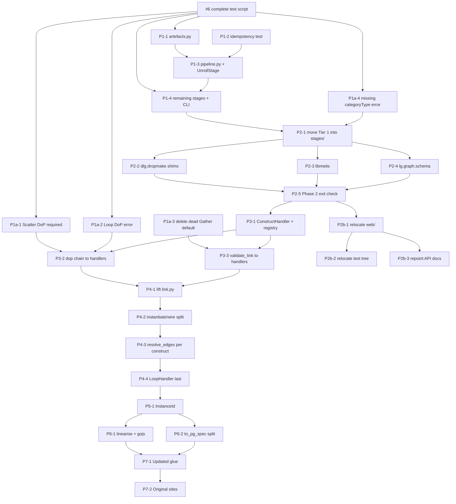

# Issue plan — Phases 1-7

Draft bodies for the GitHub issues covering §6 of
[ARCHITECTURE_PROPOSAL.md](ARCHITECTURE_PROPOSAL.md). Phase 0 is already filed as
[#4](https://github.com/SachaPoulet/daliuge/issues/4),
[#5](https://github.com/SachaPoulet/daliuge/issues/5),
[#6](https://github.com/SachaPoulet/daliuge/issues/6).

IDs below (`P1-1`, `P2-3`, …) are placeholders — replace with real issue numbers when filed.
`#6` is the real Phase 0 gate.

Labels to create: `Phase 1`, `Phase 1a`, `Phase 2`, `Phase 2b`, `Phase 3`, `Phase 4`,
`Phase 5`, `Phase 6`, `Phase 7`.

## Dependency graph



---

# Phase 1 — envelopes and pipeline

## P1-1 — Typed artefact envelopes (`artefacts.py`)

- **Label:** `Phase 1`
- **Blocked by:** #6
- **Blocking:** P1-3

One dataclass per artefact — `LogicalGraphTemplate`, `LogicalGraph`,
`PhysicalGraphTemplate`, `PhysicalGraphTemplatePartitioned`, `PhysicalGraph` — each frozen,
each holding `drops` + `reprodata` separately instead of reprodata being the last element of
a list.

The wire format does **not** change. `from_wire()` decodes the trailing-element convention,
`to_wire()` re-encodes it, and those two methods are the only place in the translator that
knows about it. Every HTTP payload stays byte-identical.

What this kills: the shape sniffs. `if not graph[-1].get("oid")`
([translator_rest.py:955](dlg/dropmake/web/translator_rest.py#L955)) becomes
`PhysicalGraphTemplate.from_wire(graph)`.

Careful:
- `pg_generator.unroll` / `partition` / `resource_map` must keep returning **bare lists** —
  `daliuge-engine` calls them directly and pops the trailing element itself (§8 Q5, Q8).
  Envelopes are internal only.
- Sketch of the target type is in §4.1 of the proposal.

Done when: the envelopes exist with round-trip tests (`from_wire(to_wire(x)) == x` on corpus
graphs), and nothing else has changed yet.

## P1-2 — Regression test: reprodata stamping is idempotent

- **Label:** `Phase 1`
- **Blocked by:** —
- **Blocking:** P1-3

Small standalone test in `daliuge-common`. Annotate a PGT twice with
`init_pgt_unroll_repro_data`, assert the graph-level `signature` and every per-drop
`pgt_blockhash` are identical after the second pass. Same for
`init_pgt_partition_repro_data`.

Why it matters: the whole design of the `repro=` flag in P1-3 assumes double-annotation is
harmless. It is today, because nothing hashes a previously-written hash —
`pgt_unroll_block_fields` lists only `categoryType`/`dt`/`storage`/`rank`,
`append_pgt_repro_data` resets `pgt_parenthashes` and overwrites `pgt_data`, and
`build_pgt_block_data` writes `pgt_blockhash` without ever reading it (§8 Q8b).

That is a property of the current field lists, not a guarantee. If someone later adds a
hash-valued field to `pgt_unroll_block_fields`, this test fails loudly instead of the flag
silently becoming load-bearing.

## P1-3 — `Stage` protocol, `Pipeline`, and the first stage

- **Label:** `Phase 1`
- **Blocked by:** P1-1, P1-2
- **Blocking:** P1-4

`Stage(Protocol[TIn, TOut])` — `run(artefact) -> artefact` plus `stamp(wire) -> wire`.
`Pipeline` composes stages and is the **only** place in the translator that calls
`init_*_repro_data`. Sketch of both is in §4.2.

**Options bind at construction**, `UnrollStage(UnrollOptions(...))`, not per `run()` call —
otherwise `Pipeline` has to know which options object goes to which stage, and the list cannot
be type-checked. `run` stays a pure `Artefact → Artefact` function.

**One options type per stage, not a shared `StageOptions` bag.** The four option sets are
disjoint (§4.2), so a shared type would put `MapOptions.nodes` in scope inside `UnrollStage`:

- `PrepareOptions` — `ssid`, `apply_config`, config overlay, `fill` params
- `UnrollOptions` — `oid_prefix`, `zerorun`, `app` (no `lenient`: §8 Q11 killed the flag)
- `PartitionOptions` — `algo`, `num_partitions`, `num_islands`, `partition_label`
- `MapOptions` — `nodes`, `num_islands`, `co_host_dim`

Each is a frozen dataclass in its own stage's `stage.py`. Only the types land in this issue —
the stages that consume them are Phase 2.

**Options are never `None`.** Default-construct: `def __init__(self, opts: UnrollOptions =
UnrollOptions())`. A `None` default cannot be uniform (`MapOptions.nodes` has no default — `resource_map` raises
`ValueError` on an empty node list), and it would force an `if opts is None:` fallback into
every stage, which is the same re-implemented-convention shape as the reprodata pop/append.
See `_get_algo_param` ([pg_generator.py:119-125](dlg/dropmake/pg_generator.py#L119-L125)) for
what `None`-punning already costs here — it exists purely to undo it.

Two carve-outs: `show_gojs` is a return-type switch, not an option, and must not enter
`PartitionOptions` (Phase 6 removes the need). The nine `algo_params` keys belong to
individual algorithm plugins, validated by `algorithms/registry.py` — the key *spellings* are
a Tier 3 contract (§7.1), only their declaration site moves.

The hook must be a constructor argument, not baked in:

- `Pipeline([...], repro=True)` — CLI and web.
- `Pipeline([...], repro=False)` — behind the `pg_generator` facade.

**Each stage carries its own `stamp()`; the Pipeline only decides whether to call it.** The
five `init_*_repro_data` functions are one per boundary and two are irregular —
`init_lgt_repro_data` takes an `rmode` argument, and prepare applies **two** hooks chained
(`init_lg_repro_data(init_lgt_repro_data(graph, rmode))`, as at
[tool_commands.py:229](dlg/translator/tool_commands.py#L229)). A single
`Callable[[list], list]` on the Pipeline cannot express that. `rmode` is therefore a
`PrepareOptions` field.

The Pipeline wraps each `stamp()` in `to_wire()` / `from_wire()` — the hooks operate on the
wire form and the stages pass envelopes, and that one line is what keeps the trailing-element
convention inside `artefacts.py`.

`then()` should return a re-typed `Pipeline[TIn, TNext]` so stage chaining is statically
checked; a bare heterogeneous list is not checkable.

Reason: `daliuge-engine` applies the hooks itself at four sites (`create_dlg_job.py:534-544`,
`start_dlg_cluster.py:341-358` and `:378`, `composite_manager.py:450-452`). A facade that
routed through a hook-applying Pipeline would annotate every engine call twice (§8 Q8).

**Ships one real stage: `UnrollStage`.** A protocol with no implementations is dead code
until P1-4, which means the design is first tested by the same PR that rewrites the CLI. Wrap
`pg_generator.unroll` here instead — the cheapest boundary to prove it on: one hook, not the
two chained ones prepare needs, and no required option fields.

```python
class UnrollStage:
    name = "unroll"

    def __init__(self, opts: UnrollOptions = UnrollOptions()):
        self._opts = opts

    def run(self, lgt: LogicalGraphTemplate) -> PhysicalGraphTemplate:
        return PhysicalGraphTemplate.from_wire(
            pg_generator.unroll(lgt.source, self._opts.oid_prefix,
                                zerorun=self._opts.zerorun, app=self._opts.app))

    def stamp(self, wire):
        return init_pgt_unroll_repro_data(wire)
```

Dumb by design — no logic moves in Phase 1, the wrapper just delegates.

**The equivalence test is the deliverable.** It is Phase 1's whole claim, checked once before
three more stages copy the pattern:

```python
new = Pipeline([UnrollStage(UnrollOptions(oid_prefix=p))], repro=True).run(lgt).to_wire()
old = init_pgt_unroll_repro_data(pg_generator.unroll(lg, oid_prefix=p))
assert new == old
```

⚠ **One contract to settle before writing `stamp`.** §4.2 currently has it take and return the
*wire* form, with `Pipeline` doing `type(artefact).from_wire(stage.stamp(artefact.to_wire()))`.
The alternative is `stamp(artefact) -> artefact`, with the conversion inside each stage: four
extra lines total, but it removes the runtime `type()` reflection, is statically checkable, and
keeps `Pipeline` ignorant of wire format entirely. Pick one here — the four `stamp` methods all
follow whichever lands.

Nothing else is wired up: `PartitionStage` and `MapStage` are P1-4.

## P1-4 — Remaining stages + CLI composes pipelines

- **Label:** `Phase 1`
- **Blocked by:** P1-3, #6
- **Blocking:** P2-1

Two jobs, in this order: add the two remaining stage wrappers on the pattern P1-3 proved, then
rewrite `tool_commands.py` to compose them. No compiler changes, no Tier 2 changes. This is the
strangler seam.

**Part 1 — `PartitionStage` (wraps `pg_generator.partition`) and `MapStage` (wraps
`pg_generator.resource_map`).** Same shape as `UnrollStage`: delegate, wrap the result in an
envelope, one `stamp` each. Each gets its own equivalence test against the raw function.

⚠ **There is no `PrepareStage` in Phase 1 — three stages exist, not four.**
`pg_generator.unroll` constructs the LG itself (`lg = LG(lg, ssid=oid_prefix)`,
[pg_generator.py:78](dlg/dropmake/pg_generator.py#L78)), so LGT → LG is not separable until
Phase 2 splits `LG.__init__`. `UnrollStage` therefore spans prepare *and* unroll for now, and
Phase 2 re-cuts the boundary. Consequence for this issue: `dlg fill` and `fill-config` keep
calling `pg_generator.fill` / `apply_config` directly, and **their hooks at
[tool_commands.py:229](dlg/translator/tool_commands.py#L229) and
[:279](dlg/translator/tool_commands.py#L279) stay** — those are LGT/LG-level and are
deliberately absent from §1.1's deletion list.

**Part 2 — the command rewrite.** Five commands change: `unroll`, `partition`,
`unroll-and-partition`, `map`, `submit`. One at a time, corpus run between each.

```python
# dlg_unroll_and_partition today (tool_commands.py:432-438)
pgt = unroll(opts.lg_path, opts.oid_prefix, zerorun=opts.zerorun, app=apps[opts.app])
init_pgt_unroll_repro_data(pgt)
repro = pgt.pop()                      # TODO: Re-integrate
pgt = partition(pgt, opts)
pgt.append(repro)
dump(init_pgt_partition_repro_data(pgt))

# after
pipeline = Pipeline([UnrollStage(uo), PartitionStage(po)], repro=True)
dump(pipeline.run(lgt).to_wire())
```

`submit` is not a stage — it is a client call. Its pop/append pair just becomes envelope field
access.

Deletes the hand-rolled reprodata handling at:
- [tool_commands.py:408](dlg/translator/tool_commands.py#L408)/[:417](dlg/translator/tool_commands.py#L417)
- [:434](dlg/translator/tool_commands.py#L434)/[:436](dlg/translator/tool_commands.py#L436) (two of these are marked `# TODO: Re-integrate`)
- [:515](dlg/translator/tool_commands.py#L515)/[:519](dlg/translator/tool_commands.py#L519)
- [:597-600](dlg/translator/tool_commands.py#L597-L600) — `dlg translator submit`, reads `pg[-1]` then re-appends around the submit call

Done when: corpus (#6) passes byte-for-byte, CLI command names / options / stdin-stdout piping
unchanged (§7.1), and `grep -n 'reprodata' dlg/translator/tool_commands.py` comes back empty.

---

# Phase 1a — remove the silent defaults

Independent of the restructure. Land these **before Phase 4**, on their own, so the corpus
absorbs the new hard failures in isolation instead of mixed into a handler extraction.

## P1a-1 — Scatter DoP becomes a required field

- **Label:** `Phase 1a`
- **Blocked by:** #6
- **Blocking:** P3-2

Client-mandated. Delete the `self._dop = 4  # dummy impl. TODO: Why is this here?` fallback at
[lg_node.py:629](dlg/dropmake/lg_node.py#L629). If none of `num_of_copies` / `num_of_splits` /
`Number of copies` is present, raise `GInvalidNode` naming the node and the three accepted
spellings.

No `--lenient` escape for this one — a required field with an opt-out is not required (§8 Q4).

⚠ This is a **deliberate behaviour change**, the only kind §6 allows. Graphs that omit the
count go from silently unrolling at DoP 4 to a hard error. #6 should already list which corpus
graphs those are; if it does not, produce that list here first, otherwise the corpus diff is
unreadable.

## P1a-2 — Loop with no iteration count fails with a real error

- **Label:** `Phase 1a`
- **Blocked by:** #6
- **Blocking:** P3-2

Loop has no fallback at all: if none of `num_of_iter` / `Number of Iterations` /
`Number of loops` is present, `_dop` is never assigned, `dop` returns `None`, and
`range(lgn.dop)` in `lgn_to_pgn` raises a bare `TypeError` with no node name
([lg_node.py:644-651](dlg/dropmake/lg_node.py#L644-L651)).

So it already fails on this input — just uselessly. Raise `GInvalidNode` naming the node and
the missing field, same shape as P1a-1.

Not a behaviour change in the corpus sense: what used to crash still crashes, with a better
message.

## P1a-3 — Delete the unreachable Gather `categoryType` default

- **Label:** `Phase 1a`
- **Blocked by:** #6
- **Blocking:** P3-3P1a-4 (the GInvalidNode + list-overlap fix, flagged as a possible behaviour change gated on #6); mermaid, UnrollOptions, and the P3-3 note updated.

Delete these two lines from `validate_link` ([lg.py:201-202](dlg/dropmake/lg.py#L201-L202)):

```python
if "categoryType" not in src.jd:
    src.jd["categoryType"] = "Data"
```

They cannot execute. The `LGNode.jd` setter fills `categoryType` in from `category`
([lg_node.py:135-139](dlg/dropmake/lg_node.py#L135-L139)) and `__init__` subscripts it bare two
lines later ([lg_node.py:60](dlg/dropmake/lg_node.py#L60)) — both before the first
`validate_link` call. Instrumented, the branch fires 0 times across the 82 bundled graphs, and
0 times with `categoryType` stripped from every Gather input (§8 Q11).

**Not a behaviour change**, and no new error to add: a non-Data Gather input already raises
`GInvalidLink`, and a node reaching `validate_link` without a `categoryType` cannot exist.
This also removes one of the three logical-model mutations in §5 row 9.

Ship with a regression test that a `Memory` node feeding a Gather with no `categoryType` key
still translates, so the setter's inference stays the thing carrying it.

## P1a-4 — Missing `categoryType` fails with a real error, and `"Data"` picks one list

- **Label:** `Phase 1a`
- **Blocked by:** #6
- **Blocking:** P2-1

Two defects surfaced by §8 Q11, both in node construction rather than validation. §5 rows 5d
and 5e.

**5d — the bare `KeyError`.** A node whose `category` is in neither `APP_TYPES` nor
`DATA_TYPES` and which omits `categoryType` dies at
[lg_node.py:60](dlg/dropmake/lg_node.py#L60) with `KeyError: 'categoryType'` — no node id, no
field name. Every construct category is outside both lists, as is any EAGLE app category newer
than `APP_TYPES`. Raise `GInvalidNode` naming the node and the missing field, same shape as
P1a-1/P1a-2. Put the check in the `jd` setter, immediately after the inference — it is the
last point that knows the node dict is unnormalised. It rides into `prepare/` with the Phase 2
move; do not put it in `validate_link`, which runs after every `LGNode` is already built.

**5e — `"Data"` is in both lists.** `Categories.DATA` appears in `DATA_TYPES`
([definition_classes.py:80](dlg/dropmake/definition_classes.py#L80)) *and* `APP_TYPES`
([:91](dlg/dropmake/definition_classes.py#L91)), and the setter tests `APP_TYPES` first, so a
`category: "Data"` node omitting `categoryType` is inferred `Application`. Decide which list
owns it and remove it from the other.

⚠ 5e is a **possible behaviour change** — the only one in this issue. Zero of the 389 nodes in
the 82 bundled graphs omit `categoryType`, so nothing there moves, but #6 must enumerate any
`category: "Data"` node without a `categoryType` in the wider `eagle-test-graphs` corpus before
this lands. If the list is empty, say so in the PR; if it is not, the reclassification is the
diff to expect.

---

# Phase 2 — split by transition

## P2-1 — Create `stages/` and move Tier 1 code into it

- **Label:** `Phase 2`
- **Blocked by:** P1-4
- **Blocking:** P2-2, P2-3, P2-4

Mechanical moves along the four transition boundaries (§1.2, layout in §3):

- `stages/prepare/` — `dm_utils` loader + normalisers, `graph_config`, `pg_generator.fill`
- `stages/unroll/` — `lg.py`, `lg_node.py`
- `stages/partition/` — `pgt.py`, `pgtp.py`, `scheduler.py`, `utils/`
- `stages/map/` — the `resource_map` half

Update `web/` imports in the same PR. Everything in the Tier 2 diff should be **import lines
only** — the one exception is the string literal in P2-4, which is called out there.

No behaviour changes, no logic edits. If a hunk is doing something for its own sake, it does
not belong in this PR.

## P2-2 — Compatibility shims at `dlg.dropmake.*`

- **Label:** `Phase 2`
- **Blocked by:** P2-1
- **Blocking:** P2-5

**Mandatory, not a nicety.** `daliuge-engine` imports translator internals from six production
modules (§8 Q5) — `pg_generator`, `graph_config`, and `web.translator_utils`. Ship Phase 2
without shims and the engine fails at import.

Frozen contracts the shims must preserve exactly (§7.2):
- `unroll_and_partition_with_params` and `prepare_lgt` — signatures **and** return types
  (`unroll_and_partition_with_params` returns a `PGT` object)
- `pg_generator.partition` — polymorphic return: `PGT` when `show_gojs=True`, list otherwise
- `pg_generator.resource_map` — takes a `(name, list)` pair

How long the shims live is the client team's release-coordination call, not ours.

## P2-3 — Move `libmetis` and repoint its loader

- **Label:** `Phase 2`
- **Blocked by:** P2-1
- **Blocking:** P2-5

`scheduler.py` moves in this phase, so `lib/libmetis.{so,dylib}` moves with it — to
`stages/partition/algorithms/lib/`, beside the loader that reads it (§8 Q10).

Two edits, neither of which is an import, so **no shim covers either**:
- [scheduler.py:1143](dlg/dropmake/scheduler.py#L1143) —
  `importlib.resources.files("dlg.dropmake")` → `dlg.translator.stages.partition.algorithms`
- the `MANIFEST.in` glob for `lib/`

⚠ **Run an actual `metis` partition before merging.** This breaks all METIS partitioning, not
just the web app, and it is silent: it is a filesystem lookup, so nothing fails at import and
the test suite stays green until `metis` is selected.

## P2-4 — Move `lg.graph.schema` into `stages/prepare/`

- **Label:** `Phase 2`
- **Blocked by:** P2-1
- **Blocking:** P2-5

The schema describes what `prepare/` produces, so the stage owns it (§8 Q10). Client confirmed
the ownership; **actually moving the `jsonschema` call into `PrepareStage` is out of our
scope** — their team does that later. So the file moves, the validation call stays in `web/`,
and that cross-tier reach is a known interim state. Do not close it opportunistically.

Three consumer edits ride along in the **same PR** — none is an import:

1. [translator_rest.py:145](dlg/dropmake/web/translator_rest.py#L145) —
   `file_as_string("lg.graph.schema", module="dlg.dropmake")` →
   `module="dlg.translator.stages.prepare"`. This is a **Tier 2 content edit inside a Tier 1
   phase** — the one exception to "import lines only". Legitimate because a Tier 1 move forced
   it; name it in the PR description.
2. `tools/checkGraph.py:14` — relative filesystem path, outside the package.
3. `MANIFEST.in:5` — `include dlg/dropmake/*.schema` → new location.

⚠ **Exercise a REST validate call before merging.** The CLI path never touches the schema, so
nothing else catches this. Miss edit 1 and LG validation breaks on *every* REST call, silently.

## P2-5 — Phase 2 exit check

- **Label:** `Phase 2`
- **Blocked by:** P2-2, P2-3, P2-4
- **Blocking:** P2b-1, P3-1

Marks the end of Phase 2. Checklist:

- [ ] `grep -rn 'dlg[./]dropmake' .` from the **monorepo root, unfiltered** — no `--include`
      filter — comes back empty except the deliberate shims. Three of the nine non-import
      references live in `build_translator.sh` / `run_translator.sh` and one in
      `tools/checkGraph.py`; a `--include='*.py'` grep misses all four.
- [ ] Corpus (#6) passes, including a real `metis` run.
- [ ] A REST validate call succeeds.
- [ ] `test/dropmake/test_tm.py` green.
- [ ] `daliuge-engine` imports and runs — smoke-run `create_dlg_job.py`.
- [ ] The translator's own suite **collects**. A stale import under `test/` is a collection
      error, not a test failure: pytest aborts the whole run, so "no tests failed" and "no
      tests ran" look identical in a summary line.

---

# Phase 2b — relocate `web/`

## P2b-1 — `git mv` the web app

- **Label:** `Phase 2b`
- **Blocked by:** P2-5
- **Blocking:** P2b-2, P2b-3

`dlg/dropmake/web/` → `dlg/translator/web/`, and
`dlg/dropmake/pg_manager.py` → `dlg/translator/web/pg_manager.py`.

**Pure rename. No content edits in the commit** beyond these path literals:

- `MANIFEST.in` — four hardcoded `dlg/dropmake/web/…` lines
- [tool_commands.py:610](dlg/translator/tool_commands.py#L610) — the literal
  `"dlg.dropmake.web.translator_rest:run"`
- `build_translator.sh:15-51` — seven lines (writes `web/VERSION`, copies `LICENSE`)
- `run_translator.sh:19-31` — three lines, the developer live-mount. Note it is already
  stale: it silently runs installed code instead of the working tree.
- a shim at `dlg.dropmake.web.translator_utils`, because the engine imports it

The schema move is **not** part of this phase — it landed in P2-4 with `stages/prepare/`.

HTML and `web/src` stay byte-identical. Endpoint paths, methods and payloads unchanged.

## P2b-2 — Relocate the translator test tree

- **Label:** `Phase 2b`
- **Blocked by:** P2b-1
- **Blocking:** —

`test/dropmake/` → `test/translator/`, mirroring the source layout.

Last of the moves, because it is the only one that cannot start earlier: six of the seven
modules under `test/dropmake/` test code that leaves in Phase 2, but `test_tm.py` tests
`translator_rest.py`, which does not move until P2b-1. Relocating in Phase 2 means moving
six files and then moving the seventh separately.

| test module | subject | subject moves in |
|-------------|---------|------------------|
| `test_dm_utils.py` | `dm_utils` → `stages/prepare/normalise/**` | P2-1 |
| `test_graph_config.py` | `graph_config` → `stages/prepare/config.py` | P2-1 |
| `test_lg.py`, `test_lg_fill.py` | `lg.py`, `pg_generator.fill` | P2-1 |
| `test_pg_gen.py` | `pg_generator`, `pgt`, `pgtp` | P2-1 |
| `test_scheduler.py` | `scheduler.py` | P2-1 |
| `test_tm.py` | `web/translator_rest.py` | P2b-1 |

Two filenames name a module that no longer exists and are renamed in the same PR:
`test_dm_utils.py` → `test_normalise.py`, and `test_pg_gen.py` → whatever `pg_generator`'s
four halves settled into (open — decide when P2-1 lands, not now).

⚠ **An import rewrite does not cover this move**, for the same reason it does not cover the
package (§8 Q7) — and the test tree has its own instance of the failure class. P2-1 hit it:
`test_graph_config.py` pinned the **logger name** as a literal,
`"WARNING:dlg.dlg.dropmake.graph_config:"`, feeding six assertions. Repointing the import
left it stale, and it fails as an assertion, not an error. Grep the test tree for the old
dotted path, not just for `import`.

⚠ **This issue is scoped to the move.** P2-1 already repointed `test_dm_utils.py` and
`test_graph_config.py` where they stand, because leaving them broken meant shipping a red
suite. Every phase repoints the tests it breaks, as it breaks them; this issue only relocates
files that already pass.

## P2b-3 — Repoint the API documentation

- **Label:** `Phase 2b`
- **Blocked by:** P2b-1
- **Blocking:** —

`docs/api/dropmake.rst` documents four modules by name. After Phase 2 two of them are
shims and a third has moved, so the page describes a package that no longer holds the code.

Rename it to `docs/api/translator.rst` and point each directive at the module that now owns
the implementation. Three consumer edits ride along, none of them a Python import:

1. `docs/api-index.rst:14` — the `api/dropmake` toctree entry
2. `docs/architecture/graphs.rst:112` — a `:doc:` cross-reference to `../api/dropmake`
3. the directives themselves — `pg_generator` → the four stage modules, `scheduler` →
   `dlg.translator.stages.partition.scheduler`, `pg_manager` → `dlg.translator.web.pg_manager`

Blocked by P2b-1 rather than folded into Phase 2 because `pg_manager` is the one entry still
documenting real code until `web/` moves; doing this earlier means editing the file twice.

⚠ **A stale `automodule` fails in two different ways, and the second is silent.** If the
module is gone the build errors, which is how P2-1 found the missing `dlg.dropmake.scheduler`
shim. But if the module is a **shim**, the build goes green and documents *nothing*:
`automodule ... :members:` skips imported objects unless `:imported-members:` is given, and
every name in a re-export shim carries the real module's `__module__`. Measured on P2-1's
shim: `members whose __module__ == 'dlg.dropmake.scheduler': NONE`.

So `.. automodule:: dlg.dropmake.pg_generator` currently renders an empty section rather than
the facade's seven functions, and the docs CI (`.github/workflows/build-documentation.yml`)
passes either way. **Check the rendered output, not the exit code.**

Worth deciding in this issue, though it is not strictly a repoint: **nothing under `docs/`
references `dlg.translator` at all.** `artefacts.py`, `pipeline.py`, `errors.py`,
`tool_commands.py` and every `stages/*/stage.py` are undocumented — the abstractions the
restructure exists to introduce have no API page. Adding them is a bigger job than this
issue; if it is not taken here, it wants an issue of its own rather than being dropped.

---

# Phase 3 — construct registry, read path

## P3-1 — `ConstructHandler` protocol + registry

- **Label:** `Phase 3`
- **Blocked by:** P2-5
- **Blocking:** P3-2, P3-3

`unroll/constructs/base.py` (the protocol) and `registry.py` (name → handler), plus empty
handler files for scatter / gather / loop / groupby / mpi / service / subgraph / leaf.

Interface is in §4.3. The one thing to get right up front is the **dispatch key**:
`(source enclosing construct, target enclosing construct, h-level relation)`, with the
loop-aware flag carried on the `LogicalLink`.

Not `(source handler, target handler)` — the four hardest cells
([lg.py:617-696](dlg/dropmake/lg.py#L617-L696)) have a **plain leaf on both ends** and key off
the *enclosing* construct, `gid` equality, `is_group_start`/`is_group_end`, h-level comparison
and `_loop_aware_set` membership. An endpoint-typed key routes all four into `LeafHandler`,
i.e. straight back into the nested conditional this work exists to remove (§8 Q9).

No behaviour routed through it yet — that is P3-2 and P3-3.

## P3-2 — Route `degree_of_parallelism` through handlers

- **Label:** `Phase 3`
- **Blocked by:** P3-1, P1a-1, P1a-2
- **Blocking:** P4-1

Move the `if/elif` chain in `LGNode.dop`
([lg_node.py:612-668](dlg/dropmake/lg_node.py#L612)) into one
`degree_of_parallelism` per handler, then delete the chain.

Blocked on P1a-1/P1a-2 deliberately: land the default removals **first**, while they are
one-line changes to a single chain. After this issue they become edits inside two separate
handler files, mixed into a bigger diff.

## P3-3 — Collapse `validate_*` into one pairwise `validate_link`

- **Label:** `Phase 3`
- **Blocked by:** P3-1
- **Blocking:** P4-1

The rules are pairwise, not per-endpoint — the Gather rule compares `src.inputs[0].h_level`
against `tgt.h_level` ([lg.py:171-181](dlg/dropmake/lg.py#L171-L181)), and the loop rule walks
*both* group chains upward in lockstep comparing `dop`
([lg.py:217-239](dlg/dropmake/lg.py#L217-L239)). Neither is expressible as a source-only or
target-only check, so it is one method with both endpoints in `ctx` (§8 Q9).

Move each clause of `validate_link` ([lg.py:156-250](dlg/dropmake/lg.py#L156)) to its handler
and delete the chain.

Note: `validate_link` currently **mutates** — it writes a default `categoryType` into `src.jd`
([lg.py:201-202](dlg/dropmake/lg.py#L201-L202)). Validation should not mutate, and this one
cannot even fire (§8 Q11): P1a-3 deletes it outright, so by the time this issue starts there is
nothing to move. If P1a-3 has not landed, delete the two lines here rather than porting them.

---

# Phase 4 — two-pass unroll

Highest-risk phase. The ~250-line conditional is where behaviour drift happens. Corpus run
after **every** issue here, not just at the end.

## P4-1 — Lift `_link_drops` into `unroll/link.py`

- **Label:** `Phase 4`
- **Blocked by:** P3-2, P3-3
- **Blocking:** P4-2

A straight lift, no behaviour change, no restructure. Do it **before any handler work**.

`_link_drops` ([lg.py:436-543](dlg/dropmake/lg.py#L436)) stays **one shared function** and
does not move into handlers. It dispatches on `categoryType`, never on construct:
`_is_stream_link` over the five app categories → inject a `NullDROP`
([:469-490](dlg/dropmake/lg.py#L469-L490)); `Application`/`Control` → port-name resolution and
`port_map` ([:492-511](dlg/dropmake/lg.py#L492-L511)); else data wiring
([:512-543](dlg/dropmake/lg.py#L512-L543)); plus `BASH_SHELL_APP` parameter registration on
both sides. Folding that into handlers copies three wiring styles into eight files (§8 Q9).

Its only construct-aware parts are the Gather/GroupBy source-DROP substitution at the top and
the gather-cache diversion — both disappear with the cache in P4-2.

## P4-2 — Split `unroll_to_tpl` into two passes

- **Label:** `Phase 4`
- **Blocked by:** P4-1
- **Blocking:** P4-3

`instantiate.py` = pass 1, every instance, no edges. `wire.py` = pass 2, every edge, no
instances. Delete `self._gather_cache` — it exists only because instantiation and wiring are
interleaved in one walk; after the split, a Gather's inputs and outputs both exist before any
edge is resolved.

Also lands here, since they are all "a pass mutates the logical model" (§5 row 9):
- `lgn_to_pgn` appends to `self._lg_links` *while* the link loop iterates it → link synthesis
  becomes a pre-pass, so the link set is frozen before pass 2 reads it
- ~~the Service branch rewrites `tlgn["categoryType"]` mid-wiring
  ([lg.py:750-755](dlg/dropmake/lg.py#L750-L755)) → moves into `ServiceHandler.instantiate`~~
  → **delete it instead.** Phase 0 proved the branch cannot ever have run: it subscripts an
  `LGNode`, which has no `__setitem__`. Unreachable for a Service *with* an input application
  (`convert_construct` moves the construct's id onto the generated app node, so a link "into
  the Service" targets the app), and for one *without* it raises
  `TypeError: 'LGNode' object does not support item assignment`. Corpus case:
  `service_no_input_app`. See §5 row 9b.

Delete `lgn_to_pgn(recursive=False)` ([lg.py:352-359](dlg/dropmake/lg.py#L352-L359)) — dead,
both call sites take the default. `pgtp.py:267`'s `recursive` is METIS's bisection flag, not
this one.

## P4-3 — Move `resolve_edges` into handlers — one construct per PR

- **Label:** `Phase 4`
- **Blocked by:** P4-2
- **Blocking:** P4-4

`resolve_edges` decides *which* source DROP pairs with *which* target DROP — the chunking,
bucketing and iteration-selection logic. It returns **pairs only**; `link.py` from P4-1 does
the wiring.

One PR per construct, corpus run between each:

- [ ] Scatter
- [ ] GroupBy (the `iid` parsing at [lg.py:693-742](dlg/dropmake/lg.py#L693) is what P5-1 later replaces)
- [ ] Gather
- [ ] MPI
- [ ] Service
- [ ] SubGraph
- [ ] Leaf

Loop is **not** in this list — see P4-4.

The 21-row decision matrix in
[ARCHITECTURE_MIGRATION_MAP.md](ARCHITECTURE_MIGRATION_MAP.md) says which cell goes to which
handler.

## P4-4 — `LoopHandler` — last, and on its own

- **Label:** `Phase 4`
- **Blocked by:** P4-3
- **Blocking:** P5-1

Take Loop last. It owns the four leaf-to-leaf cells at
[lg.py:617-696](dlg/dropmake/lg.py#L617-L696) — loop-end→loop-start relinking, cross-loop
stepwise locking, and the `loop_aware` first/last-iteration links. Both endpoints are plain
leaves; the handler is chosen by the *enclosing* construct.

Until this lands those edges still route through the legacy conditional. That is fine and
intended — it just means the "one handler per PR" cadence has a fat tail, not an even one.

Do not start this while any other construct is unmerged.

---

# Phase 5 — `InstanceId`

## P5-1 — Replace stringly-typed `iid`

- **Label:** `Phase 5`
- **Blocked by:** P4-4
- **Blocking:** P6-1, P6-2

`iid` is the only link from a physical DROP back to its logical position, and it is a
`-`/`$`-delimited string re-parsed with `split()` in several places. Replace the internals
with a value type (`coordinate.py`, sketch in §4.4).

⚠ `__str__` must produce the **bit-identical** wire string. It ships in the PG (§7.1) and the
viewer's `humanReadableKey` interpolates `drop['iid']`. Internals change, output does not.

---

# Phase 6 — partition / map / projection separation

## P6-1 — Linearisation moves out of the serialiser

- **Label:** `Phase 6`
- **Blocked by:** P5-1
- **Blocking:** P7-1

`to_gojs_json` synthesises intermediate `BarrierAppDROP`/`InMemoryDROP` nodes under
`if self._extra_drops is None:` ([pgt.py:374](dlg/dropmake/pgt.py#L374)). Exactly two classes
set that to `None` — `MinNumPartsPGTP` ([pgtp.py:619](dlg/dropmake/pgtp.py#L619)) and
`PSOPGTP` ([pgtp.py:652](dlg/dropmake/pgtp.py#L652)) — both commented *"force it to
re-calculate the extra drops due to extra links during linearisation"*. Those DROPs then reach
the production PG via `PGT.drops` ([pgt.py:108-112](dlg/dropmake/pgt.py#L108-L112)).

So this is **deliberate partitioning output typed into a serialiser**, not a visualisation
artefact (§8 Q3). Move the synthesis to `partition/linearise.py`, owned by the algorithms that
need it. `projections/gojs.py` becomes a pure read-only serialiser; `PGT.to_gojs_json` stays as
a delegating method with an identical signature.

⚠ **Client requirement: PG output must be unchanged after this move.**
- `min_num_parts` is deterministic → byte-identical PG, synthetic DROPs included: same count,
  same `oid`s, same insertion order, same `node`/`island` stamps.
- ~~`pso` is stochastic → fix the seed and compare byte-for-byte under it.~~ **`pso` does not
  run at all** — `ValueError: too many values to unpack (expected 2)` at
  [scheduler.py:837](dlg/dropmake/scheduler.py#L837). There is no golden for it and nothing
  to seed, so this move cannot be verified against `pso`; `min_num_parts` and `mysarkar`
  carry the check instead. Note those two are byte-identical to each other on every corpus
  case, so they are one comparison, not two. See §6.

GOJS payload shape is a Tier 3 contract — the bundled viewer parses it. Do not touch it.

## P6-2 — Break `to_pg_spec` apart

- **Label:** `Phase 6`
- **Blocked by:** P5-1
- **Blocking:** P7-1

`to_pg_spec` currently does partition merging, island formation, `#N`/`#M` placeholder
stamping and hostname mapping in one function — which is why island formation, a PGT-P
concern, is only reachable through the function that also does PG mapping (§1.2).

Split into `partition/islands.py`, `partition/placeholders.py` and `map/stage.py`. `PGT.to_pg_spec`
remains as a facade with an unchanged signature and unchanged output.

`#N` / `#M` placeholder convention is Tier 3 (SLURM, Helm consume it) — preserve verbatim.

---

# Phase 7 — Tier 2 glue adaptation

Deliberately last: the core API has stopped moving before we adapt against it.

## P7-1 — Collapse the `Updated`-generation reprodata sites and the glue function

- **Label:** `Phase 7`
- **Blocked by:** P6-1, P6-2
- **Blocking:** P7-2

Each pop/append pair becomes one adapter call:
- [translator_rest.py:954-961](dlg/dropmake/web/translator_rest.py#L954-L961)
- [:1009-1014](dlg/dropmake/web/translator_rest.py#L1009-L1014)
- [:1061-1067](dlg/dropmake/web/translator_rest.py#L1061-L1067)
- [translator_utils.py:162](dlg/dropmake/web/translator_utils.py#L162), [:180-184](dlg/dropmake/web/translator_utils.py#L180-L184) — deleted with the glue function

Replace the body of the glue function at
[translator_utils.py:150-185](dlg/dropmake/web/translator_utils.py#L150-L185) with a
`Pipeline` composition. It is pure glue — a function whose whole body sequences translator
calls — which is the one Tier 2 replacement the Scope rule allows.

⚠ **`unroll_and_partition_with_params` and `prepare_lgt` keep their exact signatures and
return types** — [graph_compatibility.py:34](../daliuge-engine/graph_compatibility.py#L34) in
`daliuge-engine` calls both (§8 Q5).

Endpoints, HTTP methods, payloads and HTML untouched. Verify against the Phase 0 HTTP corpus.
Leave the `post_sem` / `gen_pgt_sem` semaphores alone — this work removes the *reason* they
exist, but whether the app still needs them is a web-side concurrency question we are not
analysing.

## P7-2 — The two `Original`-generation sites — separate, last, conditional

- **Label:** `Phase 7`
- **Blocked by:** P7-1, #6
- **Blocking:** —

Two reprodata sites sit inside the `Original` generation:
[translator_rest.py:641](dlg/dropmake/web/translator_rest.py#L641) and
[:661](dlg/dropmake/web/translator_rest.py#L661), on the `gen_pg_spec` / deploy path.

§5 leaves the `Original`/`Updated` split alone, and `Original` is **what EAGLE calls**. Editing
these is legal — they are call sites, not restructuring — but it is the cleanup's only reach
into the legacy half, so it gets its own commit, last.

**Precondition:** the Phase 0 HTTP corpus must cover `gen_pg_spec`. If it does not, close this
as won't-do rather than editing blind. The cleanup is worth 10 sites, not 12, if the
alternative is an unverified change to EAGLE's path.
