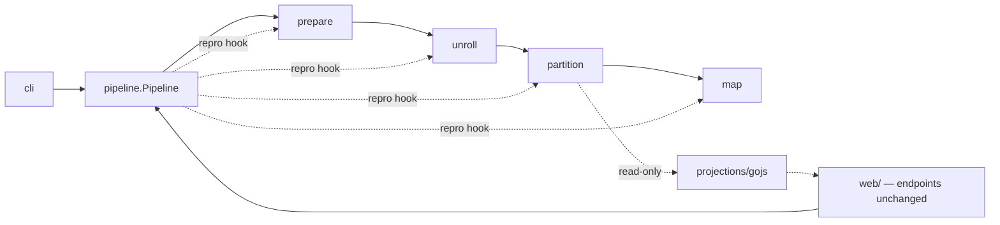

# DALiuGE Translator — Proposed Architecture

Status: **proposal**. Companion to [ARCHITECTURE.md](ARCHITECTURE.md), which describes the
as-built system. This document proposes the target structure and a migration path.

For **where each proposed file's code comes from** — a line-level source-to-target map,
plus the confirmed-dead code and the latent bugs found while tracing it — see
[ARCHITECTURE_MIGRATION_MAP.md](ARCHITECTURE_MIGRATION_MAP.md).

Goal: make the translator scalable to further change by enforcing one principle —
**one artefact transition, one owner; one concept, one abstraction.**

## Scope

Three tiers. The middle tier is the one to read carefully.

### Tier 1 — owned: the translation core and its CLI

```
dlg/dropmake/{pg_generator,lg,lg_node,dm_utils,graph_config,
              definition_classes,pgt,pgtp,scheduler}.py
dlg/dropmake/utils/**
dlg/translator/tool_commands.py
```

Free rein. This is where the proposal's structural work happens.

### Tier 2 — adaptable: the web application

```
dlg/dropmake/web/**          translator_rest.py, translator_utils.py, HTML, GOJS/D3 assets
dlg/dropmake/pg_manager.py   in-process PGT cache serving the web UI
```

**Permitted:**

- **Relocating** these files/directories wholesale, as a unit, contents otherwise unchanged.
- **Editing call sites** where they talk to the translator: import paths, argument shapes,
  return-value handling — whatever the new core API requires.
- **Replacing pure glue** — a function whose entire body sequences translator calls, with no
  HTTP, HTML or app concerns in it — with the equivalent `Pipeline` composition.
  [translator_utils.py:150-185](dlg/dropmake/web/translator_utils.py#L150-L185) is the
  canonical case.

**Not permitted:**

- Restructuring the app: no splitting `Original` / `Updated`, no extracting HTML rendering,
  no re-organising the FastAPI assembly, no new modules inside `web/`.
- Changing endpoint paths, HTTP methods, request or response payloads — EAGLE calls these.
- Changing the GOJS JSON payload shape — the bundled viewer parses it.
- Touching the front-end assets under `web/src`.
- Removing the `post_sem` / `gen_pgt_sem` semaphores. This work removes the *reason* they
  exist (§5), but whether the web app still needs them depends on web-side concurrency we
  are not analysing. Flag it; leave it.

**Rule of thumb:** an edit in Tier 2 is justified only if the corresponding Tier 1 change
forced it. Every Tier 2 diff hunk should be traceable to a specific core change. If a Tier 2
diff is doing something *for its own sake*, it does not belong in this work.

> ⚠ **`translator_utils.py` is Tier 2 by location but has a Tier 3 consumer.**
> `daliuge-engine` imports it directly —
> [graph_compatibility.py:34](../daliuge-engine/graph_compatibility.py#L34) and
> `test/end_to_end/deploy/test_graph_to_manager.py:34` both pull
> `unroll_and_partition_with_params` and `prepare_lgt` out of it. Those two signatures are
> cross-repository API, not web glue. See §8 Q5.

### Tier 3 — frozen: everyone else

Engine, EAGLE, deployment tooling. Contracts only (§7.1) — and note that `daliuge-engine`
imports translator internals from **six production modules**, so "contracts only" has a
wider surface than the wire format alone (§7.1, §8 Q5).

---

## 1. The problem, stated precisely

The translator is a four-transition compiler (LGT → LG → PGT → PGT-P → PG). The code does
not reflect that. Two failure modes, both structural.

### 1.1 Files own more than one transition

| File | Transitions it implements | Evidence | Tier |
|------|---------------------------|----------|------|
| [pg_generator.py](dlg/dropmake/pg_generator.py) | **all four** | `fill` [:57](dlg/dropmake/pg_generator.py#L57), `unroll` [:79](dlg/dropmake/pg_generator.py#L79), `partition` [:131](dlg/dropmake/pg_generator.py#L131), `resource_map` [:244](dlg/dropmake/pg_generator.py#L244) | 1 |
| [pgt.py](dlg/dropmake/pgt.py) | PGT→PGT-P **and** PGT-P→PG **and** visualisation | `to_pg_spec` [:219](dlg/dropmake/pgt.py#L219) merges partitions, forms islands, stamps `#N`/`#M` placeholders *and* writes real hostnames when `node_list` is real; `to_gojs_json` [:343](dlg/dropmake/pgt.py#L343) mutates the graph | 1 |
| [dm_utils.py](dlg/dropmake/dm_utils.py) | LGT→LG normalisation **and** unroll-semantics pre-baking | `convert_construct` [:410](dlg/dropmake/dm_utils.py#L410) replaces constructs with application DROPs and duplicates Gather app nodes to break cycles — that is unroll semantics executed one stage early | 1 |
| [tool_commands.py](dlg/translator/tool_commands.py) | all four, re-implemented | `dlg translator {fill,unroll,partition,map}` | 1 |
| [translator_rest.py](dlg/dropmake/web/translator_rest.py) | all four, re-implemented again | `/lg_fill` [:853](dlg/dropmake/web/translator_rest.py#L853), `/unroll` [:890](dlg/dropmake/web/translator_rest.py#L890), `/partition` [:923](dlg/dropmake/web/translator_rest.py#L923), `/map` [:1018](dlg/dropmake/web/translator_rest.py#L1018) | 2 — call sites only |
| [translator_utils.py](dlg/dropmake/web/translator_utils.py) | unroll + partition, a *third* time | [:160-184](dlg/dropmake/web/translator_utils.py#L160-L184) | 2 — pure glue, replaceable |

The clearest symptom is **reprodata**. The convention "reprodata is the last list element"
is hand-re-implemented at 12 translator-side sites — one producer and eleven consumers — in
every module that drives the pipeline, plus four more in `daliuge-engine` that we cannot
touch:

| Site | Tier | Fate |
|------|------|------|
| [pg_generator.py:95](dlg/dropmake/pg_generator.py#L95) — `drop_list.append(lg.reprodata)`, the *producer* | 1 | becomes `PhysicalGraphTemplate.to_wire()` |
| [tool_commands.py:408](dlg/translator/tool_commands.py#L408)/[:417](dlg/translator/tool_commands.py#L417), [:434](dlg/translator/tool_commands.py#L434)/[:436](dlg/translator/tool_commands.py#L436), [:515](dlg/translator/tool_commands.py#L515)/[:519](dlg/translator/tool_commands.py#L519) — two marked `# TODO: Re-integrate` | 1 | deleted, Phase 1 |
| [tool_commands.py:597-600](dlg/translator/tool_commands.py#L597-L600) — `dlg translator submit`; reads `pg[-1]` then re-appends around the submit call | 1 | deleted, Phase 1 |
| [translator_utils.py:162](dlg/dropmake/web/translator_utils.py#L162), [:180-184](dlg/dropmake/web/translator_utils.py#L180-L184) | 2 | deleted with the glue function |
| [translator_rest.py:954-961](dlg/dropmake/web/translator_rest.py#L954-L961), [:1009-1014](dlg/dropmake/web/translator_rest.py#L1009-L1014), [:1061-1067](dlg/dropmake/web/translator_rest.py#L1061-L1067) — `Updated` generation | 2 | each pop/append pair collapses to one adapter call — a call-site edit, nothing more |
| [translator_rest.py:641](dlg/dropmake/web/translator_rest.py#L641), [:661](dlg/dropmake/web/translator_rest.py#L661) — `Original` generation, `gen_pg_spec` / deploy path | 2 | same collapse. ⚠ These live in the legacy half, which §5 otherwise leaves alone — see below |
| `daliuge-engine`: `create_dlg_job.py:534-544`, `start_dlg_cluster.py:341-358` (incl. the `unrolled[-1].get("oid")` sniff), `composite_manager.py:450-452` (`"rmode" in graphSpec[-1]`) | **3** | **untouchable — and they constrain the fix** (§8 Q8) |

A single cross-cutting concern has no owner, so every caller re-owns it — differently. With
Tier 2 adaptable, **the 12 translator-side sites can go**, and the convention ends up
implemented once *inside the translator*.

⚠ **The convention does not end at the repo boundary.** The engine performs the same
pop/append dance around its own `pg_generator` calls, and the Drop Manager pops the trailing
element on receipt. Two consequences, both binding on §4: `pg_generator.*` must keep returning
bare lists rather than envelopes, and the translator must keep *not* applying the `init_*`
hooks inside those functions — an engine caller applies them itself and would otherwise
double-annotate. See §8 Q8.

⚠ **The `Original`-generation row is the one to think about.** §5 declares the `Original` / `Updated` split
out of scope, but two reprodata sites sit inside `Original`. Editing them is still legal —
they are call sites, not restructuring — yet they are the reprodata cleanup's only reach into
the legacy half, and `Original` is what EAGLE calls. Phase 7 should treat them as a separate,
last commit, verified against the Phase 0 HTTP corpus. If that corpus does not cover
`gen_pg_spec`, leave these two alone rather than editing blind: the cleanup is worth 10 sites,
not 12, if the alternative is an unverified change to EAGLE's path.

> ✅ **Resolved — the corpus covers it.** `rest.gen_pg_spec` is captured for all six Tier 2
> graphs, so the cleanup keeps all 12 sites. Note its response cannot be pinned by
> `oid_prefix` the way the `Updated` routes are — `gen_pgt` accepts no such parameter, so
> `LG.__init__` falls back to `datetime.now()` — and its `root_uids` come from
> `list(get_roots(...))` over a *set*, which Python reorders per process. The corpus
> normalises exactly those two things and nothing else.

### 1.2 Transitions are split across files with no declared ownership

| Transition | Currently spread over | Consequence |
|------------|----------------------|-------------|
| **LGT → LG** | `dm_utils.py` (load, version sniff, 4 normalisers), `graph_config.py`, `pg_generator.fill`, and `LG.__init__` [lg.py:88-102](dlg/dropmake/lg.py#L88-L102) which sequences them | No way to obtain a parsed LG without also running normalisation, node construction and validation. The class docstring [lg.py:59](dlg/dropmake/lg.py#L59) says so itself. |
| **LG → PGT** | `lg.py` (walk + wiring), `lg_node.py` (DoP + DROP construction), `dm_utils.py` (construct pre-baking) | The rules for "what is a Scatter" live in three files. |
| **PGT → PGT-P** | `pgtp.py` (4 algorithm subclasses), `pgt.py` (`merge_partitions`, island forming inside `to_pg_spec`), `scheduler.py`, `utils/` | Island formation — a PGT-P concern — is reachable only through the function that also does PG mapping. |
| **PGT-P → PG** | `pg_generator.resource_map`, `pgt.to_pg_spec` (real-`node_list` branch), `tool_commands` map command | Two different code paths write hostnames into DROPs. |

All four transitions are implemented entirely in Tier 1. `web/` only *invokes* them.

### 1.3 Construct semantics have no single abstraction

What a Scatter/Gather/Loop/GroupBy/MPI/Service/SubGraph *means* is encoded in four
disjoint places, all Tier 1:

1. String vocabulary — `Categories` / `ConstructTypes` in
   [definition_classes.py](dlg/dropmake/definition_classes.py) (which carries a TODO saying
   the explicit `Categories` treatment should disappear).
2. Predicates — `LGNode.is_scatter` / `is_gather` / `is_loop` / … in
   [lg_node.py:450-489](dlg/dropmake/lg_node.py#L450-L489).
3. Parallelism — the `if/elif` chain in `LGNode.dop`
   [lg_node.py:612-668](dlg/dropmake/lg_node.py#L612).
4. Behaviour — three more `if/elif` chains: `lgn_to_pgn`
   [lg.py:261](dlg/dropmake/lg.py#L261), `unroll_to_tpl`
   [lg.py:545](dlg/dropmake/lg.py#L545), `_link_drops` [lg.py:436](dlg/dropmake/lg.py#L436);
   plus DROP emission in `_create_groupby_drops` / `_create_gather_drops` /
   `_create_listener_drops` [lg_node.py:779-880](dlg/dropmake/lg_node.py#L779);
   plus validation in `validate_link` [lg.py:156](dlg/dropmake/lg.py#L156).

`grep -c is_gather` over `lg.py` + `lg_node.py` returns double digits. **Adding one
construct means editing six files and hoping you found every branch.** That is the
scalability ceiling.

---

## 2. Design principles

1. **A transition is a module.** Each of the four transitions gets exactly one package.
   Nothing outside that package may implement it.
2. **A transition is a pure function** `Artefact → Artefact`. No constructors that compile.
3. **Artefacts are typed envelopes**, not bare lists. Wire-format quirks (reprodata as
   trailing element) live in one serialisation adapter, not in every caller.
4. **Constructs are plugins.** One file per construct implementing one interface. The
   compiler core contains zero `if is_scatter` branches.
5. **Nothing outside `stages/` sequences a transition.** The CLI composes stages; so does the
   web app's glue, once adapted.
6. **Visualisation must not mutate.** A projection of an artefact is read-only.
7. **Tier 2 edits are consequences, never initiatives** (see Scope).
8. **Behaviour compatibility is the acceptance criterion**, enforced by a golden-file
   corpus, not by review.

---

## 3. Target module layout

```
dlg/translator/
├── artefacts.py              LGT, LG, PGT, PGTP, PG envelopes + wire (de)serialisation
├── pipeline.py               Stage protocol, composition, reprodata hook — the ONLY one
├── errors.py                 exception hierarchy (moved out of dm_utils/pgt/scheduler)
│
├── stages/
│   ├── prepare/              ══ TRANSITION 1: LGT → LG ══
│   │   ├── stage.py            PrepareStage + PrepareOptions — the only public entry
│   │   ├── loader.py           load_lg
│   │   ├── versions.py         get_lg_ver_type + per-version normalisation recipe
│   │   ├── config.py           graph_config overlay
│   │   ├── params.py           deprecated textual `fill`
│   │   ├── lg.graph.schema     package data, moved from dlg/dropmake/ (§8 Q6, Q10)
│   │   └── normalise/
│   │       ├── globals.py      extract_globals
│   │       ├── fields.py       convert_fields
│   │       ├── constructs.py   convert_construct
│   │       └── subgraphs.py    convert_subgraphs
│   │
│   ├── unroll/               ══ TRANSITION 2: LG → PGT ══
│   │   ├── stage.py            UnrollStage + UnrollOptions
│   │   ├── model.py            LogicalNode / LogicalLink — data, no behaviour
│   │   ├── coordinate.py       InstanceId value type (replaces stringly `iid`)
│   │   ├── validate.py         structural rules, delegating to construct plugins
│   │   ├── instantiate.py      PASS 1 — every instance, no edges
│   │   ├── wire.py             PASS 2 — every edge, no instances
│   │   ├── link.py             _link_drops — shared, construct-agnostic (§8 Q9)
│   │   └── constructs/         ONE FILE PER CONSTRUCT
│   │       ├── registry.py     name → handler
│   │       ├── base.py         ConstructHandler protocol
│   │       ├── scatter.py  gather.py  loop.py  groupby.py
│   │       ├── mpi.py      service.py subgraph.py  leaf.py
│   │
│   ├── partition/            ══ TRANSITION 3: PGT → PGT-P ══
│   │   ├── stage.py            PartitionStage + PartitionOptions — algo selection here
│   │   ├── dag.py              DAG construction + DAGUtil
│   │   ├── islands.py          partition merging & island formation
│   │   ├── linearise.py        synthetic drops for edge-zeroing algos (§8 Q3)
│   │   ├── placeholders.py     `#N` / `#M` stamping — and nothing else
│   │   └── algorithms/
│   │       ├── registry.py     name → algorithm (names are a contract); validates algo_params
│   │       ├── base.py         PartitionAlgorithm protocol + per-algorithm options
│   │       ├── none.py  metis.py  mysarkar.py  min_num_parts.py  pso.py
│   │       ├── lib/            package data, bundled libmetis.{so,dylib} (§8 Q10)
│   │       └── utils/          antichains (live), anneal, heft, bash_parameter (§9 2026-08-31)
│   │
│   └── map/                  ══ TRANSITION 4: PGT-P → PG ══
│       └── stage.py            MapStage + MapOptions. Only stage aware of real hosts
│
├── projections/              read-only serialisers the web app consumes
│   └── gojs.py                 to_gojs_json logic, side-effect free (§5 row 2)
│
├── cli/                      tool_commands — composes stages, no logic
│
└── web/                      ══ TIER 2 — MOVED, NOT RESTRUCTURED ══
    ├── translator_rest.py      same file, same endpoints; imports + glue updated
    ├── translator_utils.py     same file; glue function now composes a Pipeline
    ├── pg_manager.py           same file, relocated from dlg/dropmake/
    └── *.html, src/            byte-identical
```

The `web/` subtree keeps its internal shape exactly — same filenames, same module
boundaries, same endpoint set. It moves so that the whole translator is one package instead
of two, and its imports are rewritten because Tier 1 moved underneath it. Nothing else.

Both bundled data files sit **inside the stage that owns their subject matter**, not at the
package root. Each is located at runtime by a package-name string literal rather than by
import (§8 Q6/Q7), and that is depth-safe — `importlib.resources.files()` resolves any
importable package, and `setup.py`'s `package_files("dlg")` walk is recursive:

- **`lib/libmetis.{so,dylib}` → `stages/partition/algorithms/lib/`.** Its sole consumer is the
  METIS loader, which becomes `algorithms/metis.py`. Literal and file end up in the same
  directory, so they move together or not at all.
- **`lg.graph.schema` → `stages/prepare/`.** The LG schema describes the artefact `prepare/`
  produces, so the stage owns it. ⚠ **Its only in-package consumer today is Tier 2** —
  [translator_rest.py:145](dlg/dropmake/web/translator_rest.py#L145), used at
  [:493](dlg/dropmake/web/translator_rest.py#L493) — so that lookup becomes a cross-tier
  reach and **must be repointed in the same PR as the move**:
  `file_as_string("lg.graph.schema", module="dlg.translator.stages.prepare")`. It is a
  string literal, not an import, so no shim covers it and nothing fails until the first
  REST call (§8 Q7). Same PR: `tools/checkGraph.py:14`'s relative path and the `MANIFEST.in`
  schema glob. See §8 Q10.

The cost, for both files: the literal is now coupled to stage layout, so a later stage rename
re-opens the §8 Q7 failure class — a silent, import-clean break. That makes the
`grep -rn 'dlg[./]translator'` literal check a standing rule, not a Phase 2/2b one-off.

`projections/gojs.py` exists because `to_gojs_json` currently lives on `PGT` and does two
unrelated jobs. Serialisation goes here; the synthetic-DROP insertion goes to
`partition/linearise.py`, because the source scan showed it is partitioning logic, not a
viewer nicety (§8 Q3). `PGT.to_gojs_json` survives as a delegating method with an identical
signature and identical output, so the viewer sees no change (§7.2).

---

## 4. The four abstractions

### 4.1 `Artefact` — typed envelope

Kills the reprodata pop/append class of bugs, and makes "which artefact is this?" a type
question rather than a shape-sniffing question — `if not graph[-1].get("oid")` at
[translator_rest.py:955](dlg/dropmake/web/translator_rest.py#L955) is exactly that sniff,
and it becomes a one-line `PhysicalGraphTemplate.from_wire(graph)`.

```python
@dataclass(frozen=True)
class PhysicalGraphTemplate:
    drops: list[dropdict]
    reprodata: dict = field(default_factory=dict)

    @classmethod
    def from_wire(cls, payload: list) -> "PhysicalGraphTemplate":
        """Trailing-element convention decoded HERE and nowhere else."""

    def to_wire(self) -> list:
        """...and re-encoded HERE and nowhere else."""
```

The wire format is unchanged (§7.1). Endpoints keep returning `to_wire()` output, so HTTP
payloads are byte-identical.

### 4.2 `Stage` — one transition, one object

```python
class Stage(Protocol[TIn, TOut]):
    name: str
    def run(self, artefact: TIn) -> TOut: ...
    def stamp(self, wire: list | dict) -> list | dict: ...
```

**Options bind at construction — `UnrollStage(UnrollOptions(...))` — not per `run()` call.**
Two parameters, not three. The alternative, `run(artefact, opts)`, forces `Pipeline` to know
which options object belongs to which stage and produces a heterogeneous list that cannot be
type-checked. Binding in `__init__` makes `run` exactly what §2 principle 2 asks for: a pure
`Artefact → Artefact` function. `stamp` is this stage's reproducibility hook — see below.

**One options type per stage, not one shared `StageOptions` bag.** No option is
common to all four transitions — the sets are disjoint, and a shared bag would put
`MapOptions.nodes` in scope inside `UnrollStage`, which is the "who owns this field?" question
this proposal exists to delete. What is actually threaded today:

| Stage | Options | Source |
|-------|---------|--------|
| `PrepareStage` | `ssid`, `apply_config: bool`, the `graph_config` overlay, the textual `fill` params | [lg.py:67](dlg/dropmake/lg.py#L67), [pg_generator.py:57](dlg/dropmake/pg_generator.py#L57) |
| `UnrollStage` | `oid_prefix` (→ `ssid`), `zerorun: bool`, `app: str` | [pg_generator.py:77](dlg/dropmake/pg_generator.py#L77) |
| `PartitionStage` | `algo`, `num_partitions`, `num_islands`, `partition_label` | [pg_generator.py:127-133](dlg/dropmake/pg_generator.py#L127-L133) |
| `MapStage` | `nodes`, `num_islands`, `co_host_dim` | [pg_generator.py:243](dlg/dropmake/pg_generator.py#L243) |

Each options type is a **frozen dataclass declared in its own stage's `stage.py`**, beside the
only code that reads it.

**Two things that do not belong in these types.**

- **`show_gojs` is not an option**, it is a return-type switch — `partition()` returns a `PGT`
  when true and a list otherwise [pg_generator.py:233-241](dlg/dropmake/pg_generator.py#L233-L241).
  It exists because projection is welded to partitioning; Phase 6 separates them, and it must
  not survive into `PartitionOptions`. Until then it lives on the facade, not the stage.
- **`**algo_params` is not partition's, it is each algorithm's.** The nine keys
  (`min_goal`, `ptype`, `max_load_imb`, `max_cpu`, `max_mem`, `time_greedy`, `deadline`,
  `topk`, `swarm_size`) are read into locals at
  [pg_generator.py:167-177](dlg/dropmake/pg_generator.py#L167-L177) and then handed to
  whichever of the four `PGTP` subclasses actually wants them — `topk`/`swarm_size` are PSO's
  alone, `ptype`/`max_load_imb` are METIS's. Each `algorithms/*.py` plugin declares its own
  frozen options type; `algorithms/registry.py` validates the incoming dict against the
  selected algorithm and rejects unknown keys. ⚠ **The key spellings are a Tier 3 contract**
  (§7.1) — the names on the wire do not change, only where they are declared.

**Options are always present and always typed — never `None`.** Default-construct instead:
`def __init__(self, opts: UnrollOptions = UnrollOptions())`. Three reasons, and the third is
already visible in the current code:

1. **`None` cannot be a uniform rule.** `MapOptions.nodes` has no sensible default —
   `resource_map` raises `ValueError("Empty node_list, cannot map the PG template")`
   [pg_generator.py:251-253](dlg/dropmake/pg_generator.py#L251-L253) — and `PartitionOptions`
   wants `algo` explicit. A `None` default would split stages into two flavours and defer a
   type error to runtime.
2. **`None` re-creates the bug class §1.1 is about.** Every stage would carry its own
   `if opts is None: opts = XOptions()` — one convention, re-implemented per caller, exactly
   the reprodata pop/append shape. Field-level defaults on the dataclass put it in one place.
3. **The codebase already pays for `None`-punning.** `_get_algo_param` exists only to undo it
   [pg_generator.py:119-125](dlg/dropmake/pg_generator.py#L119-L125), docstring *"Make sure
   that default is set even if value has been passed as None"* — callers pass `deadline=None`
   meaning *unset*, so the function cannot tell absent from explicitly-null. Frozen options
   with real defaults delete that helper. `deadline` stays `int | None`, because "no deadline"
   is a value rather than a missing option.

A frozen dataclass instance is safe as a default argument precisely *because* it is frozen; a
mutable one there is the classic shared-default bug.

#### The Pipeline

`pipeline.py` composes stages and applies the reproducibility hook at each boundary — the
single place `init_*_repro_data` is called *within the translator*. `unroll_and_partition`
becomes one `Pipeline` used by the CLI, the `/unroll_and_partition` endpoint and
`translator_utils` — one implementation, three callers.

```python
class Pipeline(Generic[TIn, TOut]):
    def __init__(self, stages: Sequence[Stage], repro: bool = True):
        self._stages, self._repro = list(stages), repro

    def then(self, stage: Stage[TOut, TNext]) -> "Pipeline[TIn, TNext]":
        return Pipeline([*self._stages, stage], repro=self._repro)

    def run(self, artefact: TIn) -> TOut:
        for stage in self._stages:
            try:
                artefact = stage.run(artefact)
            except GraphException as e:
                raise StageError(stage.name) from e
            if self._repro:
                artefact = type(artefact).from_wire(stage.stamp(artefact.to_wire()))
        return artefact
```

**The stage owns *which* hook; the Pipeline owns *whether*.** The five `init_*_repro_data`
functions are not interchangeable — one per boundary — and two are irregular:
`init_lgt_repro_data` takes a second argument (`rmode`), and the prepare boundary applies
**two** hooks chained, exactly as
[tool_commands.py:229](dlg/translator/tool_commands.py#L229) does today
(`init_lg_repro_data(init_lgt_repro_data(graph, opts.reproducibility))`). A uniform
`Callable[[list], list]` held by the Pipeline cannot express that, so each stage carries its
own `stamp`:

```python
class PrepareStage:
    name = "prepare"
    def stamp(self, wire):
        return init_lg_repro_data(init_lgt_repro_data(wire, self._opts.rmode))

class UnrollStage:
    name = "unroll"
    def stamp(self, wire):
        return init_pgt_unroll_repro_data(wire)
```

That also fixes where `rmode` lives: a `PrepareOptions` field, since the CLI passes it as
`opts.reproducibility`.

**`to_wire()` / `from_wire()` wrap the hook, and only there.** The hooks operate on the wire
form — they `pop()` the trailing element and `append()` it back — while stages pass envelopes.
Converting on that one line is what keeps the trailing-element convention inside `artefacts.py`
and out of everything else (§4.1).

**`then()` returns a re-typed Pipeline**, so
`Pipeline([]).then(UnrollStage(uo)).then(PartitionStage(po))` statically checks that
`PGT → PGT-P` chains. A bare heterogeneous list cannot be checked at all.

⚠ **The hook belongs to the Pipeline, not to the `pg_generator` facade.** `daliuge-engine`
calls `pg_generator.unroll` / `partition` / `resource_map` directly and applies `init_*`
itself (§1.1, §8 Q8). If the facade routed through a hook-applying Pipeline, every engine call
site would annotate twice. So `repro` is an explicit constructor argument, and the facade
passes `False` and keeps trading in bare lists:

```python
# CLI and web — hook on
pgt = Pipeline([UnrollStage(uo), PartitionStage(po)], repro=True).run(lg)

# pg_generator facade — hook off, wire in, wire out (frozen contract, §7.2)
def partition(pgt, algo, num_partitions=1, **algo_params):
    opts = PartitionOptions(algo=algo, num_partitions=num_partitions, **algo_params)
    pipeline = Pipeline([PartitionStage(opts)], repro=False)
    return pipeline.run(PhysicalGraphTemplate.from_wire(pgt)).to_wire()
```

**Side effect worth naming:** no stage holds mutable state across `run()`, so
`unroll_to_tpl`'s thread-safety caveat stops being the reason for `post_sem` / `gen_pgt_sem`.
§5 row 8 still stands — the semaphores stay; removing them is a web-side concurrency call.



### 4.3 `ConstructHandler` — the abstraction that is missing today

One interface, one file per construct, one registry. This is the change that makes the
translator extensible: adding a construct becomes **add one file, register it**.

```python
class ConstructHandler(Protocol):
    construct_type: str

    def degree_of_parallelism(self, node, ctx) -> int: ...
    def instantiate(self, node, coord: InstanceId, ctx) -> list[dropdict]: ...
    def synthesise_links(self, node, ctx) -> list[LogicalLink]: ...
    def resolve_edges(self, link, sources, targets, ctx) -> list[Edge]: ...
    def validate_link(self, link, ctx) -> None: ...
```

Mapping from today's scattered code:

| Handler method | Absorbs | Does **not** absorb |
|----------------|---------|---------------------|
| `degree_of_parallelism` | the `dop` `if/elif` chain [lg_node.py:612](dlg/dropmake/lg_node.py#L612) | — |
| `instantiate` | `_create_groupby_drops`, `_create_gather_drops`, `_create_listener_drops`, the group branch of `lgn_to_pgn` | — |
| `synthesise_links` | loop-circle and group-start artificial links [lg.py:273-315](dlg/dropmake/lg.py#L273-L315) | — |
| `resolve_edges` | *which* source DROP pairs with *which* target DROP — the chunking, bucketing and iteration-selection logic of the ~250-line `unroll_to_tpl` conditional | **`_link_drops`.** It stays one shared function (§8 Q9) |
| `validate_link` | the corresponding clause of `validate_link` [lg.py:156](dlg/dropmake/lg.py#L156) | — |

Three constraints the source scan (§8 Q9) imposes on this interface. They are why the
signature above differs from the obvious one:

1. **Dispatch is on construct *context*, not on endpoint type.** The hardest branches —
   loop-end→loop-start relinking, cross-loop stepwise locking, `loop_aware` first/last-iteration
   links [lg.py:617-696](dlg/dropmake/lg.py#L617-L696) — have a **plain leaf on both ends**.
   They key off `slgn.group.is_loop`, `slgn.gid == tlgn.gid`, `is_group_start`/`is_group_end`,
   the h-level comparison and `_loop_aware_set` membership. So the registry dispatches on
   `(source enclosing construct, target enclosing construct, h-level relation)` with the
   loop-aware flag carried on the `LogicalLink` — a `(source handler, target handler)` key
   would route every one of those cells to `LeafHandler`, i.e. back to the nested conditional.
   `LoopHandler` owns edges *between two leaves it encloses*.
2. **`resolve_edges` returns pairs; it does not wire.** `_link_drops` dispatches on
   `categoryType` — streaming app→app via an injected `NullDROP`, `Application`/`Control`
   port-map wiring, data wiring — plus `BASH_SHELL_APP` parameter registration on both sides.
   None of that is construct-specific. Folding it into handlers would copy three wiring styles
   into eight files and rebuild the ceiling this proposal exists to remove.
3. **`validate_as_source` / `validate_as_target` collapse into one `validate_link`.** The
   rules are pairwise: the Gather rule compares `src.inputs[0].h_level` against `tgt.h_level`,
   and the loop rule walks *both* group chains upward comparing `dop`. Neither is expressible
   as a source-only or target-only check. One method, both endpoints in `ctx`, handler chosen
   by precedence.

Two structural wins still fall out:

- **The gather cache disappears.** `self._gather_cache` exists only because instantiation
  and wiring are interleaved in one walk. Splitting into `instantiate.py` (pass 1) then
  `wire.py` (pass 2) means a Gather's inputs and outputs both exist before any edge is
  resolved.
- **The link-resolution matrix becomes explicit.** Today the
  enclosing-construct/h-level/loop-aware decision table is implicit in nesting order and
  written down nowhere. Under `resolve_edges` each cell is named, located and independently
  testable.

### 4.4 `InstanceId` — stop parsing strings

`iid` is the only link from a physical DROP back to its logical position, and it is a
`-`/`$`-delimited string re-parsed by `split()` in several places. Replace with a value type:

```python
@dataclass(frozen=True)
class InstanceId:
    path: tuple[int, ...]              # hierarchical scatter/loop coordinate
    group_key: tuple[int, ...] = ()    # multi-key GroupBy unravelled index
    def child(self, i: int) -> "InstanceId": ...
    def __str__(self) -> str: ...      # emits today's exact "0-3-1$2-0" form
```

`__str__` preserves the wire format bit-for-bit, so the engine — and the viewer's
`humanReadableKey`, which interpolates `drop['iid']` — see no change.

---

## 5. Fixes that fall out of the restructure

| # | Today | After | Tier 2 cost |
|---|-------|-------|-------------|
| 1 | `LG.__init__` loads, configures, normalises, builds nodes, builds links, validates | `PrepareStage` returns an LG; `UnrollStage` consumes it. Parsing without compiling becomes possible. | import updates |
| 2 | `to_gojs_json` inserts synthetic DROPs, and those DROPs reach the PG for `min_num_parts` / `pso` via `PGT.drops` — **deliberate linearisation, not a viewer artefact** (§8 Q3) | synthesis moves to `partition/linearise.py`, owned by the algorithms that need it; `projections/gojs.py` becomes a pure serialiser; `PGT.to_gojs_json` delegates | none |
| 3 | `to_pg_spec` does merging + islands + placeholders + hostname mapping | split across `partition/islands.py`, `partition/placeholders.py`, `map/stage.py`; `PGT.to_pg_spec` remains as a facade | none |
| 4 | reprodata handled by hand at ~12 translator sites (+4 in the engine) | one adapter; every *translator* site collapses, web included. The engine's four stay, so the facade keeps returning bare lists and keeps not applying the `init_*` hooks (§8 Q8) | ~8 call-site edits |
| 5 | Scatter DoP silently defaults to 4 [lg_node.py:629](dlg/dropmake/lg_node.py#L629) | **the count becomes a required field** — `ScatterHandler.degree_of_parallelism` raises `GInvalidNode` naming the node and the three accepted spellings. No `--lenient` escape: client-mandated removal (§8 Q4) | endpoints surface a new error for graphs that omit it |
| 5b | **Loop DoP has no fallback at all**: if none of `num_of_iter` / `Number of Iterations` / `Number of loops` is present, `_dop` stays `None` and `dop` returns `None`, so `range(lgn.dop)` raises `TypeError` [lg_node.py:644-651](dlg/dropmake/lg_node.py#L644-L651) | `LoopHandler.degree_of_parallelism` raises `GInvalidNode` naming the node and the missing field | new, found during the §8 scan |
| 5c | Gather input `categoryType` silently defaults to `"Data"`, and `validate_link` writes it into `src.jd` [lg.py:201-202](dlg/dropmake/lg.py#L201-L202) — **unreachable**. The `LGNode.jd` setter fills the key in from `category` [lg_node.py:135-139](dlg/dropmake/lg_node.py#L135-L139) and `__init__` subscripts it bare two lines later [lg_node.py:60](dlg/dropmake/lg_node.py#L60), both before the first `validate_link` call. Instrumented, the branch fires **0 times** over every LG-shaped graph in the bundled corpus (60 of the 82 files; the rest are not logical graphs) — and 0 times with `categoryType` deliberately stripped from every Gather input (§8 Q11) | **delete the two lines** with the row 6 / row 10 dead-code batch. No error to add: a non-Data Gather input already raises `GInvalidLink`, and a node that reaches `validate_link` without a `categoryType` cannot exist. The mutation in row 9 goes with it | none |
| 5d | A node whose `category` is in neither `APP_TYPES` nor `DATA_TYPES` and which omits `categoryType` dies with a bare `KeyError: 'categoryType'` at [lg_node.py:60](dlg/dropmake/lg_node.py#L60) — no node id, no field name, no `GInvalidNode`. Every construct category (`Scatter`, `Gather`, `GroupBy`, `Loop`, `SubGraph`, `MKN`) is outside both lists, as is any EAGLE app category newer than `APP_TYPES` [definition_classes.py:89-101](dlg/dropmake/definition_classes.py#L89-L101) | `GInvalidNode` naming the node and the missing field, same shape as rows 5/5b. It belongs where the node dict is first normalised — `prepare/` after Phase 2, `lg_node.py` before it — **not** in `validate_link`, which runs too late to see it | endpoints surface a named error where they surfaced a `KeyError` |
| 5e | `Categories.DATA` (`"Data"`) is in **both** `DATA_TYPES` and `APP_TYPES` [definition_classes.py:80](dlg/dropmake/definition_classes.py#L80) / [:91](dlg/dropmake/definition_classes.py#L91), and the setter tests `APP_TYPES` first — so a `category: "Data"` node omitting `categoryType` is inferred **`Application`**. Feeding a Gather it raises `GInvalidLink` today: the one input shape row 5c's default existed to rescue is the one the inference rejects | decide which list owns `"Data"` and drop it from the other; the inference itself moves into `prepare/` with row 5d | corpus drift only if a graph leans on the mis-inference — Phase 0 must enumerate, as for row 5 |
| 6 | `convert_mkn` / `convert_mkn_all_share_m` [dm_utils.py:170](dlg/dropmake/dm_utils.py#L170) are unreachable | **delete** — confirmed dead *and* already broken (§8 Q2) | none |
| 7 | Vestigial `self._metis_path = "gpmetis"` alongside the Python binding | `algorithms/metis.py` picks one mechanism | none |
| 8 | `LG.unroll_to_tpl` documented as not thread-safe; `translator_rest` compensates with module-level semaphores | stages hold no mutable instance state across `run()`, so the core is no longer the reason for the semaphores | **none — semaphores stay.** Removing them is a web-side concurrency decision, out of scope |
| 9 | Three passes mutate the logical model: `lgn_to_pgn` appends to `self._lg_links` *while* §5.2 iterates it, `unroll_to_tpl` rewrites a Service target's `categoryType`/`category` [lg.py:750-755](dlg/dropmake/lg.py#L750-L755), `validate_link` writes a default `categoryType` into `src.jd` [lg.py:201-202](dlg/dropmake/lg.py#L201-L202) | `synthesise_links` runs as a pre-pass before `instantiate.py`, so the link set is frozen before pass 2 reads it; ~~the Service rewrite moves into `ServiceHandler.instantiate`~~ **the Service rewrite is deleted — it cannot ever have run** (see row 9b); the `categoryType` write is deleted outright, since row 5c shows it cannot fire | none |
| 9b | **The Service rewrite in row 9 is dead code, not behaviour.** `tlgn["categoryType"] = "Application"` [lg.py:750-755](dlg/dropmake/lg.py#L750-L755) subscripts an `LGNode`, a class with no `__setitem__`. It is unreachable for a Service *with* an input application — `convert_construct` moves the construct's id onto the generated app node, so a link "into the Service" targets the app and the branch never runs — and for a Service *without* one it runs and raises `TypeError: 'LGNode' object does not support item assignment`. Verified with an authored graph, `service_no_input_app`, now a known-broken corpus case | **delete**, with rows 6 and 10 — do not port it into `ServiceHandler.instantiate` | none |
| 9c | `convert_construct` assigns every construct a fresh `uuid.uuid4()` [dm_utils.py:457](dlg/dropmake/dm_utils.py#L457). Harmless for Scatter/Gather, whose construct node is a group and never becomes a DROP — but a **Service** construct does, so its `oid`/`lg_key` differ on every translation and the same graph yields a different PGT. Reprodata is unaffected: graph-level `merkleroot` and every per-DROP hash are stable | give the construct a derived id, not a random one; until then `service_simple` carries `golden = false` in the corpus because no stable golden exists for it | none — but it blocks byte-comparison for any Service graph |
| 10 | `lgn_to_pgn(recursive=False)` [lg.py:352-359](dlg/dropmake/lg.py#L352-L359) — deep-copies children onto `_start_list` — is unreachable; both call sites take the default, and `pgtp.py:267`'s `recursive` is METIS's bisection flag | **delete**, with the MKN batch (row 6) | none |
| 11 | `unroll` **mutates the logical graph dict it is given**. A second `unroll` of the same parsed object raises `KeyError: 'fromPort'` at [lg.py:499](dlg/dropmake/lg.py#L499) — the same signature as the corpus's known-broken `ExampleSubgraphSimple`, which may share a cause. This is row 9 observed from outside; the REST routes survive it only because `load_graph` re-parses per request | binding on §4: an `UnrollStage.run()` must not assume it can be called twice on one `LogicalGraph` envelope, or must deep-copy on entry. Worth an explicit test | none |
| 12 | `resource_map(pgt, nodes, num_islands, co_host_dim)` [pg_generator.py:244](dlg/dropmake/pg_generator.py#L244) accepts `co_host_dim` and **never reads it** in the body, despite a docstring comment describing what it would do | **delete the parameter**, with rows 6/10 — or implement it, but not silently keep it | none |
| 13 | The `Updated` `/map` route declares `nodes: str` and passes it to `resource_map` unsplit [translator_rest.py:1018](dlg/dropmake/web/translator_rest.py#L1018), so `resource_map` slices the *string*: every DROP lands on a single-character "host" (`node: "i"`, `island: "d"` where the CLI gives `nm0`/`dim0`). The `len(nodes) <= num_islands` guard above it measures string length and never fires. The CLI splits on `,` first (`tool_commands.dlg_map`); this route never does | split the string, as the CLI does. Tier 2 captures the broken output as baseline, so the fix will move `rest.map` — expected, not a regression | Tier 2 only; no PGT change |
| 14 | `map`'s host list must be at least `islands + max_partition_index + 1` long, and `resource_map` subscripts it by the index parsed out of each DROP's label. Undersized, it dies with a bare `IndexError: list index out of range` naming nothing. The required size is neither the requested `-N` (mysarkar overshoots it) nor the count of distinct partitions (metis leaves gaps — `#0,#2,#3,#5,#7` is five partitions needing eight entries) | raise a `GInvalidNode`-style error naming the shortfall. Low priority, but it cost real time during Phase 0 | none |
| 15 | **`import_metis` never selects the bundled macOS binary.** [scheduler.py:1137-1138](dlg/dropmake/scheduler.py#L1137) tests `platform.platform().startswith("Darwin")`, but `platform.platform()` rewrites the system name `Darwin` → `macOS` whenever `mac_ver()[0]` is non-empty — true on any real macOS — so `ext` is always `"so"`. A Mac with no system METIS gets `RuntimeError: Could not load METIS dll: …/libmetis.so` and the shipped `libmetis.dylib` can never load. `setup.py:161` declares `Operating System :: MacOS`, every CI runner is `ubuntu-*`, and [prepareUser.py:45](../daliuge-engine/dlg/prepareUser.py#L45) already uses the correct `platform.system() == "Darwin"` | **out of scope — not fixed by this rewrite.** Independent of the restructure: broken before P2-3 and equally broken after, and the fix is a behaviour change, which Phase 2 forbids. One line if it is ever picked up: `if platform.system() == "Darwin":`. A Linux-runnable regression test must monkeypatch `platform.system` and assert on the *path chosen*, not on a successful load | none |
| 16 | **The LG schema rejects every bundled graph, and the rejection is swallowed.** `validate(logical_graph, LG_SCHEMA)` [translator_rest.py:493](dlg/dropmake/web/translator_rest.py#L493) sits in a `try` whose `except ValidationError` logs and **falls through** [:494-496](dlg/dropmake/web/translator_rest.py#L494-L496), so `/gen_pgt` returns 200 whether the graph validated or not. Every bundled logical graph fails with `'keyAttribute' is a required property` — measured against the schema blob at both its old and new paths (identical `sha256`), so this long predates P2-4. Net effect: LG validation is **inert** — it cannot reject a bad graph and it cannot confirm a good one | **out of scope — not fixed by this rewrite.** Independent of the restructure, and deciding it needs the client: either the schema is stale against current EAGLE output, or the graphs are, and only they can say which. Two separable defects: the swallowed exception (a decision about whether validation is advisory or binding — Tier 2 behaviour) and the schema/graph mismatch itself. ⚠ **It also makes P2-5's "a REST validate call succeeds" unmeetable**, on this branch or any earlier one; that item is reworded there rather than left to fail | none |
| 17 | **A Service DROP's `oid` and `lg_key` change on every translation.** `convert_construct` [dm_utils.py:410-544](dlg/dropmake/dm_utils.py#L410) gives each Scatter / Gather / Service construct a fresh `uuid.uuid4()`, after handing the construct's original `id` to the generated app node (`_create_from_node` [:545-593](dlg/dropmake/dm_utils.py#L545), `new_node["id"] = node["id"]`) so that authored links still resolve. Scatter and Gather are unharmed — **neither becomes a DROP**, so the uuid never reaches the physical graph. **Service is the one construct in that list that does**, and `make_oid` [lg_node.py:720-731](dlg/dropmake/lg_node.py#L720) builds `"{ssid}_{self.id}_{iid}"` from it. So the same logical graph in gives a different PGT out. Reprodata is unaffected — the hashes do not cover `oid` — which is why it went unnoticed until Phase 0 tried to golden `service_simple` | **out of scope — known bug, no issue.** Client's call, 2026-09-01, same disposition as row 15. The fix is a behaviour change (deterministic replacement ids) whose drift would land on *every* graph containing a Scatter or Gather, not only Service, forcing a full golden regeneration mid-rewrite. ⚠ **Accepted cost:** `service_simple` cannot be goldened, so the Service path is unpinned through Phases 3 and 4 — P4-3's Service PR lands with no regression net, and real drift there is indistinguishable from uuid churn. Reviewers of that PR should read the Service diff rather than trust the corpus. A comparator-side normalisation of `oid`/`lg_key` for Service DROPs was considered and **not** taken | none |

**Explicitly not addressed:** splitting the `Original` / `Updated` REST generations, and
extracting HTML rendering from `translator_rest.py` — both are app restructuring, which the
Scope section forbids regardless of how tempting the 1247-line module makes them — and **rows
15 and 17**, which are genuine bugs but not ones the restructure touches. Both are recorded
here so they are not rediscovered, and as migration map §7 **B8** and **B1b**; each has
deliberately **no issue in [ARCHITECTURE_ISSUE_PLAN.md](ARCHITECTURE_ISSUE_PLAN.md)**, because
every phase there is either a move or a sanctioned behaviour change and these are neither.
They are candidates for a post-rewrite cleanup pass over the known bugs, not for a phase.

---

## 6. Migration — strangler, not rewrite

Behaviour compatibility is the acceptance criterion at every phase. No phase may change PGT
output for the `eagle-test-graphs` corpus except where §5 rows 5/5b/5c are deliberately
enabled — those are sanctioned changes, and the graphs they affect must be enumerated in
Phase 0 so the drift is expected rather than investigated.

**Phase 0 — golden corpus. ✅ Built.** It lives in
[`daliuge-translator/test/corpus/`](test/corpus/) — on the `issue-4-Bundle_test_graphs`
branch, so the links in this section resolve only once #4 merges. Its README is the
reference; this section records what the plan below got wrong.

The corpus vendors the graphs rather than depending on `eagle-test-graphs` at whatever
`master` happens to be, pinned to `2f1db6c` (release v0.2.4) with the generating DALiuGE
pinned to `c96d83fb`. 32 cases, 30 usable; 268 CLI artefacts (`lg`/`pgt`/`pgtp`/`pg`) and 48
Tier 2 artefacts, all gzipped and compared on the sha256 of the decompressed payload.
`tools/golden.py verify` regenerates everything and diffs it; `tools/cases.py check` holds
each case to its DROP count in both directions, so a *known-broken* case that starts passing
is reported too.

Four corrections to the plan as written above, all found by building it:

- **"All five algorithms" is three.** `pso` raises `ValueError: too many values to unpack`
  at [scheduler.py:837](dlg/dropmake/scheduler.py#L837) — the installed `pso()` no longer
  returns a 2-tuple — and `none` raises `GPGTException: The graph has not been partitioned
  yet` from `to_pg_spec`. **`pso` is not stochastic, it is broken**, so the "seed it and
  compare byte-for-byte" instruction has nothing to seed. Corpus covers `metis`, `mysarkar`
  and `min_num_parts`.
- **Two of those three cannot be used through a pipe.** `mysarkar` and `min_num_parts` print
  `Merging ugid ...` to *stdout* ahead of their JSON, so `partition | map` hands `map` an
  unparseable stream. Every stage must be written with `-o` to a file.
- **Their coverage is thinner than three algorithms suggests.** `min_num_parts` is
  byte-identical to `mysarkar` on all 29 goldened cases, and both collapse to a single
  partition on ~three quarters of them — they are bottom-up mergers treating `-N` as a
  ceiling. Real partitioning coverage rests on `metis`, which the plan already required for
  its own reason (§8 Q6).
- **`partition` swallows its own failure.** `GPGTNoNeedMergeException` is caught in
  `dlg_partition`, printed as prose, and the *unpartitioned* graph is emitted with exit code
  0 — so a generator trusting the exit code files an unpartitioned graph as a partitioned
  golden.

The third requirement — **record which corpus graphs omit a Scatter count** — is discharged
in [`EXPECTED_DRIFT.md`](test/corpus/EXPECTED_DRIFT.md), generated by `tools/drift.py`, and
**the answer is zero**; see the amended §8 Q4.

Both coverage requirements are met. `metis` runs on every case. `Original`'s `gen_pg_spec`
**is** in the HTTP corpus, so the Phase 7 cleanup keeps its full reach — see §1.1. It also
turns out to be the only artefact anywhere in either corpus that pins `humanReadableKey`:
[pgt.py:336](dlg/dropmake/pgt.py#L336) writes it only when `_gojs_key_dict` is populated, and
the PGTP subclasses never populate it, so the CLI path omits the field entirely.

**Phase 1 — envelopes and pipeline.** Introduce `artefacts.py` + `pipeline.py`. Rewrite
`tool_commands.py` to compose stages wrapping the *existing* functions unchanged. Deletes
the CLI reprodata sites. Zero compiler changes, zero Tier 2 changes. Highest value,
lowest risk — do this first. Ships one new test: annotate a PGT twice and assert the
`signature` and every `pgt_blockhash` are unchanged — the invariant the `repro=` flag rests
on (§8 Q8b).

⚠ **Three stages, not four — there is no `PrepareStage` yet.** `pg_generator.unroll`
constructs the LG itself (`lg = LG(lg, ssid=oid_prefix)`,
[pg_generator.py:78](dlg/dropmake/pg_generator.py#L78)), so LGT → LG is not separable until
Phase 2 splits `LG.__init__`. Phase 1's `UnrollStage` therefore spans prepare *and* unroll,
and Phase 2 re-cuts that boundary. Two consequences: the Phase 1 stage boundaries are
*function* boundaries rather than the transition boundaries of §1.2, and the two LGT/LG-level
hooks at [tool_commands.py:229](dlg/translator/tool_commands.py#L229) and
[:279](dlg/translator/tool_commands.py#L279) survive this phase — which is why §1.1's table
does not list them for deletion.

`UnrollStage` lands with `pipeline.py` rather than with the CLI rewrite, so the protocol is
exercised by one real stage — and an equivalence test against `pg_generator.unroll` — before
the remaining two copy the pattern.

**Phase 1a — remove the silent defaults.** Independent of the restructure and worth landing
on its own, before Phase 4: delete the Scatter `4` fallback (§5 row 5, client-mandated) and
give Loop's missing-DoP path a real error (row 5b). One-line changes to `lg_node.py` today;
after Phase 4 they are edits inside two new handlers, mixed into a much larger diff. Landing
them alone means the corpus absorbs the new hard failures in isolation.

**Phase 2 — split by transition.** Move Tier 1 code into `stages/*/` along the boundaries in
§1.2. Mechanical moves. Update `web/` imports in the same PR — plus the one Tier 2 *string
literal* called out below; everything else in the Tier 2 diff should be import lines only.
**Shims at the old `dlg.dropmake.*` paths are mandatory, not optional**: `daliuge-engine`
imports `pg_generator`, `graph_config` and `web.translator_utils` from six production modules
(§8 Q5). Shipping this phase without them breaks the engine.

`scheduler.py` moves in this phase, so **`lib/libmetis.*` moves with it** — to
`stages/partition/algorithms/lib/`, beside the loader that reads it (§8 Q10) — and the
`importlib.resources.files("dlg.dropmake")` literal at
[scheduler.py:1143](dlg/dropmake/scheduler.py#L1143) must be repointed at
`dlg.translator.stages.partition.algorithms` (§8 Q6). A shim cannot cover this — it is a
filesystem lookup, not an import. Run a `metis` partition before merging the phase; nothing
else exercises it.

⚠ **`lg.graph.schema` also moves in this phase, not in 2b** — it lands in `stages/prepare/`
(§8 Q10), which is created here. Three edits ride along in the same PR — none is an import,
so none is shimmable:

1. [translator_rest.py:145](dlg/dropmake/web/translator_rest.py#L145) —
   `file_as_string("lg.graph.schema", module="dlg.dropmake")` → `module=
   "dlg.translator.stages.prepare"`. **This is a Tier 2 content edit inside a Tier 1 phase**,
   the one exception to "import lines only" above. It is legitimate under the Scope rule: a
   Tier 1 move forced it. Breaks LG validation on **every** REST call if missed, and does not
   fail at import time.
2. `tools/checkGraph.py:14` — relative filesystem path, outside the package, gets the deeper
   path.
3. `MANIFEST.in:5` — `include dlg/dropmake/*.schema` → the new location.

Exercise a REST validate call before merging; the CLI path does not touch the schema.

**Phase 2b — relocate `web/`.** `dlg/dropmake/web/` → `dlg/translator/web/`,
`dlg/dropmake/pg_manager.py` → `dlg/translator/web/pg_manager.py`. A `git mv`, plus the
in-repo reference fixes the scan identified (§8 Q6): `MANIFEST.in`'s four remaining hardcoded
`dlg/dropmake/web/…` lines and the literal `"dlg.dropmake.web.translator_rest:run"` at
[tool_commands.py:610](dlg/translator/tool_commands.py#L610). The schema move and its two
consumers are **no longer part of this phase** — they land in Phase 2 with `stages/prepare/`
(§8 Q10). Also the ten shell-script lines that hardcode the old path:
`build_translator.sh:15-51` (writes `web/VERSION`, copies `LICENSE`) and
`run_translator.sh:19-31` (the developer live-mount — stale, it silently runs installed code
instead of the working tree). Plus a shim at
`dlg.dropmake.web.translator_utils`, because the engine imports it. **No content edits in
the same commit** beyond those path literals — keep the move reviewable as a pure rename.

**Phase 3 — construct registry, read path.** Introduce `ConstructHandler` and route
`degree_of_parallelism` + `validate_*` through it. Cheapest half of the interface; delete
the `dop` chain and the `validate_link` chain. Tier 1 only. The phase also lands the two
types the interface is written in terms of — `LogicalLink` (§4.3's dispatch key names it) and
`InstanceId` (§4.4, pulled forward out of Phase 5, construction only). See the 2026-09-01
changes-log row.

**Phase 4 — two-pass unroll.** Split `unroll_to_tpl` into `instantiate.py`, `wire.py` and the
shared `link.py`, move `resolve_edges` into handlers, delete `_gather_cache`. **Highest-risk
phase** — the ~250-line conditional is where behaviour drift will happen. Do it construct by
construct, running the golden corpus after each handler lands, and land it as its own PR.
Tier 1 only.

Order matters here: land `link.py` (a straight lift of `_link_drops`, no behaviour change)
*before* the first handler, and take `LoopHandler` **last**. Loop owns the four leaf-to-leaf
cells at [lg.py:617-696](dlg/dropmake/lg.py#L617-L696) (§8 Q9), so until it lands those edges
still route through the legacy conditional — which is fine, but it means the "one handler per
PR" cadence has a fat tail, not an even one.

**Phase 5 — `InstanceId`.** Replace `iid` internals; keep `__str__` output identical. The
type and its construction land in Phase 3; what remains here is the three parse sites in the
GroupBy bucketing branch, which cannot be touched until Phase 4 has moved them into
`groupby.py`.

**Phase 6 — partition / map / projection separation.** Break `to_pg_spec` apart behind an
unchanged facade; move `to_gojs_json` into `projections/` behind a delegating method.

**Phase 7 — Tier 2 glue adaptation.** The one phase whose deliverable is a web-side diff:
collapse the reprodata pop/append pairs in `translator_rest.py` to adapter calls, and
replace the `translator_utils` glue function body with a `Pipeline`. Endpoints, payloads and
HTML untouched — verify against the Phase 0 HTTP corpus. **`unroll_and_partition_with_params`
and `prepare_lgt` keep their exact signatures** — `daliuge-engine` calls both (§8 Q5).
Deliberately last, so the core API has stopped moving before we adapt against it.

---

## 7. Contracts this work does not change

### 7.1 External wire contracts (Tier 3 — hard)

All of §11 in [ARCHITECTURE.md](ARCHITECTURE.md) is preserved verbatim:

- PG wire format — flat `list[dropdict]` with `oid`, `categoryType`, `dropclass`, `node`,
  `island`, `inputs`/`outputs`/`consumers`/`producers`/`streamingConsumers`, `port_map`,
  `rank`, `iid` (including its string form — §4.4).
- Reprodata as the trailing list element at every stage boundary — now produced by one
  adapter instead of a dozen call sites, but byte-identical on the wire.
- `#N` / `#M` placeholder convention for deferred deployment (SLURM, Helm).
- CLI command names, options, stdin/stdout piping.
- **REST endpoint paths, methods and payload shapes, both generations.** EAGLE calls
  `Original`. Files may move; URLs may not.
- **GOJS JSON payload shape** — the bundled viewer parses it.
- `lg.graph.schema`.
- Supported LG versions: `LG_VER_EAGLE`, `LG_VER_EAGLE_CONVERTED`, `LG_APPREF`.
- Partitioning algorithm names and `algo_params` keys.

The typed-envelope idea *could* extend to the wire
(`{"drops": [...], "reprodata": {...}}`) and would eliminate the positional convention
entirely — but that is a cross-repository decision with the engine and is **explicitly out
of scope**. Recorded as a follow-up.

**The Python import surface `daliuge-engine` depends on** (from the §8 Q5 scan) is a
contract in the same class as the wire format, because both packages ship together:

| Engine module | Imports from translator |
|---------------|-------------------------|
| [dlg/apps/subgraph.py:31](../daliuge-engine/dlg/apps/subgraph.py#L31) | `dlg.dropmake.pg_generator.{unroll, partition}` — **called at DROP execution time** |
| `dlg/deploy/start_dlg_cluster.py:49`, `helm_client.py:46`, `start_helm_cluster.py:38`, `create_dlg_job.py:53` | `dlg.dropmake.pg_generator` |
| `dlg/deploy/create_dlg_job.py:54` | `dlg.dropmake.graph_config.change_active_configuration` |
| [graph_compatibility.py:34](../daliuge-engine/graph_compatibility.py#L34) | `dlg.dropmake.web.translator_utils.{unroll_and_partition_with_params, prepare_lgt}` |
| `test/dlg_end_to_end_utils.py:38-40`, `test/end_to_end/**` | `dlg.dropmake.{lg, pgt, pgtp}`, `dlg.dropmake.web.translator_utils` |

`subgraph.py` is the one to watch: the engine calls `unroll`/`partition` *inside a running
workflow*, so `pg_generator`'s signature is a runtime contract and the thread-safety point
in §5 row 8 has a real consumer.

**Return types are part of that contract**, not just parameter lists:

- `partition` returns a live `PGT` when `show_gojs=True` and a `to_pg_spec` list when it is
  False [pg_generator.py:233-241](dlg/dropmake/pg_generator.py#L233-L241). The engine's deploy
  scripts take the list branch; `translator_utils` [:164](dlg/dropmake/web/translator_utils.py#L164)
  and the REST layer take the object branch. Both survive the restructure unchanged.
- `resource_map` accepts a `(graph_name, list)` pair as well as a bare list
  [pg_generator.py:258](dlg/dropmake/pg_generator.py#L258); `create_dlg_job.py` writes exactly
  that shape to disk. `map/stage.py` must keep unwrapping it.
- `unroll_and_partition_with_params` returns a `PGT` object with `.reprodata` assigned
  [translator_utils.py:183-185](dlg/dropmake/web/translator_utils.py#L183-L185), not a list.
  Phase 7's `Pipeline` rewrite of its body must still hand back that object.

### 7.2 The Tier 2 call surface — changeable, but budgeted

These are the symbols `web/` imports. They are no longer frozen, but every change to one
buys a diff in a file we would rather not touch. Change them when the design demands it;
don't churn them.

| Symbol | Used by | Intended fate |
|--------|---------|---------------|
| `pg_generator.{fill, apply_config, unroll, partition, resource_map, known_algorithms}` | `translator_rest.py`, `translator_utils.py` | kept as a facade over `Pipeline`; signatures unchanged |
| `PGT` / `MetisPGTP` / `MySarkarPGTP` / `MinNumPartsPGTP` / `PSOPGTP` constructors | `translator_rest.py` | unchanged through Phase 6 |
| `PGT.{to_pg_spec, to_gojs_json, json, drops, reprodata, get_partition_info, result}` | REST + `PGManager` | unchanged; internals delegate |
| `dm_utils.{load_lg, get_lg_ver_type}`, `GraphException` family | REST + `translator_utils.py` | import path moves (Phase 2), behaviour identical |
| `graph_config.fill_config`, `LG` | REST | import path moves (Phase 2) |

Run the web test suite (`test/dropmake/test_tm.py`) every phase. It is the tripwire for both
this table and §7.1's endpoint contract.

---

## 8. Findings — open questions, answered

Answered by source scan on 2026-08-09 over `daliuge-translator/` and `daliuge-engine/`,
re-verified line-by-line the same day (every citation in both documents was checked against
the file it names), then extended outward to `daliuge-engine` call sites and non-Python
references. Every claim below is grounded in a cited line. Four findings
**contradicted assumptions in earlier drafts of this document** — Q3, Q5, Q7, Q8; each is
marked ⚠ and the proposal has been corrected.

**Client answers, 2026-08-18** closed the four items that source alone could not settle:
Q4 (the Scatter `4` is a defect — removal mandated, the count becomes required), Q3
(unchanged PG output after the linearisation move is a requirement, not just a check), Q10's
schema half (validation belongs to `prepare/`; implementing that move is out of scope), and
Q8's idempotency sub-question (answered from source against the client's rule — see Q8b).
The deprecation window is owned by the client's team. Each answer is folded into its question
below; "Still open" at the end of this section lists only what remains.

### Q1 — Is `convert_construct` prepare-time or unroll-time? ✅ Free to move

**Answer: no external party observes the normalised LG. Moving it to unroll-time is
observationally free.**

- `/lg_fill` [translator_rest.py:886](dlg/dropmake/web/translator_rest.py#L886) calls
  `pg_generator.fill`, which is the textual `string.Template` substitution
  [pg_generator.py:57](dlg/dropmake/pg_generator.py#L57). It never constructs an `LG`, so
  it never normalises.
- `fill-config` routes to `graph_config.fill_config` — also no normalisation.
- Normalisation runs only inside `LG.__init__` [lg.py:91-102](dlg/dropmake/lg.py#L91-L102),
  and its output is consumed directly by `unroll_to_tpl`. It is never serialised as an
  artefact.
- The only caller of `convert_construct` outside `LG.__init__` in either repo is
  `test/dropmake/test_dm_utils.py:30` — our own test.

**Effect on the proposal:** unblocks Phase 2. No decision needed from EAGLE or the web team.
The only observable consequence is PGT output, which the Phase 0 corpus already covers.

### Q2 — MKN: delete or implement? ✅ Delete

**Answer: dead, and already known-broken. Delete it.**

- `convert_mkn` [dm_utils.py:170](dlg/dropmake/dm_utils.py#L170) and
  `convert_mkn_all_share_m` [:324](dlg/dropmake/dm_utils.py#L324) — zero callers in either
  repo.
- `_mkn_substitution` [lg_node.py:1017](dlg/dropmake/lg_node.py#L1017) — also zero callers.
- The only *live* MKN code is a pass-through at
  [lg_node.py:926-927](dlg/dropmake/lg_node.py#L926-L927) copying `jd["mkn"]` into kwargs.
  Nothing downstream reads it.
- The MKN test graphs are commented out in three places, each labelled *"Currently broken"*:
  `test_lg.py:209`, `test_pg_gen.py:61`, `:181`, `:387`.

So MKN is not a feature we would be removing — it is an unreachable half-implementation of a
feature that already does not work. Delete `convert_mkn`, `convert_mkn_all_share_m`,
`_check_MKN`, `_mkn_substitution`, `Categories.MKN`, `ConstructTypes.MKN` and the kwargs
pass-through together.

### Q3 — ⚠ Does anything depend on `to_gojs_json`'s mutation? **Yes — and the earlier premise was wrong**

**Answer: the synthetic DROPs reach the production PG, but only for `min_num_parts` and
`pso`, and there they are deliberate partitioning output — not a visualisation artefact.**

The mechanism, in order:

1. `PGT.__init__` sets `self._extra_drops = []` — an empty list, **not** `None`
   [pgt.py:58](dlg/dropmake/pgt.py#L58).
2. `to_gojs_json` synthesises the intermediate `BarrierAppDROP`/`InMemoryDROP` nodes only
   under `if self._extra_drops is None:` [pgt.py:374](dlg/dropmake/pgt.py#L374). For base
   `PGT` the guard is False, so it takes the `else` branch
   [pgt.py:464-472](dlg/dropmake/pgt.py#L464-L472) and synthesises **nothing**.
3. Exactly two classes set it to `None`: `MinNumPartsPGTP.__init__`
   [pgtp.py:619](dlg/dropmake/pgtp.py#L619) and `PSOPGTP.__init__`
   [pgtp.py:652](dlg/dropmake/pgtp.py#L652), both with the comment *"force it to re-calculate
   the extra drops due to extra links during linearisation"*.
4. `PGT.drops` returns `self._drop_list + self._extra_drops`
   [pgt.py:108-112](dlg/dropmake/pgt.py#L108-L112), and `to_pg_spec` iterates `self.drops`
   — so once populated, the extras get a `node`/`island` stamp and ship in the PG.

**Two corrections follow.** First, [ARCHITECTURE.md](ARCHITECTURE.md) §6's claim that the
synthetic DROPs are "present in the production path too" is right in kind but too broad: it
does not happen for `none`, `metis` or `mysarkar`. Second, this proposal's earlier framing —
"a visualisation function mutating the production graph, fix by making it read-only" —
inverted the causality. The insertion exists *because* edge-zeroing linearisation adds
links that need intermediate DROPs. It is partitioning logic that happens to be typed into a
serialiser.

**Effect on the proposal:** §5 row 2 and §3 revised. Synthesis moves to
`partition/linearise.py` owned by the MySarkar-family algorithms that need it;
`projections/gojs.py` becomes a pure serialiser. Confidence is high on the mechanism —
the code is unambiguous.

**Acceptance criterion (client, 2026-08-18): PG output must be unchanged after the
linearisation move.** This was previously written as a corpus check to run; it is now a stated
requirement, which makes it a hard gate on Phase 6 rather than an observation to record. Two
consequences:

- **No structural-equivalence escape for `min_num_parts`.** It is deterministic, so
  "unchanged" means byte-identical PG, synthetic DROPs included — same count, same `oid`s,
  same insertion order, same `node`/`island` stamps.
- ~~**`pso` needs a seed, not a looser comparison.**~~ **Moot — `pso` does not run.** It
  raises `ValueError: too many values to unpack (expected 2)` at
  [scheduler.py:837](dlg/dropmake/scheduler.py#L837); the installed `pso()` no longer returns
  a 2-tuple. There is nothing to seed and no golden to compare, so this acceptance criterion
  has no `pso` case to apply to until the call is fixed. The reasoning still stands for any
  algorithm that is stochastic *and* working — none currently is.

### Q4 — Is failing loudly on a missing Scatter count acceptable? ✅ Resolved — the default is a defect, and removing it is mandated

**Answer (client, 2026-08-18): the `4` is not intentional. Removing it and making the Scatter
count a required field is an assigned task, not a judgement call this proposal has to make.**
The source comment `# dummy impl. TODO: Why is this here?` was accurate about its own origins.

**What the code says:** loud failure is already the house style for two of the three
branches; Scatter's silent `4` is the outlier.

- Scatter: falls back to `4`, with the source comment
  `# dummy impl. TODO: Why is this here?` [lg_node.py:629](dlg/dropmake/lg_node.py#L629).
- An unrecognised group category already raises `GInvalidNode`
  [lg_node.py:657](dlg/dropmake/lg_node.py#L657).
- **New finding:** Loop has *no* fallback. If none of `num_of_iter` /
  `Number of Iterations` / `Number of loops` is present, `_dop` is never assigned, `dop`
  returns `None`, and `range(lgn.dop)` in `lgn_to_pgn` raises a bare `TypeError`
  [lg_node.py:644-651](dlg/dropmake/lg_node.py#L644-L651). So Loop already fails on this
  input — just with an unhelpful error and no node name. Added as §5 row 5b.

**Three effects on the proposal.**

1. **No `--lenient` escape for Scatter.** A required field with an opt-out is not required.
   `ScatterHandler.degree_of_parallelism` raises `GInvalidNode` unconditionally when none of
   `num_of_copies` / `num_of_splits` / `Number of copies` is present
   [lg_node.py:619-629](dlg/dropmake/lg_node.py#L619-L629), naming the node and the three
   accepted spellings. §5 row 5 split accordingly — 5 is now Scatter-only and strict.
2. **`--lenient` narrows to the `categoryType` defaults — and then to nothing.** Q4 left the
   flag covering only the Gather input default and the `validate_link` write at
   [lg.py:201-202](dlg/dropmake/lg.py#L201-L202) (row 5c). **Q11 since established that both
   lines are unreachable**, so there is no lenient behaviour to preserve and no question to
   put to the client. The flag is not built; row 5c became a deletion.
3. **The corpus expectation changes, and it is the one sanctioned output change.** Any
   `eagle-test-graphs` graph that omits the Scatter count changes from *silently unrolling at
   DoP 4* to *hard error*. Phase 0 must record which graphs those are so the diff is expected
   rather than investigated; §6's acceptance criterion already carves this out.

   > ✅ **Enumerated, and the answer is zero.** [`EXPECTED_DRIFT.md`](test/corpus/EXPECTED_DRIFT.md)
   > scans every usable case for rows 5, 5b, 5d and 5e and finds **no** graph triggering any
   > of them: every Scatter carries a DoP field, every Loop an iteration count, every node a
   > `categoryType`. Two consequences, and the second is easy to miss.
   >
   > The acceptance criterion is *stronger* than drafted: there is no sanctioned drift to
   > excuse, so the goldens must not move **at all** when these land. Any diff is a
   > regression.
   >
   > And the corpus cannot **test** the new error paths — it contains no input that reaches
   > them. Each of those changes needs its own unit tests with purpose-built malformed
   > graphs; Phase 0 does not cover them and cannot be made to without authoring inputs
   > whose only purpose is to fail. The scanner itself is positively controlled against
   > deliberately malformed graphs, so the zero is a measurement rather than a silence.

**Note the ordering trap.** Removing the default is a one-line change to `lg_node.py` today,
and it is worth landing on its own — before Phase 4 — so the corpus absorbs the new failures
in isolation rather than mixed into the `ScatterHandler` extraction. Same treatment for the
Loop `TypeError` in row 5b.

### Q5 — ⚠ Which repos import `dlg.dropmake.*`? **`daliuge-engine`, from production code**

**Answer: shims are mandatory, and `translator_utils.py` is not web-private.**

Full import surface is tabulated in §7.1. The three consequences:

1. **Phase 2 must ship shims.** Not "worth adding for external importers" as an earlier
   draft put it — required, or `daliuge-engine` fails to import.
2. **`translator_utils.py` has a Tier 3 consumer.**
   [graph_compatibility.py:34](../daliuge-engine/graph_compatibility.py#L34) imports
   `unroll_and_partition_with_params` and `prepare_lgt`. Phase 7's plan to replace that glue
   with a `Pipeline` is still fine — but the signatures are frozen. Scope section and
   Phase 7 both updated.
3. **The engine calls the translator at runtime.**
   [dlg/apps/subgraph.py:31](../daliuge-engine/dlg/apps/subgraph.py#L31) imports `unroll` and
   `partition` and invokes them from inside a running workflow. `pg_generator`'s signature is
   therefore a runtime contract, and the thread-safety note (§5 row 8) has a concrete
   consumer rather than being theoretical.

### Q6 — Does relocating the package break a deployment path? ✅ Nine fixes, no blockers

⚠ **Wider than `web/`.** The scan was re-run against *all* of Tier 1, not just the `web/`
subtree, and found two runtime resource lookups that key off the string `"dlg.dropmake"`.
Neither is an import, so neither is caught by an import rewrite, and neither fails at import
time — they fail when the feature is first exercised. Both were missing from the earlier
version of this table.

| Reference | Status |
|-----------|--------|
| [scheduler.py:1143](dlg/dropmake/scheduler.py#L1143) — `os.environ["METIS_DLL"] = importlib.resources.files("dlg.dropmake") / f"lib/libmetis.{ext}"` | **must edit + move `lib/`** (to `stages/partition/algorithms/lib/`, anchor `dlg.translator.stages.partition.algorithms` — §8 Q10). Breaks *all* METIS partitioning, not just the web app. Silent until `metis` is first selected |
| [translator_rest.py:145](dlg/dropmake/web/translator_rest.py#L145) — `file_as_string("lg.graph.schema", module="dlg.dropmake")` | **must edit** → `module="dlg.translator.stages.prepare"` (§8 Q10). The schema's in-package consumer (there is a second one outside the package — see `tools/checkGraph.py` below). A Tier 2 call-site edit forced by a Tier 1 move — legitimate under the Scope rule, and it lands in **Phase 2**, with the stage |
| `MANIFEST.in` — four hardcoded `dlg/dropmake/web/*` lines, plus `dlg/dropmake/*.schema` and `dlg/dropmake/lib/*` | **must edit** (all six lines) |
| [tool_commands.py:610](dlg/translator/tool_commands.py#L610) — literal `"dlg.dropmake.web.translator_rest:run"` registering `dlg translator tm` | **must edit** |
| `dlg/dropmake/lg.graph.schema` — the only `.schema` in the package | **must move + update MANIFEST + the `translator_rest.py` literal above.** Destination is `stages/prepare/` (§8 Q10) |
| `dlg/dropmake/lib/{libmetis.so,libmetis.dylib}` | **must move + update MANIFEST + the `scheduler.py` literal above.** Destination is `stages/partition/algorithms/lib/` (§8 Q10) |
| `build_translator.sh:15-51` — writes `dlg/dropmake/web/VERSION` and copies `LICENSE` into `dlg/dropmake/web/` on all four build paths | **must edit** (7 lines). Nothing reads that `VERSION` back, so a stale path fails silently — the file just lands in a directory the app no longer occupies |
| `run_translator.sh:19-31` — `docker run --volume $PWD/dlg/dropmake:/dlg/lib/python3.8/site-packages/dlg/dropmake` on three of four paths | **must edit** (3 lines). This is the developer live-mount; a stale path silently runs the *installed* code instead of the working tree, which is the worst failure mode in the table |
| `tools/checkGraph.py:14` — `LG_SCHEMA_FILENAME = "../daliuge-translator/dlg/dropmake/lg.graph.schema"` | **must edit.** A second schema consumer, outside the translator package, resolving by relative filesystem path |
| `setup.py` — `packages=find_packages()` [:169](setup.py#L169), `package_data` built from `package_files("dlg")` [:111](setup.py#L111) | fine, both recursive |
| `setup.py` entry point `dlg.tool_commands: translator=dlg.translator.tool_commands` [:171](setup.py#L171) | fine, unaffected |
| `docker/Dockerfile{,.dev,.ray}` — `CMD ["dlg","tm",…]` | fine, path-independent |
| `dlg.spec` | fine — contains only a stale absolute `pathex` to a developer's machine |

Plus the shim at `dlg.dropmake.web.translator_utils` required by Q5. Note a shim does **not**
help the two resource lookups: `importlib.resources.files("dlg.dropmake")` resolves against
the real on-disk package directory, so a re-export module leaves it pointing at a directory
with no `lib/` in it. The literals must be edited, not shimmed.

**Corpus implication:** the Phase 0 corpus must include at least one `metis` run, or this
class of breakage ships undetected — every other algorithm is pure Python.

> ✅ **Satisfied.** `metis` runs on every goldened case, at two partition settings. It is
> also the *only* algorithm carrying real partitioning coverage — see the amended §6.

### Q7 — Does an import rewrite cover the whole move? ⚠ No — two string-literal lookups

**Answer: `dlg.dropmake` is a package-name string in two runtime resource lookups and a
`MANIFEST.in` glob set. Rewriting imports leaves all of them stale, and none fails at import
time.** Full detail in the Q6 table; the two lookups are
[scheduler.py:1143](dlg/dropmake/scheduler.py#L1143) (`libmetis`, breaks METIS partitioning)
and [translator_rest.py:145](dlg/dropmake/web/translator_rest.py#L145) (`lg.graph.schema`,
breaks LG validation on every REST call).

Generalised: **the shim strategy from Q5 covers imports and only imports.** Anything that
resolves a path from a package name at runtime has to be edited. A grep for the literal
strings `"dlg.dropmake"` / `dlg/dropmake` — not just `import dlg.dropmake` — is the check,
and it should be re-run at the end of Phase 2 and Phase 2b.

### Q8 — ⚠ Is reprodata handling really translator-internal? **No — the engine owns half of it**

**Answer: `daliuge-engine` performs the same pop/append dance around its own `pg_generator`
calls, and applies the `init_*` hooks itself. The envelope idea survives; "one place calls
`init_*`" does not.**

| Engine site | What it does |
|-------------|--------------|
| `create_dlg_job.py:534-544` | `unroll` → `init_pgt_unroll_repro_data` → `pop()` → `partition` → `append()` → `init_pgt_partition_repro_data` |
| `start_dlg_cluster.py:341-358` | same sequence, plus the shape sniff `if not unrolled[-1].get("oid"): reprodata = unrolled.pop()` — the *same* sniff §4.1 promises to collapse, in code we cannot touch |
| `start_dlg_cluster.py:378` | `init_pg_repro_data(pg_generator.resource_map(...))` |
| `composite_manager.py:450-452` | the Drop Manager pops the trailing element on receipt, keyed on `"rmode" in graphSpec[-1]` |

The translator's own stage functions do **not** call `init_*`: `unroll` appends the raw
`lg.reprodata` [pg_generator.py:95](dlg/dropmake/pg_generator.py#L95) and stops there. The
hook is the caller's job, and there are Tier 3 callers.

**Three effects on the proposal.**

1. **§4.2 revised.** The repro hook cannot be unconditional inside the Pipeline. It becomes a
   Pipeline construction option: on for the CLI and web, off for the `pg_generator` facade the
   engine calls. Without this, `create_dlg_job.py:535` annotates an already-annotated PGT.
2. **§4.1 constrained.** `PhysicalGraphTemplate` is an *internal* type. The facade's boundary
   is `to_wire()` / `from_wire()`, and the wire form stays a bare list — which §7.1 already
   promises, but for the wire only; this extends it to the Python return type.
3. **The "12 sites" claim is scoped, not wrong.** Twelve is the translator-side count. Four
   more live in the engine and stay. §1.1 updated to say so.

**Confidence:** high — all four sites read directly. **Corpus implication:** none new; the
engine's deploy path is not in the Phase 0 corpus and should not be, but a smoke run of
`create_dlg_job.py` after Phase 1 is cheap insurance against the double-annotation regression.

#### Q8b — Is `init_pgt_unroll_repro_data` idempotent? ✅ Yes, as the code stands today

The client's rule (2026-08-18): *if the hash is included in the stamping function it is not
safe; otherwise it should be safe.* Applied to the source, no previously-written hash is an
input to the stamp, so a second application reproduces the first. The four steps, all in
`daliuge-common/dlg/common/reproducibility/`:

| Step | What it reads | Prior stamp an input? |
|------|---------------|----------------------|
| `accumulate_pgt_unroll_drop_data` → `pgt_unroll_block_fields` (`reproducibility_fields.py:199-223`) | `categoryType`, `dt`, `storage`, `rank` — plain drop fields | **No.** No hash field is in the list |
| `append_pgt_repro_data` (`reproducibility.py:269-287`) | recomputes the Merkle root over those fields, then **resets** `pgt_parenthashes = {}` and overwrites `pgt_data` | **No** — it discards the previous stamp before writing |
| `build_pgt_block_data` (`reproducibility.py:383-399`) | the freshly recomputed `pgt_data["merkleroot"]`, `lg_blockhash`, and the parenthashes rebuilt in this pass | **No.** It *writes* `pgt_blockhash` and never reads it. `lg_blockhash` comes from the LG stage and is never touched here, so it is constant across runs |
| graph-level `signature = agglomerate_leaves(build_blockdag(...))` | the drops as just re-stamped | **No** — a pure function of the above |

`extract_fields`'s `REMOVE_FIRST` op (`reproducibility_fields.py:59-60`) copies rather than
mutates, so `init_pgt_partition_repro_data` is idempotent by the same argument.

**Two effects.**

1. **The `repro=` Pipeline flag is belt-and-braces, not load-bearing.** `create_dlg_job.py:535`
   annotating an already-annotated PGT is wasteful — a second O(V+E) blockdag build — but not
   corrupting. Keep the flag: it costs nothing, preserves the "engine owns its own hooks"
   boundary from the table above, and means Phase 1 does not depend on this analysis staying
   true. It is no longer a Phase 1 blocker.
2. **This is an invariant, not a property — so pin it.** Idempotency holds *because* the field
   lists contain no hash. Add one regression test alongside Phase 1 — annotate a PGT twice,
   assert the `signature` and every `pgt_blockhash` are equal — so that a future rmode adding
   a hash-valued field to `pgt_unroll_block_fields` fails loudly instead of silently making
   the flag load-bearing again.

**Confidence:** high on the code path, all four functions read directly. The client's
condition is the general rule; this is that rule evaluated against today's field lists.

### Q9 — ⚠ Does `ConstructHandler` actually cover `unroll_to_tpl`? **Mostly — three of six methods were mis-specified**

**Answer: the plugin decomposition holds, but the interface as first drawn would not have
reached the hardest branches, would have duplicated the wiring code eight times, and could not
express the validation rules. All three are fixed in §4.3.**

Read line-by-line over `lgn_to_pgn` [lg.py:261-386](dlg/dropmake/lg.py#L261),
`_link_drops` [:436-543](dlg/dropmake/lg.py#L436), `unroll_to_tpl` [:545-761](dlg/dropmake/lg.py#L545)
and `validate_link` [:156-250](dlg/dropmake/lg.py#L156).

**1. `(source handler, target handler)` is the wrong dispatch key.** Of the six top-level
branches, only three key off the endpoints' construct types. The `not slgn.is_group and not
tlgn.is_group` branch [:617-696](dlg/dropmake/lg.py#L617-L696) — four sub-branches, the
highest-risk code in the translator — has a **leaf on both ends** and dispatches on
`slgn.group.is_loop`, `slgn.gid == tlgn.gid`, `is_group_end`/`is_group_start`,
`slgn.h_level ≥ tlgn.h_level`, and `("%s-%s" % (sid, tid)) in self._loop_aware_set` — a
per-link flag computed in `LG.__init__` [:150](dlg/dropmake/lg.py#L150). Keyed on endpoint
handlers, all four cells land in `LeafHandler` and the nested conditional survives intact
inside it. Key must be `(source enclosing construct, target enclosing construct, h-level
relation)`, loop-awareness on the `LogicalLink`.

**2. `_link_drops` must not move into handlers.** It dispatches on `categoryType`, never on
construct: `_is_stream_link` over the five app categories → inject a `NullDROP`
[:469-490](dlg/dropmake/lg.py#L469-L490); `s_type in ["Application", "Control"]` → port-name
resolution and `port_map` [:492-511](dlg/dropmake/lg.py#L492-L511); else data wiring
[:512-543](dlg/dropmake/lg.py#L512-L543); plus `BASH_SHELL_APP` parameter registration on
both sides. Its only construct-aware parts are the Gather/GroupBy source-DROP substitution at
the top and the gather-cache diversion — both of which disappear with the cache. So
`resolve_edges` decides *which pairs*, a shared `unroll/link.py` decides *how*.

**3. `validate_as_source` / `validate_as_target` cannot express the rules.** They are
pairwise: the Gather rule reads `src.inputs[0].h_level == tgt.h_level` — the h-level of the
source's *own input* [:171-181](dlg/dropmake/lg.py#L171-L181) — and the loop rule walks both
group chains upward in lockstep comparing `dop` [:217-239](dlg/dropmake/lg.py#L217-L239).
Collapsed to one `validate_link(link, ctx)`.

**Two smaller findings**, recorded as §5 rows 9 and 10:

- **Three passes mutate the logical model** — `lgn_to_pgn` appends to `self._lg_links` while
  the link loop later iterates it, the Service branch rewrites `tlgn["categoryType"]`
  mid-wiring [:750-755](dlg/dropmake/lg.py#L750-L755), and `validate_link` writes a default
  `categoryType` into `src.jd` [:201-202](dlg/dropmake/lg.py#L201-L202). Each needs a home in
  the parse → validate → instantiate → wire split.
- **`lgn_to_pgn(recursive=False)` is dead** [:352-359](dlg/dropmake/lg.py#L352-L359) — both
  call sites take the default; `pgtp.py:267`'s `recursive` is METIS's bisection flag, not
  this. Delete with the MKN batch.

**Effect on the proposal:** §4.3 rewritten, §3 gains `unroll/link.py`, §5 gains rows 9 and 10,
Phase 4 gains a dispatch-key note. **Confidence:** high on 1–3, all read directly. The design
survives; the interface sketch did not.

### Q10 — Should the bundled data files sit at the package root or inside their stage? ✅ Both go in their stage

**Answer: both move into the stage that owns them — `libmetis` to
`stages/partition/algorithms/lib/`, `lg.graph.schema` to `stages/prepare/`. Nothing forces
root placement; the earlier "one anchor" rationale was weaker than it read. The schema's cost
is one Tier 2 call-site edit, which is cheap and must not be forgotten.**

**Ownership confirmed (client, 2026-08-18): the schema belongs to `prepare/`, because
validation will be used there later. That later work is not in this scope** — so the file
moves to `stages/prepare/` in Phase 2 and the `jsonschema` call stays in `web/`. The cross-tier
reach below is therefore a *known interim state with a known end state*, not an open question:
do not close it opportunistically during this migration.

**No technical blocker to deep placement.** Both lookups go through
`importlib.resources.files(<pkg>)` —
[translator_utils.py:75-78](dlg/dropmake/web/translator_utils.py#L75-L78) for the schema,
[scheduler.py:1143](dlg/dropmake/scheduler.py#L1143) for the library. The only requirement is
that the anchor be an importable package; `stages/prepare/` and
`stages/partition/algorithms/` both are. `lib/` remains a data-only subdirectory of a package,
exactly its shape today (`dropmake` is the package, `lib` is not). Packaging is depth-blind
too: [setup.py:103-111](setup.py#L103-L111) builds `package_data` from `package_files("dlg")`,
an `os.walk`, and the `MANIFEST.in` globs work at any depth — they need editing either way.

**The rationale that was wrong.** An earlier draft justified root placement with "moving them
deeper multiplies the strings that must be kept in sync." It does not. Each file has exactly
**one** in-package literal today, so depth buys one *longer* string, not more strings. The
external consumers — `MANIFEST.in`, `tools/checkGraph.py:14`'s relative filesystem path, the
`run_translator.sh` docker mount — must be edited at any depth and are unaffected by the
argument.

**Placement, and what each costs:**

| File | Home | Anchor after the move | Consumer edits |
|------|------|----------------------|----------------|
| `lib/libmetis.{so,dylib}` | `stages/partition/algorithms/lib/` | `dlg.translator.stages.partition.algorithms` | One, Tier 1: [scheduler.py:1143](dlg/dropmake/scheduler.py#L1143) → `algorithms/metis.py`. Literal and file in one directory — a future move drags both or neither |
| `lg.graph.schema` | `stages/prepare/` | `dlg.translator.stages.prepare` | Two: [translator_rest.py:145](dlg/dropmake/web/translator_rest.py#L145) (**Tier 2**) and `tools/checkGraph.py:14` (outside the package, relative path). Plus the `MANIFEST.in:5` glob |

`libmetis` is unambiguous — sole consumer, colocated with it.

**The schema is the deliberate call, and it has a wart worth naming.** The LG schema describes
what `prepare/` produces, so the stage owns it by subject matter. But the stage does not
*read* it — the only in-package reader is [translator_rest.py:493](dlg/dropmake/web/translator_rest.py#L493),
a Tier 2 REST endpoint. So the placement is by ownership, not by usage, and it leaves a
`web/` → `stages/prepare/` reach in place until validation itself moves — which is the
client team's task, not ours.

⚠ **The required edit.** The Tier 2 lookup must be repointed in the same PR as the move:

```python
# dlg/translator/web/translator_rest.py
LG_SCHEMA = json.loads(
    file_as_string("lg.graph.schema", module="dlg.translator.stages.prepare")
)
```

This is a **content edit to a Tier 2 file inside a Tier 1 phase** — permitted under the Scope
rule because a Tier 1 move forced it, and it must be named in the PR description as such.
Miss it and LG validation breaks on every REST call, silently: it is a string literal, so no
shim covers it (Q7), no import fails, and the test suite stays green until an endpoint is hit.
The end state — `PrepareStage` owning the `jsonschema` call, and the reach disappearing — is
confirmed as the direction but out of this scope; `stages/prepare/` is where the file waits
for it.

Rejected alternatives: `web/` beside its only reader (correct today, but bets that validation
stays web-private, and the schema is not a web asset); package root (consumer-neutral, but
defers the ownership question indefinitely and leaves an orphan file at the top of the tree).

**Cost of the deep anchor, accepted for both:** the literal is now coupled to stage layout.
Rename or re-nest either stage and the lookup breaks the same silent, import-clean way
described in Q7 — green tests until `metis` is selected or an endpoint is called. This is why
the literal grep in "Notes for coding agents" is a standing rule rather than a Phase 2/2b
checklist item.

### Q11 — Is a non-Data Gather input plausible, and does the default that allows it ever fire? ✅ No, and no — the default is dead code

**Answer: a Gather input that is not Data (or a GroupBy standing in for one) is invalid by
design, and the default at [lg.py:201-202](dlg/dropmake/lg.py#L201-L202) that would wave one
through can never execute. Row 5c collapses from "add an error plus a `--lenient` escape" to
"delete two lines", and `--lenient` loses its last justification.**

**Part 1 — non-Data is not plausible.** Three independent confirmations:

- **Documented as a validity rule**, at the same tier as "no cycles":
  [graphs.rst:121](../docs/architecture/graphs.rst#L121) — *"Gather can be placed only after a
  Group By or a Data component"*, listed under DropMake's validity-checking step.
- **Structurally required by unroll.** The Gather's output is already validated to be a
  group-start Application [lg.py:171-178](dlg/dropmake/lg.py#L171-L178). Its inputs are stashed
  in `_gather_cache` and later wired straight into that inner app —
  `data_drop.addConsumer(output_drop)` / `output_drop.addInput(data_drop)`
  [lg.py:783-784](dlg/dropmake/lg.py#L783-L784). `AppDROP.addInput` takes a `DataDROP`
  ([app_base.py:149](../daliuge-engine/dlg/apps/app_base.py#L149)); drops strictly alternate
  data/app. An Application input would emit a PG spec the engine cannot load, and the
  translator would not catch it — `dropdict` is an untyped `dict` with no validation
  ([common/__init__.py:55](../daliuge-common/dlg/common/__init__.py#L55)).
- **The GroupBy exemption is not a counterexample.** `_link_drops` substitutes
  `src_drop["grp-data_drop"]` [lg.py:449](dlg/dropmake/lg.py#L449) — GroupBy contributes a
  *synthetic data drop*. Its `categoryType` is `"Construct"`, which is why it needs the
  `is_groupby` escape, but it still resolves to data.

Corpus agrees: of the 11 links into a Gather across the 82 bundled test graphs, ten come from
`categoryType: "Data"` (`Memory`/`File`) and one from a `GroupBy`. So `"Data"` is the *correct*
value to default to — the value was never the defect.

**Part 2 — the default cannot fire.** The `LGNode.jd` setter infers `categoryType` from
`category` [lg_node.py:135-139](dlg/dropmake/lg_node.py#L135-L139), and two lines later
`__init__` reads it with a bare subscript [lg_node.py:60](dlg/dropmake/lg_node.py#L60). Every
node is constructed at [lg.py:112](dlg/dropmake/lg.py#L112) before the first `validate_link` at
[lg.py:139](dlg/dropmake/lg.py#L139). So by the time `validate_link` sees `src`, either the key
is present or the node already died.

Verified by execution, not by reading:

| Probe | Result |
|---|---|
| `LGNode`, no `categoryType`, `category` = `Memory` / `PythonApp` | inferred, constructs fine |
| `LGNode`, no `categoryType`, `category` = `GroupBy` / `Gather` / `Scatter` / unknown | `KeyError: 'categoryType'` — **row 5d** |
| Every LG-shaped graph in the bundled corpus (60 of 82 files), branch instrumented | fired **0** times |
| `eagle_gather_simple_update.graph` with `categoryType` stripped from all three Gather inputs | fired **0** times; graph still translates |
| Same graph, Gather input forced to `categoryType: "Application"` | `GInvalidLink` — already strict |
| Same graph, Gather input set to `category: "Data"` with no `categoryType` | `GInvalidLink` — the mis-inference of **row 5e** |

The blame trail fits. The default entered as `if "type" not in src.jd` in `68905b0f`; the strict
subscript arrived later in `648655267` (2023-04-17) and orphaned it silently.

**Three effects on the proposal.**

1. **Row 5c becomes a deletion**, batched with rows 6 and 10. No new error, no corpus drift.
2. **`--lenient` is not built.** Q4 had already reduced it to row 5c; row 5c is now empty. The
   "Still open" decision closes without needing to be asked — recorded there.
3. **Two real defects surfaced in its place** — rows 5d and 5e — neither of which
   `validate_link` is positioned to fix, because both fire during node construction.

### Still open

The client's answers of 2026-08-18 closed Q4, Q10's schema half, Q8's idempotency
sub-question and the deprecation-window item; each is recorded in place above. **Q11 closed the
last one — the scope of `--lenient` — without needing to ask**: row 5c, the flag's whole
remaining scope, turned out to be unreachable code, so there is no lenient behaviour left to
preserve and the flag is not built. §5 rows 5 / 5b collapse into "all silent defaults become
errors" and 5c into "delete the dead one".

**No open decisions remain. What is left are gates — answered, but still to be *verified*:**

- **Q3 (client requirement)** — PG output byte-identical for `min_num_parts` and `pso` after
  the linearisation move, `pso` under a fixed seed. Gates Phase 6.
- **Q8b (holds today, keep it holding)** — the annotate-twice regression test lands with
  Phase 1, so the no-hash-in-the-stamp property cannot silently regress.
- **Q4 (expected corpus drift)** — Phase 0 must record which corpus graphs omit a Scatter
  count, so their new hard failure reads as the sanctioned change and not as breakage.
- **Q11 row 5e (possible corpus drift)** — the same Phase 0 pass must record any graph with a
  `category: "Data"` node that omits `categoryType`, since fixing the `APP_TYPES`/`DATA_TYPES`
  overlap flips how it is classified. Zero such nodes exist in the 82 bundled graphs; the
  wider `eagle-test-graphs` corpus is unchecked.

**Deprecation window** — how long the `dlg.dropmake.*` shims live is handled by the client's
team as `daliuge-engine` release coordination. Not a translator question, not tracked here.

---

## 9. Changes log

Append-only. **Every coding agent or contributor making a change against this proposal adds
a row here**, newest at the bottom. Do not edit or delete existing rows — supersede them
with a new row instead.

Conventions:
- **Date** — `YYYY-MM-DD`.
- **Phase** — the §6 phase, or `—` for changes to this document itself.
- **Change** — what actually landed, not what was intended.
- **Corpus** — result of the Phase 0 golden-file run: `pass`, `n/a`, or `drift: <detail>`.
  Never write `pass` without having run it.

| Date | Author | Phase | Change | Corpus | Ref |
|------|--------|-------|--------|--------|-----|
| 2026-08-09 | Claude (Opus 5) | — | Initial proposal drafted from [ARCHITECTURE.md](ARCHITECTURE.md) + source audit of `dlg/dropmake`, `dlg/translator` | n/a | — |
| 2026-08-09 | Claude (Opus 5) | — | Scoped web application out entirely: frozen consumer, shims as the compatibility mechanism | n/a | superseded |
| 2026-08-09 | Claude (Opus 5) | — | Three-tier scope. Web is Tier 2 "adaptable": relocation + call-site/glue edits permitted, app restructuring still forbidden. Added Phase 2b (relocate `web/`) and Phase 7 (glue adaptation); reprodata cleanup now covers all ~12 sites; §7.2 reframed from frozen to budgeted | n/a | — |
| 2026-08-09 | Claude (Opus 5) | — | Source scan answered §8 Q1, Q2, Q3, Q5, Q6; Q4 partially. **Two corrections**: (a) Q3 — `to_gojs_json`'s synthetic DROPs are deliberate linearisation output for `min_num_parts`/`pso`, not a viewer artefact, so §5 row 2 and §3 now route them to `partition/linearise.py` instead of "make the serialiser read-only"; (b) Q5 — `daliuge-engine` imports translator internals from six production modules incl. `web.translator_utils`, so Phase 2 shims are mandatory and `unroll_and_partition_with_params` / `prepare_lgt` are frozen signatures. Also: MKN confirmed dead **and** broken → delete (Q2); `convert_construct` has no external observer → free to move (Q1); new §5 row 5b, Loop DoP returns `None` → bare `TypeError` | n/a | — |
| 2026-08-09 | Claude (Opus 5) | — | Added [ARCHITECTURE_MIGRATION_MAP.md](ARCHITECTURE_MIGRATION_MAP.md): line-level source→target mapping for every proposed file, the `unroll_to_tpl` 21-row decision matrix, ~600 LOC of confirmed-dead code, and five latent bugs (B1–B5). Layout addendum: `partition/dag.py` also absorbs `PGT.data_movement` / `pred_exec_time` | n/a | — |
| 2026-08-09 | Claude (Opus 5) | — | Verification pass: re-checked every line citation in this document and in [ARCHITECTURE.md](ARCHITECTURE.md) against source — all correct, no drift. **One new finding (§8 Q7)**: `dlg.dropmake` is a package-name *string literal* in two runtime resource lookups — `scheduler.py:1143` (`libmetis`) and `translator_rest.py:145` (`lg.graph.schema`) — plus six `MANIFEST.in` globs. Shims cover imports only, so Phase 2/2b would have shipped broken METIS partitioning and broken LG validation. Q6 widened from three fixes to five; §3 layout gains `lib/` and `lg.graph.schema` at package root; Phase 0 now requires a `metis` run. **Second correction**: §1.1's reprodata table under-enumerated — added `tool_commands.py:597-600` and `translator_rest.py:641`/`:661`, the latter two inside the `Original` generation, with a rule for handling them | n/a | — |
| 2026-08-09 | Claude (Opus 5) | — | [ARCHITECTURE.md](ARCHITECTURE.md) brought in line with the Q3/Q4 findings it predates: §6 GOJS paragraph now scopes the synthetic-DROP insertion to `min_num_parts`/`pso` instead of claiming it happens on every partition path; §10 item 6 reframed from "visualisation mutates production data" to "partitioning logic living in a serialiser"; §10 item 9 gains the Loop-DoP `None` → bare `TypeError` case; new §10 item 11 records the four package-path string literals | n/a | — |
| 2026-08-09 | Claude (Opus 5) | — | Outward scan (engine call sites + non-Python references). **Third correction (§8 Q8)**: `daliuge-engine` owns four reprodata sites of its own — `create_dlg_job.py:534-544`, `start_dlg_cluster.py:341-358` + `:378`, `composite_manager.py:450-452` — and applies the `init_*` hooks itself, so §4.2's "Pipeline applies the hook at every boundary" would double-annotate every engine call; the hook becomes a Pipeline constructor flag, off behind the `pg_generator` facade. **Fourth correction (§7.2)**: `pg_generator.partition` has a polymorphic return type (`PGT` when `show_gojs=True`, list otherwise), `resource_map` accepts a `(name, list)` pair, and `unroll_and_partition_with_params` returns a `PGT` object — all three are frozen return contracts, not just signatures. Q6 widened from five fixes to nine: `build_translator.sh` (7 lines), `run_translator.sh` (3 lines, the developer live-mount), `tools/checkGraph.py:14` (second schema consumer). Agent grep instruction changed to unfiltered. [ARCHITECTURE.md](ARCHITECTURE.md) §7/§9/§10-11/§10-12/§11 updated to match | n/a | — |
| 2026-08-09 | Claude (Opus 5) | — | Interface-fit scan: `ConstructHandler` checked method-by-method against `lgn_to_pgn`, `_link_drops`, `unroll_to_tpl` and `validate_link`. **Fifth correction (§8 Q9)**: three of six methods were mis-specified — (a) `resolve_edges` cannot dispatch on `(source handler, target handler)`, because the four hardest cells have a leaf on both ends and key off the *enclosing* construct, `gid` relation, h-level and `_loop_aware_set`; key is now `(source enclosing construct, target enclosing construct, h-level relation)`; (b) `_link_drops` is `categoryType`-driven, not construct-driven, so it stays one shared `unroll/link.py` and `resolve_edges` returns pairs only; (c) `validate_as_source`/`validate_as_target` collapse to one pairwise `validate_link`. New §5 rows 9 (three passes mutate the logical model — link synthesis, the Service `categoryType` rewrite, the validator's default) and 10 (`lgn_to_pgn(recursive=False)` is dead — delete with MKN). Phase 4 gains an ordering note: `link.py` first, `LoopHandler` last. [ARCHITECTURE.md](ARCHITECTURE.md) §5.1/§5.2/§5.4 and §10 items 4, 13, 14 updated to match | n/a | — |
| 2026-08-17 | Claude (Opus 5) | — | **Sixth correction (new §8 Q10)**: §3's justification for putting `lg.graph.schema` and `lib/` at the package root — "moving them deeper multiplies the strings that must be kept in sync" — was wrong. Each file has exactly one in-package literal, so depth costs one *longer* string, not more strings; `importlib.resources.files()` resolves any importable package and `setup.py`'s `package_files("dlg")` walk is depth-blind. Placement is now decided by consumer, and the two files split: **`lib/libmetis.*` moves into `stages/partition/algorithms/lib/`** beside the loader that reads it (anchor `dlg.translator.stages.partition.algorithms`), while **`lg.graph.schema` stays at the package root** — its only in-package consumer is `translator_rest.py:493`, a Tier 2 REST endpoint, so `prepare/` would be a home no consumer points at. Accepted cost: the deep anchor couples to stage layout, so the Q7 literal grep becomes a standing rule (new bullet in Notes for coding agents). New open question: does schema validation belong to `PrepareStage`? §3 layout, Phase 2, Phase 2b and the Q6 table updated to match | n/a | partly superseded |
| 2026-08-17 | Claude (Opus 5) | — | **Q10 schema half revised** (supersedes the schema half of the row above; the `libmetis` half stands). `lg.graph.schema` now moves into **`stages/prepare/`**, not the package root — the stage owns the artefact the schema describes, even though the only in-package *reader* is Tier 2. Consequence recorded everywhere it bites: the lookup at `translator_rest.py:145` must become `file_as_string("lg.graph.schema", module="dlg.translator.stages.prepare")` **in the same PR as the move**, which makes it a sanctioned Tier 2 content edit inside a Tier 1 phase — the one exception to Phase 2's "import lines only" rule, and it must be named in the PR description. It is a string literal: no shim covers it, nothing fails at import, LG validation breaks on every REST call until an endpoint is exercised. **The schema move also relocates from Phase 2b to Phase 2**, since `stages/prepare/` is created there; `tools/checkGraph.py:14` and the `MANIFEST.in:5` glob ride along. Phase 2b's scope shrinks accordingly. Phase 2 gains a "run a REST validate call before merging" gate — the CLI path never touches the schema. Still-open question sharpened: moving `jsonschema` into `PrepareStage` would close the cross-tier reach but makes validation run on the CLI path, where it does not today — a behaviour change, decide before Phase 7 | n/a | — |
| 2026-08-18 | Claude (Opus 5) | — | **Client answers folded in — four §8 questions closed.** (a) **Q4 resolved**: the Scatter `4` is not intentional; removing it and making the count required is an assigned task. `--lenient` no longer covers Scatter — §5 row 5 is now strict and unconditional, and the `categoryType` defaults split out as new row 5c, which is the flag's whole remaining scope. New **Phase 1a** lands the default removal plus the row 5b Loop error on its own, before Phase 4, so the corpus absorbs the new hard failures in isolation; Phase 0 must enumerate the corpus graphs that omit a Scatter count. (b) **Q3 promoted from check to requirement**: PG output must be *unchanged* after the linearisation move — byte-identical for `min_num_parts`, and `pso` seeded then compared byte-for-byte, since a structural comparison cannot see the extras being reordered. §6 Phase 0's "seed it or compare structurally" resolved to "seed it". (c) **Q10's schema half settled**: validation belongs to `prepare/` — the file moves there in Phase 2 as already planned, but moving the `jsonschema` call is the client team's work, so the `web/` → `stages/prepare/` reach is a known interim state and must not be closed opportunistically. (d) **Q8's idempotency sub-question answered from source** (new **Q8b**) against the client's rule — unsafe iff the stamp hashes a prior hash. It does not: `pgt_unroll_block_fields` lists only `categoryType`/`dt`/`storage`/`rank`, `append_pgt_repro_data` resets `pgt_parenthashes` and overwrites `pgt_data`, and `build_pgt_block_data` writes `pgt_blockhash` without ever reading it. So the `repro=` Pipeline flag is belt-and-braces, not a Phase 1 blocker — kept anyway, plus an annotate-twice regression test in Phase 1 so a future hash-valued field cannot regress it silently. (e) **Deprecation window** removed from "Still open" — client-owned release coordination. "Still open" now holds one decision (the scope of `--lenient`) and three verification gates | n/a | — |
| 2026-08-18 | Claude (Opus 5) | — | **§4.2 `Stage` signature corrected.** The sketch's single `opts: StageOptions` bag was under-specified: the four transitions share no option, so `Stage` becomes `Protocol[TIn, TOut, TOpts]` with a frozen per-stage options dataclass declared in each `stage.py` (fields enumerated from source in the new §4.2 table). **`opts` is never `None`** — default-construct instead, because (a) `MapOptions.nodes` has no default (`resource_map` raises on an empty node list), so a `None` default cannot be a uniform rule, (b) it would put an `if opts is None:` fallback in every stage — the same re-implemented-convention shape as the reprodata pop/append, and (c) `_get_algo_param` already exists solely to undo `None`-punning. Two carve-outs recorded: `show_gojs` is a return-type switch rather than an option and must not enter `PartitionOptions`, and the nine `algo_params` keys move to per-algorithm plugin options validated by `algorithms/registry.py` — spellings unchanged, they are Tier 3. §3 layout annotations updated | n/a | partly superseded |
| 2026-08-18 | Claude (Opus 5) | — | **§4.2 gains the `Pipeline` sketch, and the `Stage` signature is corrected again — back to two type parameters.** Per-stage options bind at **construction** (`UnrollStage(UnrollOptions(...))`), not per `run()` call: the previous row's `Protocol[TIn, TOut, TOpts]` would have forced `Pipeline` to know which options object belongs to which stage, over a list that cannot be type-checked. `run` is now a pure `Artefact → Artefact` function, matching §2 principle 2. New second protocol method `stamp(wire)`: **the stage owns which reprodata hook, the Pipeline owns whether** — the five `init_*_repro_data` functions are one per boundary and two are irregular (`init_lgt_repro_data` takes `rmode`, and prepare applies two hooks chained, per `tool_commands.py:229`), so a uniform `Callable` on the Pipeline cannot express them. `rmode` is consequently a `PrepareOptions` field. Pipeline wraps each `stamp()` in `to_wire()`/`from_wire()`, keeping the trailing-element convention inside `artefacts.py`; `then()` returns a re-typed `Pipeline[TIn, TNext]` so stage chaining is statically checked; facade example added showing `repro=False` with bare lists in and out. Also recorded: with no mutable state across `run()`, the core stops being the reason for the web semaphores — §5 row 8 unchanged, they stay | n/a | — |
| 2026-08-18 | Claude (Opus 5) | — | **Phase 1 sequencing corrected.** (a) **Three stages, not four**: `pg_generator.unroll` constructs the LG itself (`pg_generator.py:78`), so LGT → LG is not separable until Phase 2 splits `LG.__init__` — Phase 1's `UnrollStage` spans prepare *and* unroll, its boundaries are function boundaries rather than §1.2's transition boundaries, and the two LGT/LG-level hooks at `tool_commands.py:229`/`:279` survive the phase (consistent with §1.1's table, which never listed them). A real `PrepareStage` arrives in Phase 2. (b) **`UnrollStage` moves into the `pipeline.py` issue (P1-3)** rather than the CLI-rewrite issue, so the `Stage` protocol ships with one working implementation plus an equivalence test against `pg_generator.unroll`, instead of being dead code first exercised by the PR that also rewrites five CLI commands. Issue plan updated: P1-3 gains the stage and the test, P1-4 becomes `PartitionStage` + `MapStage` + the command rewrite | n/a | — |
| 2026-08-27 | Claude (Opus 5) | — | **Seventh correction (new §8 Q11): §5 row 5c was written against dead code.** Asked whether a Gather input can plausibly be anything but Data, the answer is no on three counts — [graphs.rst:121](../docs/architecture/graphs.rst#L121) states it as a validity rule; unroll wires Gather inputs into the construct's inner *Application* via `addConsumer`/`addInput` ([lg.py:783-784](dlg/dropmake/lg.py#L783-L784)), which requires DataDROPs; and the one non-`"Data"` case, GroupBy, contributes a synthetic data drop ([lg.py:449](dlg/dropmake/lg.py#L449)). All 11 Gather inputs in the 82 bundled graphs are `Data` or `GroupBy`. But the default at [lg.py:201-202](dlg/dropmake/lg.py#L201-L202) **cannot execute**: the `LGNode.jd` setter fills `categoryType` in ([lg_node.py:135-139](dlg/dropmake/lg_node.py#L135-L139)) and `__init__` subscripts it bare ([lg_node.py:60](dlg/dropmake/lg_node.py#L60)), both before the first `validate_link`; instrumented, it fires 0 times over all 60 LG-shaped graphs in the bundled corpus and 0 times with `categoryType` stripped from every Gather input. **Row 5c collapses from "new error + `--lenient`" to "delete two lines"** with the row 6/10 batch, and row 9's mutation goes with it. **`--lenient` therefore has zero scope and is not built** — the last "Still open" decision closes without being asked, and `UnrollOptions` loses its conditional field (§4.2, issue plan P1-3). Two real defects surfaced underneath: **new row 5d** — a construct node missing `categoryType` dies with a bare `KeyError` at [lg_node.py:60](dlg/dropmake/lg_node.py#L60), no node name, and `validate_link` runs too late to fix it; **new row 5e** — `Categories.DATA` sits in both `DATA_TYPES` and `APP_TYPES` with `APP_TYPES` tested first, so a `category: "Data"` node omitting `categoryType` is inferred `Application` and is rejected at a Gather today, which is precisely the input row 5c's default was meant to admit. Both become Phase 1a issues (P1a-3, P1a-4); 5e adds a Phase 0 corpus-enumeration gate | n/a | — |
| 2026-08-31 | Claude (Opus 5) | 2 | **P2-3 landed, and a plan gap found underneath it.** `lib/libmetis.{so,dylib}` moved to `stages/partition/algorithms/lib/` and the `scheduler.py:1143` anchor repointed to `dlg.translator.stages.partition.algorithms`; `MANIFEST.in` glob updated. **`algorithms/` had to be created by this issue** — §3 lists it and three issues reference it, but no issue built it, so the `PartitionAlgorithm` protocol + registry is now filed as **P6-3** (partition twin of P3-1, blocked by P2-5, blocking P6-1). **`partition/utils/` moved to `partition/algorithms/utils/` in the same PR** — the subdirectory is named `utils/`, not §3's `support/` (client's call); §3 layout and migration map §4.2 updated. All four modules moved intact: `anneal.py`, `heft/base.py` and `bash_parameter.py` have zero importers but are **retained by client decision** in case those algorithms are implemented later — this supersedes reading them as dead weight, and the map's §1 "except `bash_parameter.py`" is withdrawn (new migration map §6 subsection). **Two corrections to P2-3's own body**: (a) the "silent break" warning was false — `test_metis_pgtp_gen_pg` drives four graphs and fails without the DLL, and the anchor is a *module* name so a wrong one raises `ModuleNotFoundError` loudly, confirmed when a `/` typed for the final `.` failed immediately; (b) the `utils/` move cost one import line, `scheduler.py:34`, the only importer in the monorepo. **New latent bug B6** (migration map §7), filed as **P2-6**: `import_metis` tests `platform.platform().startswith("Darwin")`, but `platform.platform()` rewrites `Darwin` → `macOS`, so the `.dylib` has never been selected on macOS — pre-existing, invisible to Linux-only CI, fix is `platform.system()` | suite 267 passed / 27 skipped / 23 subtests, unchanged from P2-1 baseline; metis partition run across 4 graphs, `total_data_movement` matching; **golden corpus not yet re-run** | partly superseded |
| 2026-08-31 | Claude (Opus 5) | — | **P2-6 withdrawn; the macOS `libmetis` bug becomes a known bug with no issue.** Supersedes the P2-6 half of the row above. Client's call: the fix is out of the rewrite's scope. It is a one-line predicate change and therefore a *behaviour* change, which contradicts Phase 2's own rule ("No behaviour changes, no logic edits", P2-1), and it is independent of the migration — equally broken before and after P2-3. Recorded instead as **§5 row 15**, the first row in that table marked out of scope, plus migration map §7 **B6**; §5's "Explicitly not addressed" paragraph now names it and states that the absence of a plan issue is deliberate. Issue plan reverted accordingly: the `P2-6` section, its mermaid node, P2-3's `Blocking` entry and P2-5's `Blocked by` note are all removed. **Severity revised down** while writing it up: the failure is not silent — `metis.py` falls back to `find_library('metis')`, so a Mac with Homebrew METIS never reaches the branch, and one without it gets `RuntimeError: Could not load METIS dll: …/libmetis.so`, which names the wrong file outright. The real cost is that the shipped 373 KB `.dylib` can never load | n/a | §5 row 15 |
| 2026-08-31 | Claude (Opus 5) | 2 | **Phase 2 exit check (P2-5) run; four of six items green, one reworded.** Measured on `phase2-corpus-check` (`28c93479` = `p2-1-corpus-check` + `issue-16` + `issue-18` + `issue-19`), which merges P2-3 and P2-4 onto the corpus harness; the one merge conflict was `MANIFEST.in`, where each side had moved a different line, resolved by taking both. **Corpus is clean end to end**: `manifest` 29 files, `cases` all cases, `golden` every artefact, `tier2` all 48, `drift` zero with all four controls firing and `EXPECTED_DRIFT.md` unrewritten; suite 267 passed / 27 skipped / 23 subtests and `test_corpus_tools` 40 passed, matching the pre-Phase-2 baseline exactly. **The unfiltered-grep item exposed a real leak and it is now fixed**: `tool_commands.py` is Tier 1 but reached through the P2-2 `pg_generator` shim in five places — the shims exist for `daliuge-engine`, a Tier 3 consumer, so Tier 1 routing through its own shim was pointless indirection that would have broken the CLI whenever the shims are deleted. Repointed to `stages.unroll.stage.unroll`, `stages.prepare.params.{fill, apply_config}` and `stages.partition.stage.{partition, known_algorithms}`; the remaining `dlg.dropmake` hits are seven engine imports (what the shims are for) and one `web/` launch string (P2b-1). **New §5 row 16**: LG validation is inert — the schema rejects every bundled graph and the `ValidationError` is logged and swallowed, so `/gen_pgt` returns 200 either way. Pre-existing, verified against the pre-move blob's identical `sha256`. It makes P2-5's *"a REST validate call succeeds"* unmeetable as written, so that item is reworded to what the phase actually needs and can prove — the app boots, the moved schema resolves from `stages/prepare/`, and 48 Tier 2 REST artefacts match | manifest / cases / golden / tier2 / drift **all pass**; suite 267 passed, 27 skipped, 23 subtests | P2-5, §5 row 16 |
| 2026-09-01 | Claude (Opus 5) | 3 | **P3-1 scope widened; two plan gaps closed; one bug renumbered.** (a) **`coordinate.py` pulled forward from P5-1 into P3-1.** §4.3's `instantiate(node, coord: InstanceId, ctx)` cannot be written before the type exists, and shipping `coord: str` would have had P4-3 write eight handlers against a string that P5-1 then reopens. The pull-forward is safe because construction and parsing are separable: `make_single_drop` writes `kwargs["iid"] = iid` [lg_node.py:1010](dlg/dropmake/lg_node.py#L1010), so keeping `str(coord)` there leaves the three parse sites — [lg.py:702](dlg/dropmake/lg.py#L702), [:710](dlg/dropmake/lg.py#L710), [:717](dlg/dropmake/lg.py#L717), all inside the `unroll_to_tpl` GroupBy branch — reading a string and untouched. P5-1 is reduced to retiring those three, still blocked by P4-4. (b) **`model.py` had no creating issue** — §3 and migration map §3.1/§3.2 assign it a large body of `lg_node.py`, and §4.3's dispatch key rides on a `LogicalLink` that does not exist (links are raw dicts at [lg.py:140-152](dlg/dropmake/lg.py#L140-L152), loop-awareness held outside them in the `_loop_aware_set` string set), but nothing built it. Same gap class as P6-3. Split in two: P3-1 creates the file with `LogicalLink` + `Edge`; the `LGNode` split is filed as **P4-5**, blocked by P3-1 and blocking P4-3 — the construct predicates `is_scatter`/`is_gather`/… delete as handler identity, which is only safe once P4-3's handlers answer those questions. (c) **Migration map §7 had two `B6` entries** — the `categoryType` `KeyError` (2026-08-27) and the macOS `import_metis` picker (2026-08-31, filed by the P2-3 row without checking). The metis one is renumbered **B8**; §5 row 15's body text repointed; the two append-only §9 rows above still say B6 and are left as written. (d) **Migration map §7 B1 closed** — it still asked for a determination Phase 0 had already made; rewritten with both cases and their corpus pins, §3.2's `service.py` row repointed from "broken today" to "dead, DELETE in P4-2", and **B1b** added for the live Service `oid`/`lg_key` `uuid.uuid4()` nondeterminism found in the same run, which has no issue yet | n/a — documentation only | P3-1, P4-5, P5-1, map §7 B1/B1b/B8 |
| 2026-09-01 | Claude (Opus 5) | — | **The Service `oid`/`lg_key` nondeterminism becomes a known bug with no issue.** Client's call, same disposition as row 15: `convert_construct`'s `uuid.uuid4()` is unharmful for Scatter and Gather, which emit no DROP, but Service does, so every translation of an unchanged graph produces a different `oid`. Recorded as **§5 row 17** and migration map §7 **B1b**; §5's "Explicitly not addressed" paragraph now names rows 15 and 17 together and points at a post-rewrite cleanup pass rather than a phase. Two alternatives were weighed and rejected: fixing it before P4-3 (a behaviour change drifting every Scatter/Gather graph, forcing a full golden regeneration mid-rewrite) and normalising `oid`/`lg_key` in the golden comparator for Service DROPs. **The accepted cost is explicit**: `service_simple` stays ungoldenable, so the Service path is unpinned through Phases 3 and 4 and P4-3's Service PR must be reviewed by reading the diff, not by trusting the corpus | n/a — documentation only | §5 row 17, map §7 B1b |

### Notes for coding agents

- **Check the tier before editing.** Tier 1 = free rein. Tier 2 (`web/`, `pg_manager.py`) =
  move it, fix its imports, adapt its glue — never restructure it, never touch endpoints,
  payloads, HTML or `web/src`. Tier 3 = contract only.
- **Every Tier 2 diff hunk must trace to a specific Tier 1 change.** If you cannot name the
  core change that forced it, revert it.
- The golden corpus (§6 Phase 0) gates every later phase, and it now includes HTTP response
  bodies. If it does not exist yet, building it is the next task — not starting Phase 1.
- Run `test/dropmake/test_tm.py` on every phase.
- Phases are ordered by risk. Do not start Phase 4 before Phase 2 lands; the two-pass unroll
  rewrite is unreviewable while the code is still spread across `lg.py`, `lg_node.py` and
  `dm_utils.py`.
- Phase 2b is a pure `git mv` — no content edits in that commit beyond the path literals in
  §8 Q6.
- After any move, `grep -rn 'dlg[./]dropmake' .` — **unfiltered, from the monorepo root, no
  `--include` filter** — must come back empty except for the deliberate shims. Of the nine
  non-import references, three are in `build_translator.sh` / `run_translator.sh` and one is
  in `tools/checkGraph.py`; a `--include='*.py' --include='*.in'` grep misses all four. Import
  rewrites do not catch string literals (§8 Q7), and neither does the test suite until the
  feature is exercised.
- **Standing rule after Phase 2**: both bundled data files are anchored on stage paths —
  `dlg.translator.stages.partition.algorithms` for `libmetis`, `dlg.translator.stages.prepare`
  for `lg.graph.schema` (§8 Q10). *Any* later rename or re-nesting under `stages/` must re-run
  the same grep for `dlg[./]translator` literals. Deep anchors buy colocation at the price of
  layout coupling — the break is silent and import-clean.
- **Phase 2 contains one sanctioned Tier 2 content edit**: `translator_rest.py:145`'s
  `module=` argument. It is not an import, so the "import lines only" rule for that phase does
  not cover it. Name it in the PR description.
- Phase 4 lands **one construct handler per PR**, corpus run between each.
- If a change breaks anything in §7.1, stop and escalate — those are cross-repository
  decisions.
- Answer the relevant §8 question before the phase that depends on it, and record the answer
  as a changes-log row.
