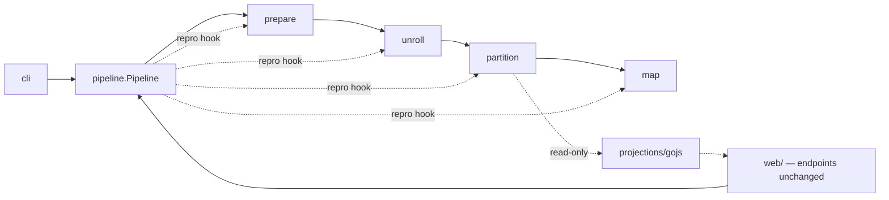

# DALiuGE Translator — Proposed Architecture

Status: **proposal**. Companion to [ARCHITECTURE.md](ARCHITECTURE.md), which describes the
as-built system. This document proposes the target structure and a migration path.

For **where each proposed file's code comes from** — a line-level source-to-target map,
plus the confirmed-dead code and the latent bugs found while tracing it — see
[ARCHITECTURE_MIGRATION_MAP.md](ARCHITECTURE_MIGRATION_MAP.md).

Goal: make the translator scalable to further change by enforcing one principle —
**one artefact transition, one owner; one concept, one abstraction.**

## Scope

Three tiers. The middle tier is the one to read carefully.

### Tier 1 — owned: the translation core and its CLI

```
dlg/dropmake/{pg_generator,lg,lg_node,dm_utils,graph_config,
              definition_classes,pgt,pgtp,scheduler}.py
dlg/dropmake/utils/**
dlg/translator/tool_commands.py
```

Free rein. This is where the proposal's structural work happens.

### Tier 2 — adaptable: the web application

```
dlg/dropmake/web/**          translator_rest.py, translator_utils.py, HTML, GOJS/D3 assets
dlg/dropmake/pg_manager.py   in-process PGT cache serving the web UI
```

**Permitted:**

- **Relocating** these files/directories wholesale, as a unit, contents otherwise unchanged.
- **Editing call sites** where they talk to the translator: import paths, argument shapes,
  return-value handling — whatever the new core API requires.
- **Replacing pure glue** — a function whose entire body sequences translator calls, with no
  HTTP, HTML or app concerns in it — with the equivalent `Pipeline` composition.
  [translator_utils.py:150-185](dlg/dropmake/web/translator_utils.py#L150-L185) is the
  canonical case.

**Not permitted:**

- Restructuring the app: no splitting `Original` / `Updated`, no extracting HTML rendering,
  no re-organising the FastAPI assembly, no new modules inside `web/`.
- Changing endpoint paths, HTTP methods, request or response payloads — EAGLE calls these.
- Changing the GOJS JSON payload shape — the bundled viewer parses it.
- Touching the front-end assets under `web/src`.
- Removing the `post_sem` / `gen_pgt_sem` semaphores. This work removes the *reason* they
  exist (§5), but whether the web app still needs them depends on web-side concurrency we
  are not analysing. Flag it; leave it.

**Rule of thumb:** an edit in Tier 2 is justified only if the corresponding Tier 1 change
forced it. Every Tier 2 diff hunk should be traceable to a specific core change. If a Tier 2
diff is doing something *for its own sake*, it does not belong in this work.

> ⚠ **`translator_utils.py` is Tier 2 by location but has a Tier 3 consumer.**
> `daliuge-engine` imports it directly —
> [graph_compatibility.py:34](../daliuge-engine/graph_compatibility.py#L34) and
> `test/end_to_end/deploy/test_graph_to_manager.py:34` both pull
> `unroll_and_partition_with_params` and `prepare_lgt` out of it. Those two signatures are
> cross-repository API, not web glue. See §8 Q5.

### Tier 3 — frozen: everyone else

Engine, EAGLE, deployment tooling. Contracts only (§7.1) — and note that `daliuge-engine`
imports translator internals from **six production modules**, so "contracts only" has a
wider surface than the wire format alone (§7.1, §8 Q5).

---

## 1. The problem, stated precisely

The translator is a four-transition compiler (LGT → LG → PGT → PGT-P → PG). The code does
not reflect that. Two failure modes, both structural.

### 1.1 Files own more than one transition

| File | Transitions it implements | Evidence | Tier |
|------|---------------------------|----------|------|
| [pg_generator.py](dlg/dropmake/pg_generator.py) | **all four** | `fill` [:57](dlg/dropmake/pg_generator.py#L57), `unroll` [:79](dlg/dropmake/pg_generator.py#L79), `partition` [:131](dlg/dropmake/pg_generator.py#L131), `resource_map` [:244](dlg/dropmake/pg_generator.py#L244) | 1 |
| [pgt.py](dlg/dropmake/pgt.py) | PGT→PGT-P **and** PGT-P→PG **and** visualisation | `to_pg_spec` [:219](dlg/dropmake/pgt.py#L219) merges partitions, forms islands, stamps `#N`/`#M` placeholders *and* writes real hostnames when `node_list` is real; `to_gojs_json` [:343](dlg/dropmake/pgt.py#L343) mutates the graph | 1 |
| [dm_utils.py](dlg/dropmake/dm_utils.py) | LGT→LG normalisation **and** unroll-semantics pre-baking | `convert_construct` [:410](dlg/dropmake/dm_utils.py#L410) replaces constructs with application DROPs and duplicates Gather app nodes to break cycles — that is unroll semantics executed one stage early | 1 |
| [tool_commands.py](dlg/translator/tool_commands.py) | all four, re-implemented | `dlg translator {fill,unroll,partition,map}` | 1 |
| [translator_rest.py](dlg/dropmake/web/translator_rest.py) | all four, re-implemented again | `/lg_fill` [:853](dlg/dropmake/web/translator_rest.py#L853), `/unroll` [:890](dlg/dropmake/web/translator_rest.py#L890), `/partition` [:923](dlg/dropmake/web/translator_rest.py#L923), `/map` [:1018](dlg/dropmake/web/translator_rest.py#L1018) | 2 — call sites only |
| [translator_utils.py](dlg/dropmake/web/translator_utils.py) | unroll + partition, a *third* time | [:160-184](dlg/dropmake/web/translator_utils.py#L160-L184) | 2 — pure glue, replaceable |

The clearest symptom is **reprodata**. The convention "reprodata is the last list element"
is hand-re-implemented at 12 translator-side sites — one producer and eleven consumers — in
every module that drives the pipeline, plus four more in `daliuge-engine` that we cannot
touch:

| Site | Tier | Fate |
|------|------|------|
| [pg_generator.py:95](dlg/dropmake/pg_generator.py#L95) — `drop_list.append(lg.reprodata)`, the *producer* | 1 | becomes `PhysicalGraphTemplate.to_wire()` |
| [tool_commands.py:408](dlg/translator/tool_commands.py#L408)/[:417](dlg/translator/tool_commands.py#L417), [:434](dlg/translator/tool_commands.py#L434)/[:436](dlg/translator/tool_commands.py#L436), [:515](dlg/translator/tool_commands.py#L515)/[:519](dlg/translator/tool_commands.py#L519) — two marked `# TODO: Re-integrate` | 1 | deleted, Phase 1 |
| [tool_commands.py:597-600](dlg/translator/tool_commands.py#L597-L600) — `dlg translator submit`; reads `pg[-1]` then re-appends around the submit call | 1 | deleted, Phase 1 |
| [translator_utils.py:162](dlg/dropmake/web/translator_utils.py#L162), [:180-184](dlg/dropmake/web/translator_utils.py#L180-L184) | 2 | deleted with the glue function |
| [translator_rest.py:954-961](dlg/dropmake/web/translator_rest.py#L954-L961), [:1009-1014](dlg/dropmake/web/translator_rest.py#L1009-L1014), [:1061-1067](dlg/dropmake/web/translator_rest.py#L1061-L1067) — `Updated` generation | 2 | each pop/append pair collapses to one adapter call — a call-site edit, nothing more |
| [translator_rest.py:641](dlg/dropmake/web/translator_rest.py#L641), [:661](dlg/dropmake/web/translator_rest.py#L661) — `Original` generation, `gen_pg_spec` / deploy path | 2 | same collapse. ⚠ These live in the legacy half, which §5 otherwise leaves alone — see below |
| `daliuge-engine`: `create_dlg_job.py:534-544`, `start_dlg_cluster.py:341-358` (incl. the `unrolled[-1].get("oid")` sniff), `composite_manager.py:450-452` (`"rmode" in graphSpec[-1]`) | **3** | **untouchable — and they constrain the fix** (§8 Q8) |

A single cross-cutting concern has no owner, so every caller re-owns it — differently. With
Tier 2 adaptable, **the 12 translator-side sites can go**, and the convention ends up
implemented once *inside the translator*.

⚠ **The convention does not end at the repo boundary.** The engine performs the same
pop/append dance around its own `pg_generator` calls, and the Drop Manager pops the trailing
element on receipt. Two consequences, both binding on §4: `pg_generator.*` must keep returning
bare lists rather than envelopes, and the translator must keep *not* applying the `init_*`
hooks inside those functions — an engine caller applies them itself and would otherwise
double-annotate. See §8 Q8.

⚠ **The `Original`-generation row is the one to think about.** §5 declares the `Original` / `Updated` split
out of scope, but two reprodata sites sit inside `Original`. Editing them is still legal —
they are call sites, not restructuring — yet they are the reprodata cleanup's only reach into
the legacy half, and `Original` is what EAGLE calls. Phase 7 should treat them as a separate,
last commit, verified against the Phase 0 HTTP corpus. If that corpus does not cover
`gen_pg_spec`, leave these two alone rather than editing blind: the cleanup is worth 10 sites,
not 12, if the alternative is an unverified change to EAGLE's path.

### 1.2 Transitions are split across files with no declared ownership

| Transition | Currently spread over | Consequence |
|------------|----------------------|-------------|
| **LGT → LG** | `dm_utils.py` (load, version sniff, 4 normalisers), `graph_config.py`, `pg_generator.fill`, and `LG.__init__` [lg.py:88-102](dlg/dropmake/lg.py#L88-L102) which sequences them | No way to obtain a parsed LG without also running normalisation, node construction and validation. The class docstring [lg.py:59](dlg/dropmake/lg.py#L59) says so itself. |
| **LG → PGT** | `lg.py` (walk + wiring), `lg_node.py` (DoP + DROP construction), `dm_utils.py` (construct pre-baking) | The rules for "what is a Scatter" live in three files. |
| **PGT → PGT-P** | `pgtp.py` (4 algorithm subclasses), `pgt.py` (`merge_partitions`, island forming inside `to_pg_spec`), `scheduler.py`, `utils/` | Island formation — a PGT-P concern — is reachable only through the function that also does PG mapping. |
| **PGT-P → PG** | `pg_generator.resource_map`, `pgt.to_pg_spec` (real-`node_list` branch), `tool_commands` map command | Two different code paths write hostnames into DROPs. |

All four transitions are implemented entirely in Tier 1. `web/` only *invokes* them.

### 1.3 Construct semantics have no single abstraction

What a Scatter/Gather/Loop/GroupBy/MPI/Service/SubGraph *means* is encoded in four
disjoint places, all Tier 1:

1. String vocabulary — `Categories` / `ConstructTypes` in
   [definition_classes.py](dlg/dropmake/definition_classes.py) (which carries a TODO saying
   the explicit `Categories` treatment should disappear).
2. Predicates — `LGNode.is_scatter` / `is_gather` / `is_loop` / … in
   [lg_node.py:450-489](dlg/dropmake/lg_node.py#L450-L489).
3. Parallelism — the `if/elif` chain in `LGNode.dop`
   [lg_node.py:612-668](dlg/dropmake/lg_node.py#L612).
4. Behaviour — three more `if/elif` chains: `lgn_to_pgn`
   [lg.py:261](dlg/dropmake/lg.py#L261), `unroll_to_tpl`
   [lg.py:545](dlg/dropmake/lg.py#L545), `_link_drops` [lg.py:436](dlg/dropmake/lg.py#L436);
   plus DROP emission in `_create_groupby_drops` / `_create_gather_drops` /
   `_create_listener_drops` [lg_node.py:779-880](dlg/dropmake/lg_node.py#L779);
   plus validation in `validate_link` [lg.py:156](dlg/dropmake/lg.py#L156).

`grep -c is_gather` over `lg.py` + `lg_node.py` returns double digits. **Adding one
construct means editing six files and hoping you found every branch.** That is the
scalability ceiling.

---

## 2. Design principles

1. **A transition is a module.** Each of the four transitions gets exactly one package.
   Nothing outside that package may implement it.
2. **A transition is a pure function** `Artefact → Artefact`. No constructors that compile.
3. **Artefacts are typed envelopes**, not bare lists. Wire-format quirks (reprodata as
   trailing element) live in one serialisation adapter, not in every caller.
4. **Constructs are plugins.** One file per construct implementing one interface. The
   compiler core contains zero `if is_scatter` branches.
5. **Nothing outside `stages/` sequences a transition.** The CLI composes stages; so does the
   web app's glue, once adapted.
6. **Visualisation must not mutate.** A projection of an artefact is read-only.
7. **Tier 2 edits are consequences, never initiatives** (see Scope).
8. **Behaviour compatibility is the acceptance criterion**, enforced by a golden-file
   corpus, not by review.

---

## 3. Target module layout

```
dlg/translator/
├── artefacts.py              LGT, LG, PGT, PGTP, PG envelopes + wire (de)serialisation
├── pipeline.py               Stage protocol, composition, reprodata hook — the ONLY one
├── errors.py                 exception hierarchy (moved out of dm_utils/pgt/scheduler)
├── lg.graph.schema           package data, moved from dlg/dropmake/  (§8 Q6)
├── lib/                      package data, bundled libmetis.{so,dylib} — moved (§8 Q6)
│
├── stages/
│   ├── prepare/              ══ TRANSITION 1: LGT → LG ══
│   │   ├── stage.py            PrepareStage — the only public entry
│   │   ├── loader.py           load_lg
│   │   ├── versions.py         get_lg_ver_type + per-version normalisation recipe
│   │   ├── config.py           graph_config overlay
│   │   ├── params.py           deprecated textual `fill`
│   │   └── normalise/
│   │       ├── globals.py      extract_globals
│   │       ├── fields.py       convert_fields
│   │       ├── constructs.py   convert_construct
│   │       └── subgraphs.py    convert_subgraphs
│   │
│   ├── unroll/               ══ TRANSITION 2: LG → PGT ══
│   │   ├── stage.py            UnrollStage
│   │   ├── model.py            LogicalNode / LogicalLink — data, no behaviour
│   │   ├── coordinate.py       InstanceId value type (replaces stringly `iid`)
│   │   ├── validate.py         structural rules, delegating to construct plugins
│   │   ├── instantiate.py      PASS 1 — every instance, no edges
│   │   ├── wire.py             PASS 2 — every edge, no instances
│   │   ├── link.py             _link_drops — shared, construct-agnostic (§8 Q9)
│   │   └── constructs/         ONE FILE PER CONSTRUCT
│   │       ├── registry.py     name → handler
│   │       ├── base.py         ConstructHandler protocol
│   │       ├── scatter.py  gather.py  loop.py  groupby.py
│   │       ├── mpi.py      service.py subgraph.py  leaf.py
│   │
│   ├── partition/            ══ TRANSITION 3: PGT → PGT-P ══
│   │   ├── stage.py            PartitionStage — algorithm selection lives here
│   │   ├── dag.py              DAG construction + DAGUtil
│   │   ├── islands.py          partition merging & island formation
│   │   ├── linearise.py        synthetic drops for edge-zeroing algos (§8 Q3)
│   │   ├── placeholders.py     `#N` / `#M` stamping — and nothing else
│   │   └── algorithms/
│   │       ├── registry.py     name → algorithm (public names are a contract)
│   │       ├── base.py         PartitionAlgorithm protocol
│   │       ├── none.py  metis.py  mysarkar.py  min_num_parts.py  pso.py
│   │       └── support/        antichains, anneal, heft, Schedule/Partition types
│   │
│   └── map/                  ══ TRANSITION 4: PGT-P → PG ══
│       └── stage.py            placeholder → hostname. Only stage aware of real hosts.
│
├── projections/              read-only serialisers the web app consumes
│   └── gojs.py                 to_gojs_json logic, side-effect free (§5 row 2)
│
├── cli/                      tool_commands — composes stages, no logic
│
└── web/                      ══ TIER 2 — MOVED, NOT RESTRUCTURED ══
    ├── translator_rest.py      same file, same endpoints; imports + glue updated
    ├── translator_utils.py     same file; glue function now composes a Pipeline
    ├── pg_manager.py           same file, relocated from dlg/dropmake/
    └── *.html, src/            byte-identical
```

The `web/` subtree keeps its internal shape exactly — same filenames, same module
boundaries, same endpoint set. It moves so that the whole translator is one package instead
of two, and its imports are rewritten because Tier 1 moved underneath it. Nothing else.

`lg.graph.schema` and `lib/` sit at the package root rather than inside the stage that uses
them (`prepare/` and `partition/algorithms/` respectively), because both are located at
runtime by a **package-name string literal**, not by import — moving them deeper multiplies
the strings that must be kept in sync. Package root keeps it to one anchor: `dlg.translator`.
See §8 Q6.

`projections/gojs.py` exists because `to_gojs_json` currently lives on `PGT` and does two
unrelated jobs. Serialisation goes here; the synthetic-DROP insertion goes to
`partition/linearise.py`, because the source scan showed it is partitioning logic, not a
viewer nicety (§8 Q3). `PGT.to_gojs_json` survives as a delegating method with an identical
signature and identical output, so the viewer sees no change (§7.2).

---

## 4. The four abstractions

### 4.1 `Artefact` — typed envelope

Kills the reprodata pop/append class of bugs, and makes "which artefact is this?" a type
question rather than a shape-sniffing question — `if not graph[-1].get("oid")` at
[translator_rest.py:955](dlg/dropmake/web/translator_rest.py#L955) is exactly that sniff,
and it becomes a one-line `PhysicalGraphTemplate.from_wire(graph)`.

```python
@dataclass(frozen=True)
class PhysicalGraphTemplate:
    drops: list[dropdict]
    reprodata: dict = field(default_factory=dict)

    @classmethod
    def from_wire(cls, payload: list) -> "PhysicalGraphTemplate":
        """Trailing-element convention decoded HERE and nowhere else."""

    def to_wire(self) -> list:
        """...and re-encoded HERE and nowhere else."""
```

The wire format is unchanged (§7.1). Endpoints keep returning `to_wire()` output, so HTTP
payloads are byte-identical.

### 4.2 `Stage` — one transition, one object

```python
class Stage(Protocol[TIn, TOut]):
    name: str
    def run(self, artefact: TIn, opts: StageOptions) -> TOut: ...
```

`pipeline.py` composes stages and applies the reproducibility hook at each boundary — the
single place `init_*_repro_data` is called *within the translator*. `unroll_and_partition`
becomes `Pipeline([UnrollStage(), PartitionStage()])` in the CLI, in the
`/unroll_and_partition` endpoint, and in `translator_utils` — one implementation, three
callers.

⚠ **The hook belongs to the Pipeline, not to the `pg_generator` facade.** `daliuge-engine`
calls `pg_generator.unroll` / `partition` / `resource_map` directly and applies `init_*`
itself (§1.1, §8 Q8). If the facade routed through a hook-applying Pipeline, every engine call
site would annotate twice. The facade must compose the *stages* and skip the hook, which means
`Pipeline` needs the hook to be an explicit constructor argument rather than baked in —
`Pipeline([...], repro=True)` for CLI/web, `repro=False` behind the facade.



### 4.3 `ConstructHandler` — the abstraction that is missing today

One interface, one file per construct, one registry. This is the change that makes the
translator extensible: adding a construct becomes **add one file, register it**.

```python
class ConstructHandler(Protocol):
    construct_type: str

    def degree_of_parallelism(self, node, ctx) -> int: ...
    def instantiate(self, node, coord: InstanceId, ctx) -> list[dropdict]: ...
    def synthesise_links(self, node, ctx) -> list[LogicalLink]: ...
    def resolve_edges(self, link, sources, targets, ctx) -> list[Edge]: ...
    def validate_link(self, link, ctx) -> None: ...
```

Mapping from today's scattered code:

| Handler method | Absorbs | Does **not** absorb |
|----------------|---------|---------------------|
| `degree_of_parallelism` | the `dop` `if/elif` chain [lg_node.py:612](dlg/dropmake/lg_node.py#L612) | — |
| `instantiate` | `_create_groupby_drops`, `_create_gather_drops`, `_create_listener_drops`, the group branch of `lgn_to_pgn` | — |
| `synthesise_links` | loop-circle and group-start artificial links [lg.py:273-315](dlg/dropmake/lg.py#L273-L315) | — |
| `resolve_edges` | *which* source DROP pairs with *which* target DROP — the chunking, bucketing and iteration-selection logic of the ~250-line `unroll_to_tpl` conditional | **`_link_drops`.** It stays one shared function (§8 Q9) |
| `validate_link` | the corresponding clause of `validate_link` [lg.py:156](dlg/dropmake/lg.py#L156) | — |

Three constraints the source scan (§8 Q9) imposes on this interface. They are why the
signature above differs from the obvious one:

1. **Dispatch is on construct *context*, not on endpoint type.** The hardest branches —
   loop-end→loop-start relinking, cross-loop stepwise locking, `loop_aware` first/last-iteration
   links [lg.py:617-696](dlg/dropmake/lg.py#L617-L696) — have a **plain leaf on both ends**.
   They key off `slgn.group.is_loop`, `slgn.gid == tlgn.gid`, `is_group_start`/`is_group_end`,
   the h-level comparison and `_loop_aware_set` membership. So the registry dispatches on
   `(source enclosing construct, target enclosing construct, h-level relation)` with the
   loop-aware flag carried on the `LogicalLink` — a `(source handler, target handler)` key
   would route every one of those cells to `LeafHandler`, i.e. back to the nested conditional.
   `LoopHandler` owns edges *between two leaves it encloses*.
2. **`resolve_edges` returns pairs; it does not wire.** `_link_drops` dispatches on
   `categoryType` — streaming app→app via an injected `NullDROP`, `Application`/`Control`
   port-map wiring, data wiring — plus `BASH_SHELL_APP` parameter registration on both sides.
   None of that is construct-specific. Folding it into handlers would copy three wiring styles
   into eight files and rebuild the ceiling this proposal exists to remove.
3. **`validate_as_source` / `validate_as_target` collapse into one `validate_link`.** The
   rules are pairwise: the Gather rule compares `src.inputs[0].h_level` against `tgt.h_level`,
   and the loop rule walks *both* group chains upward comparing `dop`. Neither is expressible
   as a source-only or target-only check. One method, both endpoints in `ctx`, handler chosen
   by precedence.

Two structural wins still fall out:

- **The gather cache disappears.** `self._gather_cache` exists only because instantiation
  and wiring are interleaved in one walk. Splitting into `instantiate.py` (pass 1) then
  `wire.py` (pass 2) means a Gather's inputs and outputs both exist before any edge is
  resolved.
- **The link-resolution matrix becomes explicit.** Today the
  enclosing-construct/h-level/loop-aware decision table is implicit in nesting order and
  written down nowhere. Under `resolve_edges` each cell is named, located and independently
  testable.

### 4.4 `InstanceId` — stop parsing strings

`iid` is the only link from a physical DROP back to its logical position, and it is a
`-`/`$`-delimited string re-parsed by `split()` in several places. Replace with a value type:

```python
@dataclass(frozen=True)
class InstanceId:
    path: tuple[int, ...]              # hierarchical scatter/loop coordinate
    group_key: tuple[int, ...] = ()    # multi-key GroupBy unravelled index
    def child(self, i: int) -> "InstanceId": ...
    def __str__(self) -> str: ...      # emits today's exact "0-3-1$2-0" form
```

`__str__` preserves the wire format bit-for-bit, so the engine — and the viewer's
`humanReadableKey`, which interpolates `drop['iid']` — see no change.

---

## 5. Fixes that fall out of the restructure

| # | Today | After | Tier 2 cost |
|---|-------|-------|-------------|
| 1 | `LG.__init__` loads, configures, normalises, builds nodes, builds links, validates | `PrepareStage` returns an LG; `UnrollStage` consumes it. Parsing without compiling becomes possible. | import updates |
| 2 | `to_gojs_json` inserts synthetic DROPs, and those DROPs reach the PG for `min_num_parts` / `pso` via `PGT.drops` — **deliberate linearisation, not a viewer artefact** (§8 Q3) | synthesis moves to `partition/linearise.py`, owned by the algorithms that need it; `projections/gojs.py` becomes a pure serialiser; `PGT.to_gojs_json` delegates | none |
| 3 | `to_pg_spec` does merging + islands + placeholders + hostname mapping | split across `partition/islands.py`, `partition/placeholders.py`, `map/stage.py`; `PGT.to_pg_spec` remains as a facade | none |
| 4 | reprodata handled by hand at ~12 translator sites (+4 in the engine) | one adapter; every *translator* site collapses, web included. The engine's four stay, so the facade keeps returning bare lists and keeps not applying the `init_*` hooks (§8 Q8) | ~8 call-site edits |
| 5 | Scatter DoP silently defaults to 4 [lg_node.py:629](dlg/dropmake/lg_node.py#L629); Gather input `categoryType` silently defaults to `"Data"` | handlers raise `GInvalidNode` by default; opt-in `--lenient` restores old behaviour with a warning | endpoints may surface a new error — see §8 Q4 |
| 5b | **Loop DoP has no fallback at all**: if none of `num_of_iter` / `Number of Iterations` / `Number of loops` is present, `_dop` stays `None` and `dop` returns `None`, so `range(lgn.dop)` raises `TypeError` [lg_node.py:644-651](dlg/dropmake/lg_node.py#L644-L651) | `LoopHandler.degree_of_parallelism` raises `GInvalidNode` naming the node and the missing field | new, found during the §8 scan |
| 6 | `convert_mkn` / `convert_mkn_all_share_m` [dm_utils.py:170](dlg/dropmake/dm_utils.py#L170) are unreachable | **delete** — confirmed dead *and* already broken (§8 Q2) | none |
| 7 | Vestigial `self._metis_path = "gpmetis"` alongside the Python binding | `algorithms/metis.py` picks one mechanism | none |
| 8 | `LG.unroll_to_tpl` documented as not thread-safe; `translator_rest` compensates with module-level semaphores | stages hold no mutable instance state across `run()`, so the core is no longer the reason for the semaphores | **none — semaphores stay.** Removing them is a web-side concurrency decision, out of scope |
| 9 | Three passes mutate the logical model: `lgn_to_pgn` appends to `self._lg_links` *while* §5.2 iterates it, `unroll_to_tpl` rewrites a Service target's `categoryType`/`category` [lg.py:750-755](dlg/dropmake/lg.py#L750-L755), `validate_link` writes a default `categoryType` into `src.jd` [lg.py:201-202](dlg/dropmake/lg.py#L201-L202) | `synthesise_links` runs as a pre-pass before `instantiate.py`, so the link set is frozen before pass 2 reads it; the Service rewrite moves into `ServiceHandler.instantiate`; the `categoryType` default becomes the `--lenient` path of row 5 | none |
| 10 | `lgn_to_pgn(recursive=False)` [lg.py:352-359](dlg/dropmake/lg.py#L352-L359) — deep-copies children onto `_start_list` — is unreachable; both call sites take the default, and `pgtp.py:267`'s `recursive` is METIS's bisection flag | **delete**, with the MKN batch (row 6) | none |

**Explicitly not addressed:** splitting the `Original` / `Updated` REST generations, and
extracting HTML rendering from `translator_rest.py`. Both are app restructuring, which the
Scope section forbids regardless of how tempting the 1247-line module makes them.

---

## 6. Migration — strangler, not rewrite

Behaviour compatibility is the acceptance criterion at every phase. No phase may change PGT
output for the `eagle-test-graphs` corpus except where §5 row 5 is deliberately enabled.

**Phase 0 — golden corpus.** Before touching code: pin `eagle-test-graphs`, run every graph
through `unroll`, `partition` (all five algorithms, fixed `--oid_prefix` for determinism)
and `map`, and store the outputs. Add a second corpus capturing `to_gojs_json` output and
the HTTP response body of every `Updated` endpoint for a handful of graphs — that is the
Tier 2 regression net, and Tier 2 is now something we edit. `pso` is stochastic; seed it or
compare structurally.

Two coverage requirements the later phases depend on, both cheap to include now and expensive
to retrofit:

- **`metis` must actually run** — it is the only algorithm that loads the bundled
  `libmetis`, so it is the only one that would catch the Phase 2 package-path breakage (§8 Q6).
- **`Original`'s `gen_pg_spec` must be in the HTTP corpus** if Phase 7 is to touch its two
  reprodata sites (§1.1). Without it, that part of the cleanup is not verifiable and should
  be dropped.

**Phase 1 — envelopes and pipeline.** Introduce `artefacts.py` + `pipeline.py`. Rewrite
`tool_commands.py` to compose stages wrapping the *existing* functions unchanged. Deletes
the three CLI reprodata sites. Zero compiler changes, zero Tier 2 changes. Highest value,
lowest risk — do this first.

**Phase 2 — split by transition.** Move Tier 1 code into `stages/*/` along the boundaries in
§1.2. Mechanical moves. Update `web/` imports in the same PR — that is the whole Tier 2 diff
for this phase, and it should be import lines only. **Shims at the old `dlg.dropmake.*`
paths are mandatory, not optional**: `daliuge-engine` imports `pg_generator`, `graph_config`
and `web.translator_utils` from six production modules (§8 Q5). Shipping this phase without
them breaks the engine.

`scheduler.py` moves in this phase, so **`lib/libmetis.*` moves with it** and the
`importlib.resources.files("dlg.dropmake")` literal at
[scheduler.py:1143](dlg/dropmake/scheduler.py#L1143) must be repointed at `dlg.translator`
(§8 Q6). A shim cannot cover this — it is a filesystem lookup, not an import. Run a `metis`
partition before merging the phase; nothing else exercises it.

**Phase 2b — relocate `web/`.** `dlg/dropmake/web/` → `dlg/translator/web/`,
`dlg/dropmake/pg_manager.py` → `dlg/translator/web/pg_manager.py`. A `git mv`, plus the
in-repo reference fixes the scan identified (§8 Q6): `MANIFEST.in`'s six hardcoded
`dlg/dropmake/…` lines, the literal `"dlg.dropmake.web.translator_rest:run"` at
[tool_commands.py:610](dlg/translator/tool_commands.py#L610), the `lg.graph.schema` move,
and its two consumers — `file_as_string("lg.graph.schema", module="dlg.dropmake")` at
[translator_rest.py:145](dlg/dropmake/web/translator_rest.py#L145) and the relative path in
`tools/checkGraph.py:14`. Also the ten shell-script lines that hardcode the old path:
`build_translator.sh:15-51` (writes `web/VERSION`, copies `LICENSE`) and
`run_translator.sh:19-31` (the developer live-mount — stale, it silently runs installed code
instead of the working tree). Plus a shim at
`dlg.dropmake.web.translator_utils`, because the engine imports it. **No content edits in
the same commit** beyond those path literals — keep the move reviewable as a pure rename.

**Phase 3 — construct registry, read path.** Introduce `ConstructHandler` and route
`degree_of_parallelism` + `validate_*` through it. Cheapest half of the interface; delete
the `dop` chain and the `validate_link` chain. Tier 1 only.

**Phase 4 — two-pass unroll.** Split `unroll_to_tpl` into `instantiate.py`, `wire.py` and the
shared `link.py`, move `resolve_edges` into handlers, delete `_gather_cache`. **Highest-risk
phase** — the ~250-line conditional is where behaviour drift will happen. Do it construct by
construct, running the golden corpus after each handler lands, and land it as its own PR.
Tier 1 only.

Order matters here: land `link.py` (a straight lift of `_link_drops`, no behaviour change)
*before* the first handler, and take `LoopHandler` **last**. Loop owns the four leaf-to-leaf
cells at [lg.py:617-696](dlg/dropmake/lg.py#L617-L696) (§8 Q9), so until it lands those edges
still route through the legacy conditional — which is fine, but it means the "one handler per
PR" cadence has a fat tail, not an even one.

**Phase 5 — `InstanceId`.** Replace `iid` internals; keep `__str__` output identical.

**Phase 6 — partition / map / projection separation.** Break `to_pg_spec` apart behind an
unchanged facade; move `to_gojs_json` into `projections/` behind a delegating method.

**Phase 7 — Tier 2 glue adaptation.** The one phase whose deliverable is a web-side diff:
collapse the reprodata pop/append pairs in `translator_rest.py` to adapter calls, and
replace the `translator_utils` glue function body with a `Pipeline`. Endpoints, payloads and
HTML untouched — verify against the Phase 0 HTTP corpus. **`unroll_and_partition_with_params`
and `prepare_lgt` keep their exact signatures** — `daliuge-engine` calls both (§8 Q5).
Deliberately last, so the core API has stopped moving before we adapt against it.

---

## 7. Contracts this work does not change

### 7.1 External wire contracts (Tier 3 — hard)

All of §11 in [ARCHITECTURE.md](ARCHITECTURE.md) is preserved verbatim:

- PG wire format — flat `list[dropdict]` with `oid`, `categoryType`, `dropclass`, `node`,
  `island`, `inputs`/`outputs`/`consumers`/`producers`/`streamingConsumers`, `port_map`,
  `rank`, `iid` (including its string form — §4.4).
- Reprodata as the trailing list element at every stage boundary — now produced by one
  adapter instead of a dozen call sites, but byte-identical on the wire.
- `#N` / `#M` placeholder convention for deferred deployment (SLURM, Helm).
- CLI command names, options, stdin/stdout piping.
- **REST endpoint paths, methods and payload shapes, both generations.** EAGLE calls
  `Original`. Files may move; URLs may not.
- **GOJS JSON payload shape** — the bundled viewer parses it.
- `lg.graph.schema`.
- Supported LG versions: `LG_VER_EAGLE`, `LG_VER_EAGLE_CONVERTED`, `LG_APPREF`.
- Partitioning algorithm names and `algo_params` keys.

The typed-envelope idea *could* extend to the wire
(`{"drops": [...], "reprodata": {...}}`) and would eliminate the positional convention
entirely — but that is a cross-repository decision with the engine and is **explicitly out
of scope**. Recorded as a follow-up.

**The Python import surface `daliuge-engine` depends on** (from the §8 Q5 scan) is a
contract in the same class as the wire format, because both packages ship together:

| Engine module | Imports from translator |
|---------------|-------------------------|
| [dlg/apps/subgraph.py:31](../daliuge-engine/dlg/apps/subgraph.py#L31) | `dlg.dropmake.pg_generator.{unroll, partition}` — **called at DROP execution time** |
| `dlg/deploy/start_dlg_cluster.py:49`, `helm_client.py:46`, `start_helm_cluster.py:38`, `create_dlg_job.py:53` | `dlg.dropmake.pg_generator` |
| `dlg/deploy/create_dlg_job.py:54` | `dlg.dropmake.graph_config.change_active_configuration` |
| [graph_compatibility.py:34](../daliuge-engine/graph_compatibility.py#L34) | `dlg.dropmake.web.translator_utils.{unroll_and_partition_with_params, prepare_lgt}` |
| `test/dlg_end_to_end_utils.py:38-40`, `test/end_to_end/**` | `dlg.dropmake.{lg, pgt, pgtp}`, `dlg.dropmake.web.translator_utils` |

`subgraph.py` is the one to watch: the engine calls `unroll`/`partition` *inside a running
workflow*, so `pg_generator`'s signature is a runtime contract and the thread-safety point
in §5 row 8 has a real consumer.

**Return types are part of that contract**, not just parameter lists:

- `partition` returns a live `PGT` when `show_gojs=True` and a `to_pg_spec` list when it is
  False [pg_generator.py:233-241](dlg/dropmake/pg_generator.py#L233-L241). The engine's deploy
  scripts take the list branch; `translator_utils` [:164](dlg/dropmake/web/translator_utils.py#L164)
  and the REST layer take the object branch. Both survive the restructure unchanged.
- `resource_map` accepts a `(graph_name, list)` pair as well as a bare list
  [pg_generator.py:258](dlg/dropmake/pg_generator.py#L258); `create_dlg_job.py` writes exactly
  that shape to disk. `map/stage.py` must keep unwrapping it.
- `unroll_and_partition_with_params` returns a `PGT` object with `.reprodata` assigned
  [translator_utils.py:183-185](dlg/dropmake/web/translator_utils.py#L183-L185), not a list.
  Phase 7's `Pipeline` rewrite of its body must still hand back that object.

### 7.2 The Tier 2 call surface — changeable, but budgeted

These are the symbols `web/` imports. They are no longer frozen, but every change to one
buys a diff in a file we would rather not touch. Change them when the design demands it;
don't churn them.

| Symbol | Used by | Intended fate |
|--------|---------|---------------|
| `pg_generator.{fill, apply_config, unroll, partition, resource_map, known_algorithms}` | `translator_rest.py`, `translator_utils.py` | kept as a facade over `Pipeline`; signatures unchanged |
| `PGT` / `MetisPGTP` / `MySarkarPGTP` / `MinNumPartsPGTP` / `PSOPGTP` constructors | `translator_rest.py` | unchanged through Phase 6 |
| `PGT.{to_pg_spec, to_gojs_json, json, drops, reprodata, get_partition_info, result}` | REST + `PGManager` | unchanged; internals delegate |
| `dm_utils.{load_lg, get_lg_ver_type}`, `GraphException` family | REST + `translator_utils.py` | import path moves (Phase 2), behaviour identical |
| `graph_config.fill_config`, `LG` | REST | import path moves (Phase 2) |

Run the web test suite (`test/dropmake/test_tm.py`) every phase. It is the tripwire for both
this table and §7.1's endpoint contract.

---

## 8. Findings — open questions, answered

Answered by source scan on 2026-08-09 over `daliuge-translator/` and `daliuge-engine/`,
re-verified line-by-line the same day (every citation in both documents was checked against
the file it names), then extended outward to `daliuge-engine` call sites and non-Python
references. Every claim below is grounded in a cited line. Four findings
**contradicted assumptions in earlier drafts of this document** — Q3, Q5, Q7, Q8; each is
marked ⚠ and the proposal has been corrected.

### Q1 — Is `convert_construct` prepare-time or unroll-time? ✅ Free to move

**Answer: no external party observes the normalised LG. Moving it to unroll-time is
observationally free.**

- `/lg_fill` [translator_rest.py:886](dlg/dropmake/web/translator_rest.py#L886) calls
  `pg_generator.fill`, which is the textual `string.Template` substitution
  [pg_generator.py:57](dlg/dropmake/pg_generator.py#L57). It never constructs an `LG`, so
  it never normalises.
- `fill-config` routes to `graph_config.fill_config` — also no normalisation.
- Normalisation runs only inside `LG.__init__` [lg.py:91-102](dlg/dropmake/lg.py#L91-L102),
  and its output is consumed directly by `unroll_to_tpl`. It is never serialised as an
  artefact.
- The only caller of `convert_construct` outside `LG.__init__` in either repo is
  `test/dropmake/test_dm_utils.py:30` — our own test.

**Effect on the proposal:** unblocks Phase 2. No decision needed from EAGLE or the web team.
The only observable consequence is PGT output, which the Phase 0 corpus already covers.

### Q2 — MKN: delete or implement? ✅ Delete

**Answer: dead, and already known-broken. Delete it.**

- `convert_mkn` [dm_utils.py:170](dlg/dropmake/dm_utils.py#L170) and
  `convert_mkn_all_share_m` [:324](dlg/dropmake/dm_utils.py#L324) — zero callers in either
  repo.
- `_mkn_substitution` [lg_node.py:1017](dlg/dropmake/lg_node.py#L1017) — also zero callers.
- The only *live* MKN code is a pass-through at
  [lg_node.py:926-927](dlg/dropmake/lg_node.py#L926-L927) copying `jd["mkn"]` into kwargs.
  Nothing downstream reads it.
- The MKN test graphs are commented out in three places, each labelled *"Currently broken"*:
  `test_lg.py:209`, `test_pg_gen.py:61`, `:181`, `:387`.

So MKN is not a feature we would be removing — it is an unreachable half-implementation of a
feature that already does not work. Delete `convert_mkn`, `convert_mkn_all_share_m`,
`_check_MKN`, `_mkn_substitution`, `Categories.MKN`, `ConstructTypes.MKN` and the kwargs
pass-through together.

### Q3 — ⚠ Does anything depend on `to_gojs_json`'s mutation? **Yes — and the earlier premise was wrong**

**Answer: the synthetic DROPs reach the production PG, but only for `min_num_parts` and
`pso`, and there they are deliberate partitioning output — not a visualisation artefact.**

The mechanism, in order:

1. `PGT.__init__` sets `self._extra_drops = []` — an empty list, **not** `None`
   [pgt.py:58](dlg/dropmake/pgt.py#L58).
2. `to_gojs_json` synthesises the intermediate `BarrierAppDROP`/`InMemoryDROP` nodes only
   under `if self._extra_drops is None:` [pgt.py:374](dlg/dropmake/pgt.py#L374). For base
   `PGT` the guard is False, so it takes the `else` branch
   [pgt.py:464-472](dlg/dropmake/pgt.py#L464-L472) and synthesises **nothing**.
3. Exactly two classes set it to `None`: `MinNumPartsPGTP.__init__`
   [pgtp.py:619](dlg/dropmake/pgtp.py#L619) and `PSOPGTP.__init__`
   [pgtp.py:652](dlg/dropmake/pgtp.py#L652), both with the comment *"force it to re-calculate
   the extra drops due to extra links during linearisation"*.
4. `PGT.drops` returns `self._drop_list + self._extra_drops`
   [pgt.py:108-112](dlg/dropmake/pgt.py#L108-L112), and `to_pg_spec` iterates `self.drops`
   — so once populated, the extras get a `node`/`island` stamp and ship in the PG.

**Two corrections follow.** First, [ARCHITECTURE.md](ARCHITECTURE.md) §6's claim that the
synthetic DROPs are "present in the production path too" is right in kind but too broad: it
does not happen for `none`, `metis` or `mysarkar`. Second, this proposal's earlier framing —
"a visualisation function mutating the production graph, fix by making it read-only" —
inverted the causality. The insertion exists *because* edge-zeroing linearisation adds
links that need intermediate DROPs. It is partitioning logic that happens to be typed into a
serialiser.

**Effect on the proposal:** §5 row 2 and §3 revised. Synthesis moves to
`partition/linearise.py` owned by the MySarkar-family algorithms that need it;
`projections/gojs.py` becomes a pure serialiser. Confidence is high on the mechanism —
the code is unambiguous — but the Phase 0 corpus must still confirm byte-identical PG output
for `min_num_parts` and `pso` before Phase 6 lands.

### Q4 — Is failing loudly on a missing Scatter count acceptable? ◐ Partial — still needs product sign-off

**What the code says:** loud failure is already the house style for two of the three
branches; Scatter's silent `4` is the outlier.

- Scatter: falls back to `4`, with the source comment
  `# dummy impl. TODO: Why is this here?` [lg_node.py:629](dlg/dropmake/lg_node.py#L629).
- An unrecognised group category already raises `GInvalidNode`
  [lg_node.py:657](dlg/dropmake/lg_node.py#L657).
- **New finding:** Loop has *no* fallback. If none of `num_of_iter` /
  `Number of Iterations` / `Number of loops` is present, `_dop` is never assigned, `dop`
  returns `None`, and `range(lgn.dop)` in `lgn_to_pgn` raises a bare `TypeError`
  [lg_node.py:644-651](dlg/dropmake/lg_node.py#L644-L651). So Loop already fails on this
  input — just with an unhelpful error and no node name. Added as §5 row 5b.

**Still open:** whether any graph in active use relies on the Scatter default. The scan
cannot answer that — it needs the Phase 0 corpus plus product agreement. §5 row 5 stands as
proposed, behind `--lenient`.

### Q5 — ⚠ Which repos import `dlg.dropmake.*`? **`daliuge-engine`, from production code**

**Answer: shims are mandatory, and `translator_utils.py` is not web-private.**

Full import surface is tabulated in §7.1. The three consequences:

1. **Phase 2 must ship shims.** Not "worth adding for external importers" as an earlier
   draft put it — required, or `daliuge-engine` fails to import.
2. **`translator_utils.py` has a Tier 3 consumer.**
   [graph_compatibility.py:34](../daliuge-engine/graph_compatibility.py#L34) imports
   `unroll_and_partition_with_params` and `prepare_lgt`. Phase 7's plan to replace that glue
   with a `Pipeline` is still fine — but the signatures are frozen. Scope section and
   Phase 7 both updated.
3. **The engine calls the translator at runtime.**
   [dlg/apps/subgraph.py:31](../daliuge-engine/dlg/apps/subgraph.py#L31) imports `unroll` and
   `partition` and invokes them from inside a running workflow. `pg_generator`'s signature is
   therefore a runtime contract, and the thread-safety note (§5 row 8) has a concrete
   consumer rather than being theoretical.

### Q6 — Does relocating the package break a deployment path? ✅ Nine fixes, no blockers

⚠ **Wider than `web/`.** The scan was re-run against *all* of Tier 1, not just the `web/`
subtree, and found two runtime resource lookups that key off the string `"dlg.dropmake"`.
Neither is an import, so neither is caught by an import rewrite, and neither fails at import
time — they fail when the feature is first exercised. Both were missing from the earlier
version of this table.

| Reference | Status |
|-----------|--------|
| [scheduler.py:1143](dlg/dropmake/scheduler.py#L1143) — `os.environ["METIS_DLL"] = importlib.resources.files("dlg.dropmake") / f"lib/libmetis.{ext}"` | **must edit + move `lib/`.** Breaks *all* METIS partitioning, not just the web app. Silent until `metis` is first selected |
| [translator_rest.py:145](dlg/dropmake/web/translator_rest.py#L145) — `file_as_string("lg.graph.schema", module="dlg.dropmake")` | **must edit.** The schema's in-package consumer (there is a second one outside the package — see `tools/checkGraph.py` below). A Tier 2 call-site edit forced by a Tier 1 move — legitimate under the Scope rule |
| `MANIFEST.in` — four hardcoded `dlg/dropmake/web/*` lines, plus `dlg/dropmake/*.schema` and `dlg/dropmake/lib/*` | **must edit** (all six lines) |
| [tool_commands.py:610](dlg/translator/tool_commands.py#L610) — literal `"dlg.dropmake.web.translator_rest:run"` registering `dlg translator tm` | **must edit** |
| `dlg/dropmake/lg.graph.schema` — the only `.schema` in the package | **must move + update MANIFEST** |
| `dlg/dropmake/lib/{libmetis.so,libmetis.dylib}` | **must move + update MANIFEST + the `scheduler.py` literal above** |
| `build_translator.sh:15-51` — writes `dlg/dropmake/web/VERSION` and copies `LICENSE` into `dlg/dropmake/web/` on all four build paths | **must edit** (7 lines). Nothing reads that `VERSION` back, so a stale path fails silently — the file just lands in a directory the app no longer occupies |
| `run_translator.sh:19-31` — `docker run --volume $PWD/dlg/dropmake:/dlg/lib/python3.8/site-packages/dlg/dropmake` on three of four paths | **must edit** (3 lines). This is the developer live-mount; a stale path silently runs the *installed* code instead of the working tree, which is the worst failure mode in the table |
| `tools/checkGraph.py:14` — `LG_SCHEMA_FILENAME = "../daliuge-translator/dlg/dropmake/lg.graph.schema"` | **must edit.** A second schema consumer, outside the translator package, resolving by relative filesystem path |
| `setup.py` — `packages=find_packages()` [:169](setup.py#L169), `package_data` built from `package_files("dlg")` [:111](setup.py#L111) | fine, both recursive |
| `setup.py` entry point `dlg.tool_commands: translator=dlg.translator.tool_commands` [:171](setup.py#L171) | fine, unaffected |
| `docker/Dockerfile{,.dev,.ray}` — `CMD ["dlg","tm",…]` | fine, path-independent |
| `dlg.spec` | fine — contains only a stale absolute `pathex` to a developer's machine |

Plus the shim at `dlg.dropmake.web.translator_utils` required by Q5. Note a shim does **not**
help the two resource lookups: `importlib.resources.files("dlg.dropmake")` resolves against
the real on-disk package directory, so a re-export module leaves it pointing at a directory
with no `lib/` in it. The literals must be edited, not shimmed.

**Corpus implication:** the Phase 0 corpus must include at least one `metis` run, or this
class of breakage ships undetected — every other algorithm is pure Python.

### Q7 — Does an import rewrite cover the whole move? ⚠ No — two string-literal lookups

**Answer: `dlg.dropmake` is a package-name string in two runtime resource lookups and a
`MANIFEST.in` glob set. Rewriting imports leaves all of them stale, and none fails at import
time.** Full detail in the Q6 table; the two lookups are
[scheduler.py:1143](dlg/dropmake/scheduler.py#L1143) (`libmetis`, breaks METIS partitioning)
and [translator_rest.py:145](dlg/dropmake/web/translator_rest.py#L145) (`lg.graph.schema`,
breaks LG validation on every REST call).

Generalised: **the shim strategy from Q5 covers imports and only imports.** Anything that
resolves a path from a package name at runtime has to be edited. A grep for the literal
strings `"dlg.dropmake"` / `dlg/dropmake` — not just `import dlg.dropmake` — is the check,
and it should be re-run at the end of Phase 2 and Phase 2b.

### Q8 — ⚠ Is reprodata handling really translator-internal? **No — the engine owns half of it**

**Answer: `daliuge-engine` performs the same pop/append dance around its own `pg_generator`
calls, and applies the `init_*` hooks itself. The envelope idea survives; "one place calls
`init_*`" does not.**

| Engine site | What it does |
|-------------|--------------|
| `create_dlg_job.py:534-544` | `unroll` → `init_pgt_unroll_repro_data` → `pop()` → `partition` → `append()` → `init_pgt_partition_repro_data` |
| `start_dlg_cluster.py:341-358` | same sequence, plus the shape sniff `if not unrolled[-1].get("oid"): reprodata = unrolled.pop()` — the *same* sniff §4.1 promises to collapse, in code we cannot touch |
| `start_dlg_cluster.py:378` | `init_pg_repro_data(pg_generator.resource_map(...))` |
| `composite_manager.py:450-452` | the Drop Manager pops the trailing element on receipt, keyed on `"rmode" in graphSpec[-1]` |

The translator's own stage functions do **not** call `init_*`: `unroll` appends the raw
`lg.reprodata` [pg_generator.py:95](dlg/dropmake/pg_generator.py#L95) and stops there. The
hook is the caller's job, and there are Tier 3 callers.

**Three effects on the proposal.**

1. **§4.2 revised.** The repro hook cannot be unconditional inside the Pipeline. It becomes a
   Pipeline construction option: on for the CLI and web, off for the `pg_generator` facade the
   engine calls. Without this, `create_dlg_job.py:535` annotates an already-annotated PGT.
2. **§4.1 constrained.** `PhysicalGraphTemplate` is an *internal* type. The facade's boundary
   is `to_wire()` / `from_wire()`, and the wire form stays a bare list — which §7.1 already
   promises, but for the wire only; this extends it to the Python return type.
3. **The "12 sites" claim is scoped, not wrong.** Twelve is the translator-side count. Four
   more live in the engine and stay. §1.1 updated to say so.

**Confidence:** high — all four sites read directly. **Corpus implication:** none new; the
engine's deploy path is not in the Phase 0 corpus and should not be, but a smoke run of
`create_dlg_job.py` after Phase 1 is cheap insurance against the double-annotation regression.

### Q9 — ⚠ Does `ConstructHandler` actually cover `unroll_to_tpl`? **Mostly — three of six methods were mis-specified**

**Answer: the plugin decomposition holds, but the interface as first drawn would not have
reached the hardest branches, would have duplicated the wiring code eight times, and could not
express the validation rules. All three are fixed in §4.3.**

Read line-by-line over `lgn_to_pgn` [lg.py:261-386](dlg/dropmake/lg.py#L261),
`_link_drops` [:436-543](dlg/dropmake/lg.py#L436), `unroll_to_tpl` [:545-761](dlg/dropmake/lg.py#L545)
and `validate_link` [:156-250](dlg/dropmake/lg.py#L156).

**1. `(source handler, target handler)` is the wrong dispatch key.** Of the six top-level
branches, only three key off the endpoints' construct types. The `not slgn.is_group and not
tlgn.is_group` branch [:617-696](dlg/dropmake/lg.py#L617-L696) — four sub-branches, the
highest-risk code in the translator — has a **leaf on both ends** and dispatches on
`slgn.group.is_loop`, `slgn.gid == tlgn.gid`, `is_group_end`/`is_group_start`,
`slgn.h_level ≥ tlgn.h_level`, and `("%s-%s" % (sid, tid)) in self._loop_aware_set` — a
per-link flag computed in `LG.__init__` [:150](dlg/dropmake/lg.py#L150). Keyed on endpoint
handlers, all four cells land in `LeafHandler` and the nested conditional survives intact
inside it. Key must be `(source enclosing construct, target enclosing construct, h-level
relation)`, loop-awareness on the `LogicalLink`.

**2. `_link_drops` must not move into handlers.** It dispatches on `categoryType`, never on
construct: `_is_stream_link` over the five app categories → inject a `NullDROP`
[:469-490](dlg/dropmake/lg.py#L469-L490); `s_type in ["Application", "Control"]` → port-name
resolution and `port_map` [:492-511](dlg/dropmake/lg.py#L492-L511); else data wiring
[:512-543](dlg/dropmake/lg.py#L512-L543); plus `BASH_SHELL_APP` parameter registration on
both sides. Its only construct-aware parts are the Gather/GroupBy source-DROP substitution at
the top and the gather-cache diversion — both of which disappear with the cache. So
`resolve_edges` decides *which pairs*, a shared `unroll/link.py` decides *how*.

**3. `validate_as_source` / `validate_as_target` cannot express the rules.** They are
pairwise: the Gather rule reads `src.inputs[0].h_level == tgt.h_level` — the h-level of the
source's *own input* [:171-181](dlg/dropmake/lg.py#L171-L181) — and the loop rule walks both
group chains upward in lockstep comparing `dop` [:217-239](dlg/dropmake/lg.py#L217-L239).
Collapsed to one `validate_link(link, ctx)`.

**Two smaller findings**, recorded as §5 rows 9 and 10:

- **Three passes mutate the logical model** — `lgn_to_pgn` appends to `self._lg_links` while
  the link loop later iterates it, the Service branch rewrites `tlgn["categoryType"]`
  mid-wiring [:750-755](dlg/dropmake/lg.py#L750-L755), and `validate_link` writes a default
  `categoryType` into `src.jd` [:201-202](dlg/dropmake/lg.py#L201-L202). Each needs a home in
  the parse → validate → instantiate → wire split.
- **`lgn_to_pgn(recursive=False)` is dead** [:352-359](dlg/dropmake/lg.py#L352-L359) — both
  call sites take the default; `pgtp.py:267`'s `recursive` is METIS's bisection flag, not
  this. Delete with the MKN batch.

**Effect on the proposal:** §4.3 rewritten, §3 gains `unroll/link.py`, §5 gains rows 9 and 10,
Phase 4 gains a dispatch-key note. **Confidence:** high on 1–3, all read directly. The design
survives; the interface sketch did not.

### Still open

- **Q4's product half** — is the Scatter `4` default load-bearing for real graphs?
- **Q8's double-annotation guard** — is `init_pgt_unroll_repro_data` idempotent? If it is, the
  `repro=` Pipeline flag is belt-and-braces; if not, it is load-bearing. Answer before Phase 1.
- **Q3's corpus confirmation** — PG output for `min_num_parts` / `pso` unchanged after the
  linearisation move.
- **Deprecation window** — how long the `dlg.dropmake.*` shims must live is now a
  `daliuge-engine` release-coordination question, not a translator one.

---

## 9. Changes log

Append-only. **Every coding agent or contributor making a change against this proposal adds
a row here**, newest at the bottom. Do not edit or delete existing rows — supersede them
with a new row instead.

Conventions:
- **Date** — `YYYY-MM-DD`.
- **Phase** — the §6 phase, or `—` for changes to this document itself.
- **Change** — what actually landed, not what was intended.
- **Corpus** — result of the Phase 0 golden-file run: `pass`, `n/a`, or `drift: <detail>`.
  Never write `pass` without having run it.

| Date | Author | Phase | Change | Corpus | Ref |
|------|--------|-------|--------|--------|-----|
| 2026-08-09 | Claude (Opus 5) | — | Initial proposal drafted from [ARCHITECTURE.md](ARCHITECTURE.md) + source audit of `dlg/dropmake`, `dlg/translator` | n/a | — |
| 2026-08-09 | Claude (Opus 5) | — | Scoped web application out entirely: frozen consumer, shims as the compatibility mechanism | n/a | superseded |
| 2026-08-09 | Claude (Opus 5) | — | Three-tier scope. Web is Tier 2 "adaptable": relocation + call-site/glue edits permitted, app restructuring still forbidden. Added Phase 2b (relocate `web/`) and Phase 7 (glue adaptation); reprodata cleanup now covers all ~12 sites; §7.2 reframed from frozen to budgeted | n/a | — |
| 2026-08-09 | Claude (Opus 5) | — | Source scan answered §8 Q1, Q2, Q3, Q5, Q6; Q4 partially. **Two corrections**: (a) Q3 — `to_gojs_json`'s synthetic DROPs are deliberate linearisation output for `min_num_parts`/`pso`, not a viewer artefact, so §5 row 2 and §3 now route them to `partition/linearise.py` instead of "make the serialiser read-only"; (b) Q5 — `daliuge-engine` imports translator internals from six production modules incl. `web.translator_utils`, so Phase 2 shims are mandatory and `unroll_and_partition_with_params` / `prepare_lgt` are frozen signatures. Also: MKN confirmed dead **and** broken → delete (Q2); `convert_construct` has no external observer → free to move (Q1); new §5 row 5b, Loop DoP returns `None` → bare `TypeError` | n/a | — |
| 2026-08-09 | Claude (Opus 5) | — | Added [ARCHITECTURE_MIGRATION_MAP.md](ARCHITECTURE_MIGRATION_MAP.md): line-level source→target mapping for every proposed file, the `unroll_to_tpl` 21-row decision matrix, ~600 LOC of confirmed-dead code, and five latent bugs (B1–B5). Layout addendum: `partition/dag.py` also absorbs `PGT.data_movement` / `pred_exec_time` | n/a | — |
| 2026-08-09 | Claude (Opus 5) | — | Verification pass: re-checked every line citation in this document and in [ARCHITECTURE.md](ARCHITECTURE.md) against source — all correct, no drift. **One new finding (§8 Q7)**: `dlg.dropmake` is a package-name *string literal* in two runtime resource lookups — `scheduler.py:1143` (`libmetis`) and `translator_rest.py:145` (`lg.graph.schema`) — plus six `MANIFEST.in` globs. Shims cover imports only, so Phase 2/2b would have shipped broken METIS partitioning and broken LG validation. Q6 widened from three fixes to five; §3 layout gains `lib/` and `lg.graph.schema` at package root; Phase 0 now requires a `metis` run. **Second correction**: §1.1's reprodata table under-enumerated — added `tool_commands.py:597-600` and `translator_rest.py:641`/`:661`, the latter two inside the `Original` generation, with a rule for handling them | n/a | — |
| 2026-08-09 | Claude (Opus 5) | — | [ARCHITECTURE.md](ARCHITECTURE.md) brought in line with the Q3/Q4 findings it predates: §6 GOJS paragraph now scopes the synthetic-DROP insertion to `min_num_parts`/`pso` instead of claiming it happens on every partition path; §10 item 6 reframed from "visualisation mutates production data" to "partitioning logic living in a serialiser"; §10 item 9 gains the Loop-DoP `None` → bare `TypeError` case; new §10 item 11 records the four package-path string literals | n/a | — |
| 2026-08-09 | Claude (Opus 5) | — | Outward scan (engine call sites + non-Python references). **Third correction (§8 Q8)**: `daliuge-engine` owns four reprodata sites of its own — `create_dlg_job.py:534-544`, `start_dlg_cluster.py:341-358` + `:378`, `composite_manager.py:450-452` — and applies the `init_*` hooks itself, so §4.2's "Pipeline applies the hook at every boundary" would double-annotate every engine call; the hook becomes a Pipeline constructor flag, off behind the `pg_generator` facade. **Fourth correction (§7.2)**: `pg_generator.partition` has a polymorphic return type (`PGT` when `show_gojs=True`, list otherwise), `resource_map` accepts a `(name, list)` pair, and `unroll_and_partition_with_params` returns a `PGT` object — all three are frozen return contracts, not just signatures. Q6 widened from five fixes to nine: `build_translator.sh` (7 lines), `run_translator.sh` (3 lines, the developer live-mount), `tools/checkGraph.py:14` (second schema consumer). Agent grep instruction changed to unfiltered. [ARCHITECTURE.md](ARCHITECTURE.md) §7/§9/§10-11/§10-12/§11 updated to match | n/a | — |
| 2026-08-09 | Claude (Opus 5) | — | Interface-fit scan: `ConstructHandler` checked method-by-method against `lgn_to_pgn`, `_link_drops`, `unroll_to_tpl` and `validate_link`. **Fifth correction (§8 Q9)**: three of six methods were mis-specified — (a) `resolve_edges` cannot dispatch on `(source handler, target handler)`, because the four hardest cells have a leaf on both ends and key off the *enclosing* construct, `gid` relation, h-level and `_loop_aware_set`; key is now `(source enclosing construct, target enclosing construct, h-level relation)`; (b) `_link_drops` is `categoryType`-driven, not construct-driven, so it stays one shared `unroll/link.py` and `resolve_edges` returns pairs only; (c) `validate_as_source`/`validate_as_target` collapse to one pairwise `validate_link`. New §5 rows 9 (three passes mutate the logical model — link synthesis, the Service `categoryType` rewrite, the validator's default) and 10 (`lgn_to_pgn(recursive=False)` is dead — delete with MKN). Phase 4 gains an ordering note: `link.py` first, `LoopHandler` last. [ARCHITECTURE.md](ARCHITECTURE.md) §5.1/§5.2/§5.4 and §10 items 4, 13, 14 updated to match | n/a | — |

### Notes for coding agents

- **Check the tier before editing.** Tier 1 = free rein. Tier 2 (`web/`, `pg_manager.py`) =
  move it, fix its imports, adapt its glue — never restructure it, never touch endpoints,
  payloads, HTML or `web/src`. Tier 3 = contract only.
- **Every Tier 2 diff hunk must trace to a specific Tier 1 change.** If you cannot name the
  core change that forced it, revert it.
- The golden corpus (§6 Phase 0) gates every later phase, and it now includes HTTP response
  bodies. If it does not exist yet, building it is the next task — not starting Phase 1.
- Run `test/dropmake/test_tm.py` on every phase.
- Phases are ordered by risk. Do not start Phase 4 before Phase 2 lands; the two-pass unroll
  rewrite is unreviewable while the code is still spread across `lg.py`, `lg_node.py` and
  `dm_utils.py`.
- Phase 2b is a pure `git mv` — no content edits in that commit beyond the path literals in
  §8 Q6.
- After any move, `grep -rn 'dlg[./]dropmake' .` — **unfiltered, from the monorepo root, no
  `--include` filter** — must come back empty except for the deliberate shims. Of the nine
  non-import references, three are in `build_translator.sh` / `run_translator.sh` and one is
  in `tools/checkGraph.py`; a `--include='*.py' --include='*.in'` grep misses all four. Import
  rewrites do not catch string literals (§8 Q7), and neither does the test suite until the
  feature is exercised.
- Phase 4 lands **one construct handler per PR**, corpus run between each.
- If a change breaks anything in §7.1, stop and escalate — those are cross-repository
  decisions.
- Answer the relevant §8 question before the phase that depends on it, and record the answer
  as a changes-log row.
